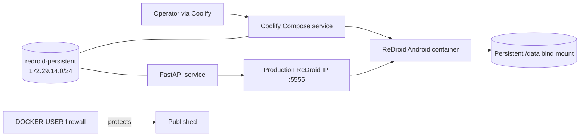
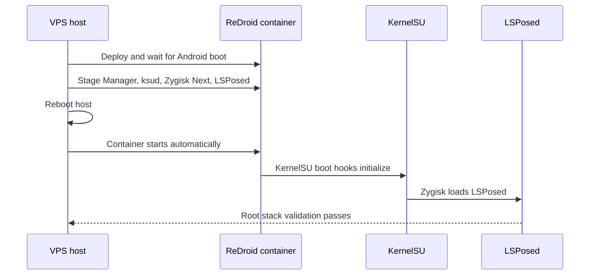
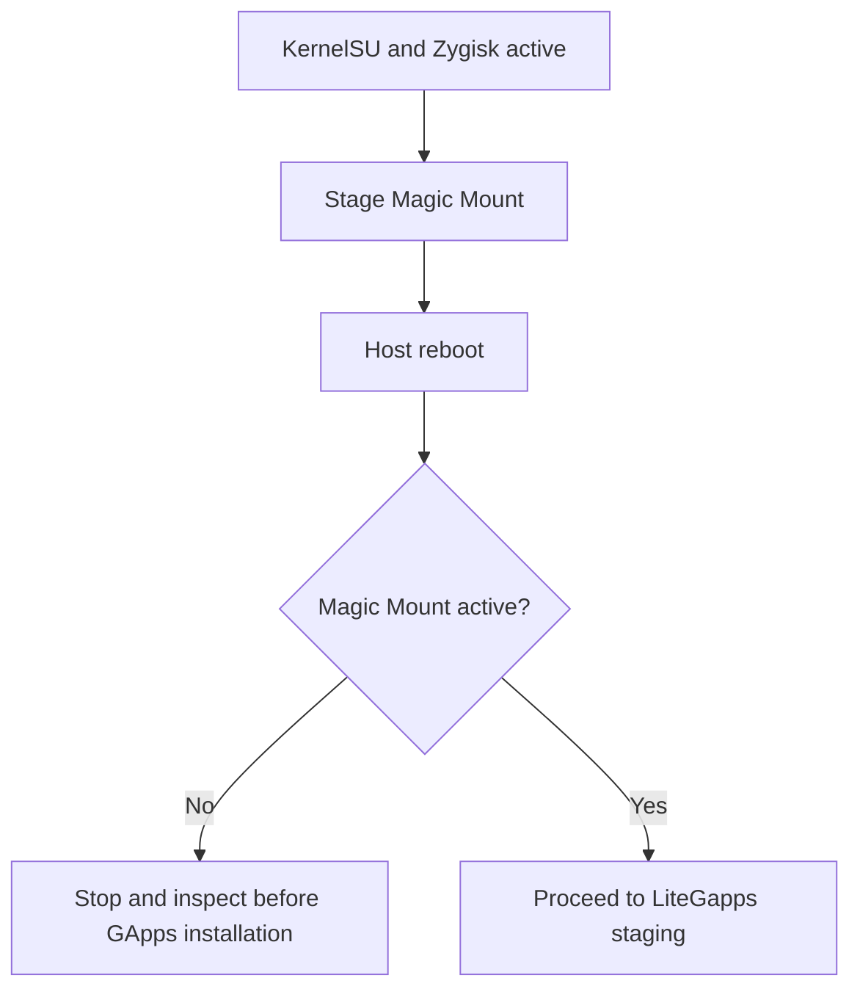
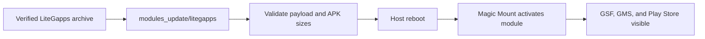

# ReDroid 14 on Coolify: Complete Migration and Setup Record

This run migrated the existing hand-managed ReDroid deployment to a Coolify-managed Docker Compose service, then installed and validated KernelSU Next, Zygisk Next, LSPosed, Magic Mount, and LiteGapps.

Do not put SSH private keys, Coolify API tokens, or Coolify/Sentinel tokens in this file, terminal history, or source control.

## Final verified state

- Host kernel: `6.8.12-zksu`
- Host architecture/page size: ARM64 / 4 KiB pages
- ReDroid image: `redroid/redroid@sha256:0a611199ba2e0b5d60af39b3327a517f6407231f4352114ed3bd3cbfe2be69aa`
- Coolify resource: **ReDroid 14 KernelSU**
- Coolify project/environment: `My first project` / `production`
- Container management: Coolify Docker Compose service
- ADB publication: `0.0.0.0:5555` and `[::]:5555` for the FastAPI container, but
  external access is now blocked at the host by a `DOCKER-USER` drop rule
  (persisted via `redroid-adb-firewall.service`); only the docker `172.16/12`
  networks and the localhost SSH tunnel can reach it. Closing 5555 to the public
  internet was mandatory: an exposed ADB port let the `com.hagaseca.thost9` ADB
  worm in (see "ADB became offline"). Still to do: close 5555 in the Oracle Cloud
  Security List too.
- Persistent data: `/home/ubuntu/redroid14-data`
- Enabled Android root stack:
  - KernelSU Next Manager `3.3.0`
  - KernelSU daemon `ksud 3.3.0`
  - Zygisk Next `1.4.3 (817-e815170-release)`
  - LSPosed `v1.9.2 (7024)`
  - Magic Mount metamodule `v1.0.1-sprout`
  - LiteGapps ARM64 Android 14 Lite `v4.9`, build `2026-01-18`
  - Customized Play Integrity Fix `v4.7-1`
  - TEESimulator-RS `v6.0.1-282` under module ID `tricky_store`
  - Persistent Android 14 Conscrypt capture-CA module
- Target-App runtime:
  - official Play-signed Target-App split APKs installed from the retained APKS;
  - preserved PairIPFix and TalsecKill APKs enabled and scoped only to Target-App;
  - Target-App retained one PID for five minutes after a full host reboot;
  - a Coolify Restart triggered guarded host recovery, after which Target-App
    retained one PID for another verified five minutes;
  - final HTTPS capture contained 18 completed HTTP responses and **zero 4xx**;
  - the Target-App token-bearing API request returned **HTTP 200**.
- Restart persistence:
  - `/home/ubuntu/redroid14-data` is an explicit read-write bind mount at `/data`;
  - Docker uses `restart: unless-stopped`;
  - a host watcher detects broken LSPosed state after Docker/Coolify-only
    restarts and schedules one guarded VPS reboot;
  - the guard prevents a host-reboot loop if recovery ever remains incomplete;
  - full VPS reboot and Coolify Restart recovery were tested successfully.
- Stable service identity:
  - external Docker network: `redroid-persistent`;
  - fixed subnet: `172.29.14.0/24`;
  - configured/runtime hostname: `redroid14-ksu`;
  - persistent Docker DNS aliases: `redroid14` and `redroid14-ksu`;
  - the same external network ID survived two Coolify force-redeployments.
- Final ten-minute stability gate: passed.
  - Memory stabilized around `1.85–2.11 GiB` out of the configured `8 GiB` limit.
  - PID count stabilized around `1,232–1,471`, below the `8,192` Docker limit.
  - Android remained boot-complete throughout.
  - No OOM, kernel panic, or kernel BUG signal was detected.

## Files added for Coolify

All files are in `KernelSU_setup/coolify/`:

| File | Purpose |
|---|---|
| `docker-compose.yml` | Coolify-managed pinned ReDroid Compose service. |
| `remove-legacy-redroid.sh` | Deletes the previous hand-managed ReDroid container and Android data only when explicitly asked to purge. |
| `prepare-coolify-host.sh` | Configures BinderFS/module loading on the host. |
| `stage-root-stack.sh` | Installs `ksud`, KernelSU Manager, Zygisk Next, and LSPosed. |
| `install-litegapps.sh` | Installs Magic Mount and verified LiteGapps in separate rebooted stages. |
| `validate-coolify-redroid.sh` | Validates the root stack or the full GApps stack. |
| `mitmproxy-ca-post-fs-data.sh` | Rebuilds Android 14's active Conscrypt APEX CA view with the local capture CA. |
| `redroid-kernelsu-replay.sh` | Detects loss of LSPosed after a Coolify restart and schedules one guarded host reboot. |
| `redroid-kernelsu-replay.service` | Keeps the guarded recovery watcher active on the VPS. |
| `redroid-api-network.sh` | Reattaches recreated FastAPI containers, refreshes the production ReDroid network mapping, and calls `/adb/connect`. |
| `redroid-api-network.service` | Keeps API networking and its ADB transport healthy without restarting ReDroid. |

## 1. Upload the deployment bundle

Run from the Windows repository root. Replace the key and server placeholders.

```powershell
$Key = 'C:/path/to/private-key.key'
$Target = 'ubuntu@SERVER_IP'

ssh -i $Key $Target 'test -d /home/ubuntu/kbuild'
scp -i $Key -r '.\KernelSU_setup\coolify' "${Target}:/home/ubuntu/kbuild/"
scp -i $Key -r '.\KernelSU_setup\vps' "${Target}:/home/ubuntu/kbuild/"

ssh -i $Key $Target '
  chmod 0755 /home/ubuntu/kbuild/coolify/*.sh
  sudo docker compose -f /home/ubuntu/kbuild/coolify/docker-compose.yml config --quiet
'
```

The `vps/` upload supplies the pre-existing BinderFS systemd unit files used by `prepare-coolify-host.sh`.

## 2. Delete the legacy ReDroid deployment

This was executed on the VPS:

```bash
sudo bash /home/ubuntu/kbuild/coolify/remove-legacy-redroid.sh \
  --purge-data --remove-image --remove-legacy-units
```

It performed the following controlled removal:

- stopped and disabled `redroid14.service`, `redroid14-watchdog.service`, and `redroid14-validate.service`;
- removed the former `redroid14-ksu` container;
- permanently removed `/home/ubuntu/redroid14-data`;
- removed the old pinned ReDroid image when no longer in use;
- removed only the legacy ReDroid service/validator/watchdog units.

It intentionally preserved the custom KernelSU host kernel, Android installation assets, and reusable BinderFS host configuration.

## 3. Prepare BinderFS on the host

This was executed on the VPS:

```bash
sudo bash /home/ubuntu/kbuild/coolify/prepare-coolify-host.sh
```

The script requires all of the following before it proceeds:

```bash
uname -r                         # must be 6.8.12-zksu
dpkg --print-architecture         # must be arm64
getconf PAGESIZE                  # must be 4096
```

It installs/enables the following host prerequisites:

```bash
/etc/modules-load.d/redroid-binder.conf
/etc/modprobe.d/redroid-binder.conf
/etc/systemd/system/dev-binderfs.mount
/etc/systemd/system/binder-bindmounts.service
/etc/systemd/system/redroid-binder-permissions.service
```

Verify them with:

```bash
systemctl is-active \
  dev-binderfs.mount \
  binder-bindmounts.service \
  redroid-binder-permissions.service

stat -Lc '%n %a' \
  /dev/binderfs/binder \
  /dev/binderfs/hwbinder \
  /dev/binderfs/vndbinder
```

Each Binder node must be a character device with mode `666`.

## 4. Create the service in Coolify

The deployment has three deliberately separate layers: Coolify manages the
container lifecycle, the persistent Docker network provides stable service
addressing, and the host/API watchers repair connectivity without restarting
Android unnecessarily.



The service was created through Coolify's local API so it is visible and managed in the Coolify GUI. The Compose definition is `KernelSU_setup/coolify/docker-compose.yml`.

Create the external network once on the VPS **before the first deployment**:

```bash
if ! sudo docker network inspect redroid-persistent >/dev/null 2>&1; then
  sudo docker network create \
    --driver bridge \
    --attachable \
    --subnet 172.29.14.0/24 \
    --label com.redroid.persistent=true \
    redroid-persistent
fi
```

The Compose file declares this network as `external: true`. Compose and Coolify
can attach or recreate containers, but they cannot rename or delete the network.

If creating it manually in the GUI instead:

1. Open the Coolify project and select the `production` environment.
2. Create a **Service** using **Docker Compose**.
3. Name it `ReDroid 14 KernelSU`.
4. Paste the contents of `KernelSU_setup/coolify/docker-compose.yml`.
5. Do not add a public domain or proxy route.
6. Deploy it.

Important Compose properties:

```yaml
privileged: true
restart: unless-stopped
cpus: 1.5
mem_limit: 8g
memswap_limit: 10g
pids_limit: 8192
hostname: redroid14-ksu
ports:
  - "5555:5555"
networks:
  redroid-persistent:
    aliases:
      - redroid14
      - redroid14-ksu
```

The service mounts the three persistent BinderFS nodes and the persistent Android data directory. It also maps `/dev/kmsg` to `/dev/null`, so Android cannot write the real host kernel log. `restart: unless-stopped` makes the Coolify-managed container return automatically after Docker or the VPS restarts; the memory and PID limits still bound a failed workload.

### Display and scrcpy responsiveness

On the GPU-less Ampere host, `androidboot.redroid_gpu_mode=guest` is required.
Without explicit display arguments, this ReDroid image exposed a 720×1280 display
at only 15 Hz (`dumpsys display` reported `renderFrameRate=15.000001`). The image
and host were both ARM64, BinderFS devices matched by inode, 2 GiB swap was
active, and there was no OOM event; the 15 Hz display ceiling was the primary
source of visibly delayed UI interaction.

The conservative two-core configuration is:

```yaml
command:
  - androidboot.redroid_gpu_mode=guest
  - androidboot.use_memfd=1
  - androidboot.redroid_width=720
  - androidboot.redroid_height=1280
  - androidboot.redroid_dpi=320
  - androidboot.redroid_fps=24
```

Keep the existing 1.5-CPU safety limit initially. During a 38-second scrcpy/UI
interaction sample at 15 Hz, the cgroup was throttled in 26 of 384 periods and
accumulated about 0.8 seconds of throttled time, so CPU quota pressure existed
but was not the main bottleneck. Re-measure `cpu.stat` after enabling 24 Hz before
raising the quota or trying 30 Hz.

Disable Android animation delays once; these settings persist under `/data`:

```bash
adb shell settings put global window_animation_scale 0
adb shell settings put global transition_animation_scale 0
adb shell settings put global animator_duration_scale 0
adb shell settings put global disable_window_blurs 1
```

Use H.264 and do not ask scrcpy for frames the device cannot produce:

```powershell
scrcpy -s 127.0.0.1:5555 `
  --max-size=720 --max-fps=24 --video-bit-rate=2M `
  --video-codec=h264 --no-audio
```

Do not use H.265 for this CPU-only path. If 24 Hz materially increases cgroup
throttling or produces new stutter, set `androidboot.redroid_fps=20`; only test
30 Hz after 24 Hz passes the same interaction sample. The deployed 24 Hz profile
passed: an equivalent interaction sample was throttled in 6 of 426 periods and
added only about 79 ms of throttled time, with no OOM or container restart.

`5555:5555` publishes ADB on all VPS interfaces. It was selected so the API can
reach Docker's published-port path. No persistent `DOCKER-USER` restriction was
installed in this run. Keep the cloud/VPS firewall closed to untrusted TCP/5555
sources. Windows operators should continue using the SSH tunnel rather than a
direct public ADB connection.

The `/data` binding is deliberately expressed in long Compose syntax:

```yaml
- type: bind
  source: /home/ubuntu/redroid14-data
  target: /data
  bind:
    create_host_path: true
```

This host directory owns Android app data, the ADB authorization file, KernelSU
modules, LSPosed's database, TEESimulator configuration, the keybox, and the CA
module. Recreating the Coolify container therefore does not recreate Android.

Coolify adds its own generated suffix to the actual Docker container name. Do **not** assume the container is named `redroid14-ksu`. The supplied scripts resolve it by the Coolify label:

```bash
sudo docker ps -q --filter 'label=coolify.serviceName=redroid14'
```

Docker's generated container name and IP address can change. Android init resets the kernel hostname to
`localhost`; the guarded host service reapplies `redroid14-ksu` after every
successful Android boot.

FastAPI keeps the requested serial `redroid14:5555`. The host watcher resolves
only the production `coolify.serviceName=redroid14` endpoint on
`redroid-persistent` and refreshes that name inside the API container. This
bypasses the published-port hairpin path, which returned `No route to host`
after a VPS reboot.

Verification:

```bash
CONTAINER=$(sudo docker ps -q --filter 'label=coolify.serviceName=redroid14')

sudo docker exec "$CONTAINER" hostname
sudo docker inspect "$CONTAINER" --format '{{.Config.Hostname}}'
sudo docker network inspect redroid-persistent --format \
  'name={{.Name}} id={{.Id}} subnet={{range .IPAM.Config}}{{.Subnet}}{{end}}'

sudo docker run --rm --network redroid-persistent busybox:1.36 \
  nslookup redroid14. 127.0.0.11
sudo docker run --rm --network redroid-persistent busybox:1.36 \
  nslookup redroid14-ksu. 127.0.0.11
```

The trailing dots in `nslookup` prevent the VPS DNS search suffix from being
appended. ICMP ping is not a valid health check for this Android container; DNS
resolution is the service-identity contract. Coolify also attaches its proxy to
service networks, so seeing both ReDroid and `coolify-proxy` as endpoints is
expected and is not a stale deployment.

### 4.1 Persist FastAPI access to ADB

The FastAPI source of truth is `D:\PROJECT\_TRASH\DW-fast-api`. Its Compose file
contains:

```yaml
services:
  dw-fast-api:
    networks:
      redroid-persistent:
        aliases:
          - dw-fast-api
networks:
  redroid-persistent:
    external: true
    name: redroid-persistent
```

Coolify's API environment remains:

```dotenv
DEV_MODE=false
DEFAULT_ADB_SERIAL=redroid14:5555
```

The source and Compose were copied to
`/home/ubuntu/kbuild/api-deployment/` over SSH; GitHub was not changed. Install
the VPS fallback watcher:

```bash
sudo install -m 0755 \
  /home/ubuntu/kbuild/coolify/redroid-api-network.sh \
  /usr/local/sbin/redroid-api-network
sudo install -m 0644 \
  /home/ubuntu/kbuild/coolify/redroid-api-network.service \
  /etc/systemd/system/redroid-api-network.service
sudo systemctl daemon-reload
sudo systemctl enable --now redroid-api-network.service
```

For each new API container ID/start timestamp, the watcher:

1. attaches it to `redroid-persistent` if required;
2. resolves the production ReDroid IP on `redroid-persistent` and maps
   `redroid14` to that current address in the API container's `/etc/hosts`;
3. waits for FastAPI port `8001`;
4. calls the retry-safe internal `POST /adb/connect` route with the configured
   admin key when required;
5. does not restart the API container.

It also checks `adb get-state` every 30 seconds. After two failed checks it
resets only the API container's ADB server and calls `/adb/connect`. If that
fails, it performs one targeted Android `adbd` stop/start and retries. Recovery
is rate-limited and never restarts the ReDroid container or VPS.

The behavior was tested through a Coolify application restart. The recreated
container automatically rejoined the network and reported:

```text
DEFAULT_ADB_SERIAL=redroid14:5555
TCP peer=<production-redroid-persistent-IP>:5555
ADB state=device
/adb/status online=true
/health status=ok, adb_ready=true
```

It was also tested by deliberately killing the API-side ADB server. The watcher
restored `redroid14:5555` while the VPS boot ID, ReDroid container start time,
and Android `adbd` PID remained unchanged.

## 5. Stage KernelSU Manager, Zygisk Next, and LSPosed

The root stack is activated in stages because KernelSU hooks are installed by
the host kernel during boot, while Zygisk and LSPosed are Android runtime
components that depend on those hooks.



After the first Coolify deployment reaches Android boot completion, run:

```bash
sudo bash /home/ubuntu/kbuild/coolify/stage-root-stack.sh
```

This script verifies `artifacts/android/SHA256SUMS`, installs the KernelSU Manager APK, installs the `ksud` binary into persistent Android data, and stages both modules:

```text
/data/adb/modules_update/zygisksu
/data/adb/modules_update/zygisk_lsposed
```

A host reboot is mandatory because KernelSU init hooks execute at host kernel boot:

```bash
sudo reboot
```

After the VPS returns, the `unless-stopped` policy starts ReDroid automatically.
Wait for `sys.boot_completed=1`; do not issue a second restart during boot.

Validate the activated root stack:

```bash
sudo bash /home/ubuntu/kbuild/coolify/validate-coolify-redroid.sh root
```

Expected module IDs:

```text
zygisksu
zygisk_lsposed
```

## 6. Install Magic Mount

LiteGapps changes Android system paths, so KernelSU requires an active metamodule first. Stage Magic Mount:

```bash
sudo bash /home/ubuntu/kbuild/coolify/install-litegapps.sh metamodule
sudo reboot
```

After the VPS returns, wait for the automatically started Coolify service. Confirm Magic Mount is active:

```bash
CONTAINER=$(sudo docker ps -q --filter 'label=coolify.serviceName=redroid14')
sudo docker exec "$CONTAINER" /data/adb/ksud module metamodule
sudo docker exec "$CONTAINER" sh -c \
  'grep -F "Magic Mount Completed Successfully" /data/adb/magic_mount/mm.log'
```

Expected metamodule status: `Installed`.



## 7. Install LiteGapps

Run:

```bash
sudo bash /home/ubuntu/kbuild/coolify/install-litegapps.sh litegapps
```

The script downloads and verifies:

```text
LiteGapps-arm64-14.0-20260118-official.zip
SHA-256: 6308d96e359dd61f40ff32c9828108a0b2695cc21701204600b4513b7379876a
```

Before installation it remounts Android `/dev` to `768 MiB`. LiteGapps expands to more than 300 MiB through `/dev/tmp`; Docker's default 64 MiB `/dev` tmpfs is insufficient.

Before rebooting, validate the staged payload:

```bash
CONTAINER=$(sudo docker ps -q --filter 'label=coolify.serviceName=redroid14')

sudo docker exec "$CONTAINER" du -sh /data/adb/modules_update/litegapps
sudo docker exec "$CONTAINER" stat -c '%n %s bytes' \
  /data/adb/modules_update/litegapps/system/product/priv-app/GmsCore/GmsCore.apk \
  /data/adb/modules_update/litegapps/system/product/priv-app/Phonesky/Phonesky.apk
```

Expected values for the pinned archive:

```text
~305M  /data/adb/modules_update/litegapps
GmsCore.apk   225469269 bytes
Phonesky.apk   76478510 bytes
```

Then activate the module:

```bash
sudo reboot
```

After the VPS returns and Android completes its automatic start, run:

```bash
sudo bash /home/ubuntu/kbuild/coolify/validate-coolify-redroid.sh gapps
```

The final validator confirms all of these packages are visible to Android:

```text
com.google.android.gsf
com.google.android.gms
com.android.vending
```



## 8. Configure Play Integrity Fix and TEESimulator-RS

The retained customized PIF source is under
`rev-eng/PlayIntegrityFix-KOWX712/module/`. The official binary payload was
downloaded and verified before replacing only the reviewed scripts/properties.

Verified artifacts used in this run:

```text
PlayIntegrityFix_v4.7-1-inject-s.zip
10eec591735cafee437332871443a2fadf6632b1a58abb16fe2461d9df100ab1

PlayIntegrityFix_v4.7-1-redroid.zip (this run's repack)
e8c96498c46e2c87a4e6888a487159ef4d6f0bcda07b5f6835723370b2e76329

TEESimulator-RS-v6.0.1-282-Release.zip
4cde854bdc6add7a3f587dae24d3cefff519206716b2d0dea7ff4c2772bb86ef
```

Both ZIPs were installed using the persistent `ksud`:

```bash
CONTAINER=$(sudo docker ps -q --filter 'label=coolify.serviceName=redroid14')

sudo docker exec "$CONTAINER" mount -o remount,size=768M /dev
sudo docker cp PlayIntegrityFix_v4.7-1-redroid.zip \
  "$CONTAINER:/data/local/tmp/PlayIntegrityFix.zip"
sudo docker exec "$CONTAINER" \
  /data/adb/ksud module install /data/local/tmp/PlayIntegrityFix.zip

sudo docker cp TEESimulator-RS-v6.0.1-282-Release.zip \
  "$CONTAINER:/data/local/tmp/TEESimulator-RS.zip"
sudo docker exec "$CONTAINER" \
  /data/adb/ksud module install /data/local/tmp/TEESimulator-RS.zip
```

The authorized keybox was copied to
`/data/adb/tricky_store/keybox.xml` with owner `root:root`, mode `0600`, and
verified SHA-256 `5c9ba17bc4f6ef2b746c82875c53481cb1217cd0bfd5901543af31ad593da3f8`.
Never print or commit its private-key contents.

Final TEESimulator targets:

```text
com.google.android.gms
gr.nikolasspyr.integritycheck
  <target-app-package>
```

`com.android.vending` was removed from that target list because injecting the
current stack into Play Store caused an early Android `Resources` NPE. It is not
required for Target-App's GMS attestation request.

Final `pif.prop` runtime switches are conservative:

```properties
spoofBuild=false
spoofProps=false
spoofProvider=false
spoofSignature=false
spoofVendingBuild=false
spoofVendingSdk=false
DEBUG=false
```

PIF's `post-fs-data.sh` still applies the coherent global Pixel 5 Android 14
profile documented in `rev-eng/network-tools/captures/README.md`. TEESimulator
owns the selected package attestation path. This exact family of TEESimulator,
keybox, and package targets produced Basic, Device, and Strong labels in the
earlier controlled checker run. A separate checker UI run was not repeated in
this migration; the decisive current-run evidence is Target-App's token-bearing
v3 request returning HTTP 200.

After activating the modules, GSF and Play Store data were reset once, the host
was rebooted, and the newly generated GSF ID was submitted at:

```text
https://www.google.com/android/uncertified/
```

Do not clear GSF again unless a new ID will also be registered.

## 9. Install Target-App and its existing LSPosed fixes

The shortest reliable route was the retained original Play-signed split set,
not Play Store. The APKS identity was:

```text
  rev-eng/apk-extractor/target-apk/Target-App_<version>_<build>_Play.apks
SHA-256 <sha256-of-retained-target-app-apks>
```

Extract and install the four required splits from Windows:

```powershell
$Dir = Join-Path $env:LOCALAPPDATA 'Temp\kilo\target-app-<version>'
New-Item -ItemType Directory -Force $Dir | Out-Null
tar -xf '.\rev-eng\apk-extractor\target-apk\Target-App_<version>_<build>_Play.apks' -C $Dir

adb -s 127.0.0.1:5555 install-multiple -i com.android.vending `
  "$Dir\base.apk" `
  "$Dir\split_config.arm64_v8a.apk" `
  "$Dir\split_config.en.apk" `
  "$Dir\split_config.xhdpi.apk"
```

Verified package state:

```text
versionName=<target-app-version>
versionCode=<target-app-build>
installerPackageName=com.android.vending
initiatingPackageName=com.android.shell
```

The shell initiator is expected for this sideload path. PairIPFix and the
already-configured TalsecKill handle the local checks. TalsecKill source and APK
were **not modified or rebuilt** in this reproduction.

Install the preserved modules:

```powershell
adb -s 127.0.0.1:5555 install -r 'rev-eng\modules\pairipfix.apk'
adb -s 127.0.0.1:5555 install -r 'rev-eng\modules\pairipfix.apk'
adb -s 127.0.0.1:5555 install -r 'rev-eng\modules\talseckill.apk'
```

Artifact hashes from this run:

```text
pairipfix.apk  0b2da5a7e10844437e3e643476b6236ac69eb38bf348ea06189d6bdabd461d40
talseckill.apk 7304bc235393682b70a26bd62bd91db69ad3a97f92f9a1876d3ac9cfc9b09e3d
```

Android's bundled SQLite aborted when opening LSPosed's WAL database. The safe
procedure used the VPS SQLite implementation while `lspd` was frozen:

```bash
CONTAINER=$(sudo docker ps -q --filter 'label=coolify.serviceName=redroid14')
LSPD_PID=$(sudo docker exec "$CONTAINER" pidof lspd)
DB=/home/ubuntu/redroid14-data/adb/lspd/config/modules_config.db

sudo docker exec "$CONTAINER" kill -STOP "$LSPD_PID"
sudo sqlite3 "$DB" '
BEGIN IMMEDIATE;
UPDATE modules SET enabled=1
 WHERE module_pkg_name IN (
   "io.github.ahmedmani.io.github.ahmedmani.pairipfixio.github.ahmedmani.pairipfix",
   "com.recon.talsecbypass"
 );
INSERT OR IGNORE INTO scope(mid,app_pkg_name,user_id)
  SELECT mid,"<target-app-package>",0 FROM modules
 WHERE module_pkg_name="io.github.ahmedmani.io.github.ahmedmani.pairipfixio.github.ahmedmani.pairipfix";
INSERT OR IGNORE INTO scope(mid,app_pkg_name,user_id)
  SELECT mid,"<target-app-package>",0 FROM modules
 WHERE module_pkg_name="com.recon.talsecbypass";
COMMIT;
'
sudo reboot
```

The reboot occurs while `lspd` is frozen; do not resume a writer after replacing
or updating its database and WAL externally.

Runtime verification retained one Target-App PID for five minutes. Logs proved
PairIPFix installed all four hooks and TalsecKill loaded the existing v24 flow,
blocked the native self-kill, sanitized the signed AppiCrypt check set, and left
`FNatives.z()` signing active.

## 10. Persist the Android 14 capture CA

The local mitmproxy CA used by the successful capture had:

```text
old subject hash: c8750f0d
SHA-256: 5034cfcde54293421240c1da91186bd09a2ebb1863bb5c676e57734ce0dc9776
```

Android 14 reads the active system trust store from
`/apex/com.android.conscrypt/cacerts`. Adding a file only under
`/system/etc/security/cacerts` is insufficient.

A small KernelSU module named `mitmproxy-ca` stores the public certificate under
the persistent `/data/adb/modules` tree. Its `post-fs-data.sh` is the repository
file `mitmproxy-ca-post-fs-data.sh`. It creates a new mirror of the Conscrypt CA
directory, adds `c8750f0d.0`, and bind-mounts that mirror before Zygote starts.
It never deletes an older mirror because that directory may still back a live
bind mount.

Verify both active stores after boot:

```bash
CONTAINER=$(sudo docker ps -q --filter 'label=coolify.serviceName=redroid14')
sudo docker exec "$CONTAINER" sha256sum \
  /system/etc/security/cacerts/c8750f0d.0 \
  /apex/com.android.conscrypt/cacerts/c8750f0d.0
sudo docker exec "$CONTAINER" stat -c '%a %n' \
  /apex/com.android.conscrypt/cacerts/c8750f0d.0
```

The active APEX file must have the expected hash and mode `644`.

Do not bind the PEM directly to an `/apex/...` path in Compose. Android mounts
the signed APEX during its own initialization and would hide an earlier Docker
file bind. The durable Compose binding is `/data`; the KernelSU module performs
the APEX-aware mount at the correct Android boot stage.

## 11. Survive Docker and Coolify-only restarts

A full VPS reboot naturally runs KernelSU's boot stages. A Docker/Coolify-only
restart preserves every file under `/data`, but it cannot reliably reconstruct
KernelSU's Zygisk/LSPosed process state. The reproduced failure had correct APK
paths and LSPosed database scopes but no running `lspd`; Target-App then exited
itself because PairIPFix and TalsecKill were not injected.

Install the supplied host watcher:

```bash
sudo install -m 0755 \
  /home/ubuntu/kbuild/coolify/redroid-kernelsu-replay.sh \
  /usr/local/sbin/redroid-kernelsu-replay
sudo install -m 0644 \
  /home/ubuntu/kbuild/coolify/redroid-kernelsu-replay.service \
  /etc/systemd/system/redroid-kernelsu-replay.service

sudo systemctl daemon-reload
sudo systemctl enable --now redroid-kernelsu-replay.service
```

For each new container start timestamp the watcher:

1. waits for Android boot completion;
2. allows another minute for LSPosed startup;
3. checks GSF, the active Conscrypt CA, and a running `lspd` process;
4. when any check is missing, writes a persistent recovery-pending guard and
   schedules one complete VPS reboot;
5. clears the guard only after the next host boot passes every check;
6. refuses a second reboot when the pending guard remains, preventing a loop.

Do not replace this with repeated `ksud post-fs-data` plus Android soft reboots.
That experiment restored GApps/CA mounts but left `lspd` absent, so Target-App
continued exiting. This custom-kernel deployment requires a host boot to restore
the complete KernelSU/Zygisk/LSPosed chain.

Status commands:

```bash
systemctl is-active redroid-kernelsu-replay.service
sudo journalctl -u redroid-kernelsu-replay.service -b --no-pager
```

Both recovery cases were tested:

- full VPS reboot: ReDroid started automatically with GApps, Target-App, modules,
  keybox, and CA intact;
- Coolify **Restart**: the watcher detected missing `lspd`, logged
  `scheduling one guarded VPS reboot`, and rebooted the host once. The following
  boot logged that KernelSU, LSPosed, GApps, and CA were healthy.

After that exact Coolify Restart recovery, Target-App retained PID `2469` at every
30-second sample from 0 through 300 seconds. Runtime logs again showed PairIPFix
`4/4 hooks applied`, TalsecKill loaded, the AppiCrypt hook installed,
`FNatives.z` preserved, and `FNatives.x` self-kills blocked.

## 12. Final network-capture result

Run the repository capture utility through the private ADB tunnel:

```powershell
python -u '.\rev-eng\network-tools\capture-live-networks.py' `
  --serial 127.0.0.1:5555 `
  --name target-app-coolify-final
```

Launch Target-App once, wait about 45–55 seconds, and stop capture with Ctrl+C.
The verified capture is ignored by Git:

```text
rev-eng/network-tools/captures/target-app-coolify-final_YYYYMMDD_HHMMSS_NNNNNN.json
```

Secret-safe result:

```text
completed HTTP records: 18
HTTP 4xx responses:      0
GET  /api/v1/ads/get_al                     304
GET  /api/v1/appuser/version                304
POST /api/v1/appuser/<target-app-resource>/<api-version>  200
all other completed capture responses       2xx/304
```

The app remained alive after capture. Clear proxy state even after a normal
capture exit:

```powershell
adb -s 127.0.0.1:5555 shell settings put global http_proxy :0
adb -s 127.0.0.1:5555 shell settings delete global global_http_proxy_host
adb -s 127.0.0.1:5555 shell settings delete global global_http_proxy_port
adb -s 127.0.0.1:5555 shell settings delete global global_http_proxy_exclusion_list
adb -s 127.0.0.1:5555 shell settings delete global global_proxy_pac_url
adb -s 127.0.0.1:5555 reverse --remove tcp:8080
adb -s 127.0.0.1:5555 shell logcat -c
```

Capture JSON contains request headers and token-bearing bodies. Keep it under
the ignored `captures/` directory and do not publish it.

## 13. Stability gate used for this deployment

The following ten-minute monitor was run after LiteGapps validation:

```bash
set -Eeuo pipefail
started=$(date --iso-8601=seconds)

for sample in $(seq 1 11); do
  container=$(sudo docker ps -q --filter 'label=coolify.serviceName=redroid14' | head -n1)
  test -n "$container"
  test "$(sudo docker inspect --format '{{.State.Running}}' "$container")" = true
  test "$(sudo docker exec "$container" getprop sys.boot_completed)" = 1
  test "$(sudo docker inspect --format '{{.State.OOMKilled}}' "$container")" = false

  sudo docker stats --no-stream \
    --format "sample=$sample {{.Name}} cpu={{.CPUPerc}} mem={{.MemUsage}} pids={{.PIDs}}" \
    "$container"

  if sudo journalctl -k --since "$started" --no-pager | \
    grep -qiE 'kernel panic|BUG:|out of memory|killed process'; then
    echo 'Critical kernel event detected' >&2
    exit 1
  fi

  [ "$sample" -eq 11 ] || sleep 60
done
```

It completed successfully.

## Blockers encountered and fixes applied

### Legacy ReDroid scripts were not on the VPS

**Symptom**

```text
Missing required host unit: /home/ubuntu/kbuild/coolify/../vps/dev-binderfs.mount
```

**Fix**

Uploaded `KernelSU_setup/vps/` to `/home/ubuntu/kbuild/vps/`, then reran:

```bash
sudo bash /home/ubuntu/kbuild/coolify/prepare-coolify-host.sh
```

### Coolify API initially disabled

**Symptom**

```text
{"success":true,"message":"API is disabled."}
```

**Fix**

The deployment automation temporarily enabled Coolify's local API, generated a short-lived root-team API token, created/restarted the service, then removed the token and disabled the API again. No persistent deployment token is required.

### Coolify rejected `connect_to_docker_network` during service creation

**Symptom**

```text
{"message":"Validation failed.","errors":{"connect_to_docker_network":["This field is not allowed."]}}
```

**Fix**

Omitted that optional field from the initial creation request. The ReDroid service does not need an application network connection.

### Initial ReDroid creation failed when `/dev` was explicitly tmpfs-mounted

**Symptom**

```text
error reopening /dev/null inside container: open /dev/null: permission denied
```

**Cause and fix**

A Compose-level `/dev` tmpfs conflicted with the `/dev/null:/dev/kmsg` safety bind mount. The permanent `/dev` tmpfs entry was removed from `docker-compose.yml`. The LiteGapps script instead enlarges `/dev` only for its installation session:

```bash
docker exec "$CONTAINER" mount -o remount,size=768M /dev
```

### Coolify changes `container_name`

Coolify rewrites the Compose `container_name` to a resource-specific generated name. Static scripts targeting `redroid14-ksu` would fail.

**Fix**

All root/GApps/validation scripts now locate the live container through:

```bash
docker ps -q --filter 'label=coolify.serviceName=redroid14'
```

They fall back to stopped containers only when no running match exists. This
avoids a transient two-container result during a Coolify force-recreate.

### Initial API Start returned “already running” after a host reboot

The first revision used `restart: "no"`. Coolify's resource state could remain
stale while Docker had stopped the container during host shutdown.

**Final fix**

The Compose service now uses `restart: unless-stopped`. BinderFS units run before
Docker, and `/data` remains bind-mounted from `/home/ubuntu/redroid14-data`, so
the container returns automatically without losing Android or module state.

### Coolify restart preserved data but initially lost module mounts

**Symptom**

After a Coolify-only restart, `/data` and every module directory remained, but
GSF/Play Store and the Android 14 APEX CA were absent from Android's fresh mount
namespace.

**Fix**

Installed `redroid-kernelsu-replay.service`. It detects the new Docker start
timestamp and validates GSF, the Conscrypt CA, and `lspd`. If LSPosed is absent,
it schedules one guarded full VPS reboot. This restored PairIPFix/TalsecKill
injection; the post-recovery five-minute Target-App PID test passed.

The root cause was therefore not missing APKs, stale APK paths, or missing scope
rows. Those were all correct. The cause was the absent `lspd` process after an
unsupported container-only KernelSU recovery attempt.

### Production ADB became unreachable after the experimental-host reboot

**Incident boundary (2026-08-19):** `redroid14` is production;
`redroid-experimental` is a separate Coolify service. The production Android
container itself did not fail during this incident. It was boot-complete and
Docker-healthy, `adbd` and `lspd` were running, GSF and the Conscrypt CA were
present, and the guarded KernelSU watcher reported the production stack healthy.
The failure was the network path used to reach production ADB.

**Symptoms**

```text
DW-fast-api /health: status=degraded, adb_ready=false
adb connect redroid14:5555: No route to host
pending capture queue: full
Windows adb through 127.0.0.1:5555: offline
```

The old API mapping sent `redroid14:5555` to the persistent-network gateway
`172.29.14.1:5555`, relying on Docker's published-port hairpin path. After the
VPS reboot, Docker forwarded that port toward ReDroid's Coolify-network address,
but traffic originating from `redroid-persistent` could not complete that
cross-network path. FastAPI then exhausted the primary transport, probed the
non-listening `:5554` fallback, closed recovery admission, and filled its bounded
pending queue. The Windows tunnel had the same problem because it targeted the
host's published `127.0.0.1:5555` path.

The decisive check from inside FastAPI was:

```text
172.29.14.1:5555                         No route to host
production redroid14 network IP:5555    connected
```

**Fix applied without restarting production ReDroid**

1. Updated `redroid-api-network.sh` to resolve only the container carrying
   `coolify.serviceName=redroid14` and obtain its current IP on
   `redroid-persistent`.
2. Replaced the stale gateway entry in FastAPI's `/etc/hosts` with that
   production IP while retaining the application serial `redroid14:5555`.
3. Restarted only FastAPI to clear the stuck recovery generation and full
   pending queue; production ReDroid was not restarted.
4. Reconnected Windows through an SSH tunnel whose remote target is the resolved
   production ReDroid IP rather than the broken host-published port.

Final validation:

```text
DW-fast-api /health: status=ok, adb_ready=true, adb_transport_online=true
pending_captures=0, recovery_pending=false
redroid14:5555 device
Windows 127.0.0.1:5555 device
production Diskwala PID present
all health-enabled Docker containers healthy
```

The watcher refreshes the mapping every health interval, so a future production
container IP change is repaired automatically. Never resolve or substitute the
`redroid-experimental` address for `redroid14`; the Coolify service label is the
production/experimental safety boundary.

### ADB became offline: `com.hagaseca.thost9` ADB worm (TCP/5555 hijack)

**Confirmed root cause: internet-exposed ADB.** ReDroid's ADB port was published
on `0.0.0.0:5555` **and** allowed through the host firewall (`ufw` had
`5555/tcp ALLOW IN Anywhere`, and the `DOCKER-USER` iptables chain was empty), so
any host on the internet could reach `adb`. `com.hagaseca.thost9` is a **known,
in-the-wild ReDroid/ADB worm** (variant renames `thost4` (2025) -> `thost9`
(2026)) that scans the internet for open port 5555, installs itself over
unauthenticated `adb`, then **squats TCP/5555 itself** (rewrites
`service.adb.tcp.port`) so real `adbd` cannot bind it. Every ADB client (FastAPI
`redroid14:5555`, the Windows SSH tunnel) then reaches the worm instead of `adbd`
and reports `device offline`. It persists in `/data` and relaunches at
`BOOT_COMPLETED`, surviving reboots and container restarts. Public reports of the
identical package/behavior:

- https://github.com/remote-android/redroid-doc/issues/634
- https://github.com/piyawatpm/yellotalk-bot/commit/df4da7ee6ffb5d0cc4611eae0f6322cd1e9c47a5

Package identity observed in this deployment:

```text
package:      com.hagaseca.thost9
APK SHA-256:  30f4e1bc0cd96d4210765b18533eb0c5343f155a36b1a567132538242487d09c
permissions:  BOOT_COMPLETED receiver, AccessibilityService,
              WRITE_SECURE_SETTINGS, INTERNET
also dropped: com.android.secure, com.roblox.client, and a "hacker" file under
              /data/local/tmp (none of these were present in the 2026-08-09 run)
```

This is the same family as ADB.Miner / Fbot (2018-present). The recurrence across
freshly created instances (an earlier `/home/ubuntu/redroid` instance from
2026-07-24 was also infected) is the worm re-hitting the open port, **not** a
leaked credential. The committed ADB key in the private `DW-fast-api` repo is not
the vector (private repo, sole access; the worm needs no key) — it is only a
low-priority hygiene item because that key is baked into built images.

**Do NOT `sudo reboot` or `docker restart` for an ADB-offline event.** The worm
lives in `/data` and relaunches at boot (re-hijacking 5555); `docker restart`
also drops `lspd` and trips `redroid-kernelsu-replay` into a full guarded host
reboot. Neither removes the worm, and while the port was open both invited
immediate reinfection. Fix the port and the package instead (runbook under
"Normal operations" -> "Recovery: device offline / ADB worm").

**Durable fix applied (2026-08-09):**

1. Block external TCP/5555 at the host while keeping the FastAPI (`172.29.x`)
   path and the localhost SSH tunnel working:

   ```bash
   sudo iptables -I DOCKER-USER 1 -p tcp --dport 5555 ! -s 172.16.0.0/12 -j DROP
   sudo ufw delete allow 5555/tcp
   ```

   `DOCKER-USER` is required because Docker's published ports bypass `ufw`.

2. Persist the rule across reboots and Docker restarts with
   `redroid-adb-firewall.service` (`/usr/local/sbin/redroid-adb-firewall` +
   `/etc/systemd/system/redroid-adb-firewall.service`, ordered
   `After=/Requires=/PartOf=docker.service`):

   ```bash
   systemctl is-active redroid-adb-firewall.service
   sudo iptables -S DOCKER-USER   # expect the "! -s 172.16.0.0/12 --dport 5555 -j DROP" rule
   ```

3. Remove the worm and restore `adbd` (runbook below). After the fix, `adbd`
   owned `[::]:5555` again and FastAPI reported `adb_ready: true` with
   `redroid14:5555 device`. `redroid-api-network.service` still performs bounded
   API-side transport reset and targeted `adbd` recovery without restarting
   ReDroid.

**Still open:** also close TCP/5555 in the Oracle Cloud **Security List**
(console only); the host `DOCKER-USER` drop already covers the in-VM path.
`ro.adb.secure=1` alone is not sufficient during the boot/setup window before keys
are authorized — keeping 5555 off the public internet is the control that matters.

### Play Store remained on its splash screen

**Symptom**

Play Store repeatedly failed in `ActivityThread.handleBindApplication()` with a
`Resources.getConfiguration()` null dereference.

**Fix and boundary**

Removed Play Store from TEESimulator targets and disabled PIF's per-process
runtime spoof switches. The shortest authorized test path did not require Play
Store: the retained official Play-signed Target-App splits were installed from
the host, followed by PairIPFix and the unchanged TalsecKill APK. Target-App's v3
request then returned HTTP 200.

### Play Store could not open its own `Phonesky.apk`

**Symptom**

Play Store exited during `ActivityThread.handleBindApplication()` with
`ClassNotFoundException` and `Unable to open
'/system/product/priv-app/Phonesky/Phonesky.apk'`. The APK existed from the
container/root mount namespace, but it disappeared from the Play Store process.

**Cause**

The customized KOWX712 PIF Zygisk module calls `FORCE_DENYLIST_UNMOUNT` for
`com.android.vending` before checking the `spoofVendingBuild` and
`spoofVendingSdk` switches. Setting those switches to `false` therefore prevents
property spoofing but does not prevent the denylist unmount. Because LiteGApps is
systemless, that unmount also removes the mount containing Play Store's own APK.

**Diagnosis and temporary recovery**

The reviewed PIF build's built-in script-only mode keeps `post-fs-data.sh` and
the coherent global Pixel profile, while its Zygisk code exits before requesting
the per-process unmount:

```bash
CONTAINER=$(sudo docker ps -q --filter 'label=coolify.serviceName=redroid14')
sudo docker exec "$CONTAINER" sh -c '
  touch /data/adb/pif_script_only
  chown root:root /data/adb/pif_script_only
  chmod 600 /data/adb/pif_script_only
'
sudo reboot
```

After the full VPS reboot, verify that `com.android.vending` retains a PID and
that logcat has no `Phonesky.apk`, `Resources.getConfiguration`, or fatal Play
Store errors.

Do not leave script-only mode as the final state when another protected app
depends on PIF's GMS/DroidGuard injection. Restore the reviewed PIF configuration
by removing `/data/adb/pif_script_only` and performing a full VPS reboot. Treat
the marker as a bounded Play Store crash diagnostic, not as the fix for Play
catalog eligibility or another app's integrity flow.

### Certificate existed under `/system` but TLS interception failed

**Cause**

Android 14 uses the Conscrypt APEX trust store. A normal systemless
`/system/etc/security/cacerts` file alone was not active for app TLS.

**Fix**

Installed `mitmproxy-ca` with `mitmproxy-ca-post-fs-data.sh`, which supplies the
same public CA to `/apex/com.android.conscrypt/cacerts`. The final capture
completed TLS successfully and recorded zero 4xx responses.

### LiteGapps installer emitted `sh: true: unknown operand`

The installer printed this message twice but completed successfully. The staged directory size and both critical APK sizes matched the verified expected values, then post-reboot package validation passed. Treat the recorded payload integrity checks as the decision point, not that non-fatal installer message alone.

## Normal operations

### Connect ADB from Windows

Resolve the production ReDroid IP, then keep this tunnel open. Repeat this after
a production container recreation because the IP can change:

```powershell
$Key = 'C:/path/to/private-key.key'
$Target = 'ubuntu@SERVER_IP'
$RedroidIP = (ssh -i $Key $Target `
  'c=$(sudo docker ps -q --filter label=coolify.serviceName=redroid14 | head -n1); sudo docker inspect --format ''{{with index .NetworkSettings.Networks "redroid-persistent"}}{{.IPAddress}}{{end}}'' "$c"').Trim()

ssh -i $Key $Target `
  -o ExitOnForwardFailure=yes `
  -o ServerAliveInterval=30 `
  -N `
  -L "127.0.0.1:5555:${RedroidIP}:5555"
```

Then, in another PowerShell window:

```powershell
adb kill-server
adb start-server
adb connect 127.0.0.1:5555
adb devices -l
```

### Check service state

```bash
CONTAINER=$(sudo docker ps -q --filter 'label=coolify.serviceName=redroid14')
sudo docker stats --no-stream "$CONTAINER"
sudo docker logs --tail 200 "$CONTAINER"
sudo bash /home/ubuntu/kbuild/coolify/validate-coolify-redroid.sh gapps
systemctl is-active redroid-kernelsu-replay.service
systemctl is-active redroid-adb-firewall.service
```

### Recovery: device offline / ADB worm

Symptom: FastAPI or tunneled `adb` shows `redroid14:5555 offline`. Confirm whether
a non-`adbd` process owns port 5555 (the worm), then remediate. Do **not** reboot
or `docker restart` (see "ADB became offline").

```bash
CONTAINER=$(sudo docker ps -q --filter 'label=coolify.serviceName=redroid14')

# 1. Who owns 5555? (want a single adbd LISTEN; a package name here = infected)
sudo docker exec "$CONTAINER" sh -c 'netstat -tlnp 2>/dev/null | grep 5555 || ss -tlnp | grep 5555'
sudo docker exec "$CONTAINER" pm list packages -3     # anything outside the allowlist below is suspect

# 2. Remove the worm + known dropped IOCs (rename-safe: also pull any non-allowlisted 3rd-party pkg)
for pkg in com.hagaseca.thost9 com.hagaseca.thost4 com.android.secure com.roblox.client; do
  sudo docker exec "$CONTAINER" sh -c "am force-stop $pkg 2>/dev/null; pm uninstall $pkg 2>/dev/null || pm uninstall --user 0 $pkg 2>/dev/null; true"
done

# 3. Restore real adbd on 5555
sudo docker exec "$CONTAINER" sh -c 'setprop service.adb.tcp.port 5555; setprop ctl.restart adbd'

# 4. Reconnect the API transport and verify
sudo systemctl restart redroid-api-network.service
APIC=$(sudo docker ps -q --filter 'name=dw-fast-api' | head -n1)
sudo docker exec "$APIC" adb devices -l               # expect: redroid14:5555 device
curl -s http://127.0.0.1:8001/health                  # expect: "adb_ready":true

# 5. Confirm the port is still firewalled (the actual fix)
systemctl is-active redroid-adb-firewall.service
sudo iptables -S DOCKER-USER
```

Allowlisted third-party packages for this deployment: `<target-app-package>`,
`com.rifsxd.ksunext`, `io.github.ahmedmani...pairipfix`, `com.recon.talsecbypass`.
Anything else installed via `com.android.shell` should be treated as the worm.

### Google sign-in and Play Protect

Open Play Store inside Android through `scrcpy` and enter Google credentials only in the Android UI. Do not put a password in ADB commands, shell history, scripts, logs, or this document.

Play Store availability does not imply Play Protect certification or Play Integrity. If Play Protect registration is required, follow the GSF ID procedure in `KernelSU_setup/setup_guide.md` section 12.8. Keep `/home/ubuntu/redroid14-data` unchanged after registering, because recreating Android data changes the GSF ID.

The on-device check is **Profile → Settings → About → Play Protect
certification**. If it reports **Device is not certified**, first compare the
installed `/data/adb/tricky_store/keybox.xml` by SHA-256 and permissions without
printing it. Recopying an identical keybox does not change certification.
TEESimulator/keybox attestation and Play Protect certification are related but
separate states: the former can produce Basic/Device/Strong verdicts for a
targeted checker while Play Store still reports the device as uncertified.

Use **Fix device issue** once. If Google cannot repair certification, retain the
existing GSF database, retrieve its GSF ID as documented in section 12.8, and
submit that same ID through Google's signed-in uncertified-device portal. Do not
clear GSF merely to retry: doing so creates another ID and invalidates the
registration being diagnosed.

### Recovery: disable LiteGapps

If Android becomes unstable while SSH remains available:

```bash
CONTAINER=$(sudo docker ps -aq --filter 'label=coolify.serviceName=redroid14' | head -n1)
sudo docker stop -t 20 "$CONTAINER" || true

for module_dir in \
  /home/ubuntu/redroid14-data/adb/modules/litegapps \
  /home/ubuntu/redroid14-data/adb/modules_update/litegapps
do
  if sudo test -d "$module_dir"; then
    sudo touch "$module_dir/disable"
  fi
done

sudo reboot
```

After the VPS returns, `restart: unless-stopped` starts the container. Do not
delete Android data unless a full reset is intentional.
