# Multi-Instance KernelSU Kernel Patch and Rollout Plan

## Document ownership

Two documents cover this work and they must not drift. Each fact has exactly one
home; the other document links to it rather than restating it.

| Topic | Canonical location |
|---|---|
| Build procedure, phase-by-phase reasoning, execution record, findings, runbook | **this file** |
| Reproduction commands and expected markers | **this file**, [runbook](#reproduction-runbook-phases-1-through-7) |
| Per-file purpose of everything in `wsl/`, and when to run it | [README.md](README.md#kernel-build-tooling-wsl) |
| The nine multi-instance requirements and their met/not-met status | [README.md](README.md#requirements-for-a-future-multi-instance-kernel-patch) |
| Requirement 6 analysis, kernel-capability comparison, operational rules | [README.md](README.md#what-requirement-6-being-out-of-scope-actually-means) |
| Production/experimental operating rules and current runtime state | [README.md](README.md#current-operational-decision) |
| Plain-language summary of what two rooted instances cost the operator | [README.md](README.md#read-this-first-running-two-rooted-instances) |
| Package revisions, SHA256 hashes, per-phase status | **this file** — authoritative, deliberately not restated in README |

When changing anything, update the canonical location, then check the other
document only for statements that would become **false**. `wsl/check-docs.sh`
enforces the mechanical half of this contract: unresolved anchors, missing linked
files, undocumented scripts, and revisions or hashes leaking into README.

## Objective

Build a new ARM64 Linux 6.8.12 kernel on an x86-64 Windows computer using WSL2,
add a reviewed KernelSU multi-ReDroid lifecycle patch, transfer the resulting
Debian packages to an Oracle ARM64 VPS, test the kernel through a one-time GRUB
boot, and make it the saved default only after complete validation.

The source tree remains on the development computer. Do not copy a source tree
or a raw `vmlinuz` into `/boot` manually. Transfer and install the generated
ARM64 image and headers `.deb` packages.

```mermaid
flowchart LR
    Source[Linux v6.8.12 source in WSL2] --> KSU[Pinned KernelSU Next]
    KSU --> Existing[Existing Linux 6.8 compatibility patches]
    Existing --> Multi[New multi-instance patch]
    Multi --> Build[ARM64 cross-build]
    Build --> Packages[Image and headers DEBs]
    Packages --> SSH[SCP to current production ARM64 VPS]
    SSH --> Install[Install without changing default]
    Install --> Once[One-time grub-reboot]
    Once --> Validate{All validation passes?}
    Validate -- No --> Rollback[Boot previous saved kernel]
    Validate -- Yes --> Repeat[Repeat reboot and multi-instance tests]
    Repeat --> Default[Set new kernel as saved GRUB default]
```



## Oracle Cloud compatibility

The current Oracle ARM64 instance already proves that its guest boot chain can
run a custom kernel:

```text
installed: linux-image-6.8.12-zksu 6.8.12-14 arm64
running:   6.8.12-zksu
source:    linux-upstream
```

The instance boots through guest-managed GRUB and currently runs a kernel that
is not the stock Oracle kernel. Therefore this specific VPS supports installing
and booting another correctly packaged ARM64 kernel.

This does not mean Oracle validates or supports the custom kernel itself. Kernel
boot failures, missing drivers, initramfs errors, or KernelSU faults remain the
operator's responsibility. Before testing, confirm access to the Oracle serial
console and create a boot-volume backup or clone. Secure Boot, measured boot, or
different OCI image/shape settings must be checked separately on any new VPS.

## Non-negotiable safety rules

1. Do not overwrite or uninstall `6.8.12-zksu`.
2. Keep at least one stock Ubuntu/Oracle kernel installed.
3. Give the new kernel a unique release, such as `6.8.12-zksu-multi`.
4. Never make an untested kernel the persistent GRUB default.
5. The current production VPS is the only available ARM64 test host. Scheduled
   downtime is accepted, but a boot-volume backup and Oracle serial-console
   access are mandatory before its first test reboot.
6. Use `grub-reboot` for one-time test boots.
7. Use `grub-set-default` only after repeated successful validation.
8. Have Oracle serial-console and boot-volume recovery available before reboot.
9. Preserve production `redroid14` data and its known-good kernel packages.
10. Do not treat a successful cross-compile as runtime validation.


## Phase 1: prepare WSL2

Install Ubuntu under WSL2. The computer's C drive does not have enough space, so
the WSL2 distribution and its ext4 virtual disk must be stored on the D drive.
The local WSL catalog exposed the generic `Ubuntu` package, which registered as
Ubuntu 22.04 rather than the originally planned Ubuntu 24.04. This is acceptable
for cross-compilation because the ARM64 target ABI comes from the selected
kernel source/configuration and `aarch64-linux-gnu-` toolchain. Keep the kernel
tree inside that WSL ext4 filesystem, such as `$HOME/kbuild`; do not build
directly under `/mnt/c`, `/mnt/d`, OneDrive, or another NTFS mount.

Recommended resources:

```text
RAM:       16 GiB or more
Free disk: at least 30 GiB inside WSL2
CPU jobs:  8-10 on a 12-thread computer
Target:    ARM64, 4 KiB pages
```

Measured consumption on this host, for planning the host-side free space:

```text
source and object tree after packaging   5.6 GiB
Ubuntu reference (deb + selective tree)  0.7 GiB
image and headers packages               142 MiB
```

The WSL virtual disk is sparse and does **not** shrink when files are deleted, so
the D-drive requirement is the peak, not the final, footprint.

### Place the WSL2 virtual disk on D

Run from elevated Windows PowerShell before downloading the kernel source. Check
the exact distribution name first:

```powershell
wsl --list --verbose
wsl --shutdown
New-Item -ItemType Directory -Force 'D:\WSL\Ubuntu'
wsl --manage Ubuntu --move 'D:\WSL\Ubuntu'
```

Run `wsl --list --verbose` again and start Ubuntu. If the installed WSL version
does not support `wsl --manage --move`, use Microsoft's export/import procedure
to import the distribution under `D:\WSL\Ubuntu`; verify the exported
archive before unregistering the original distribution.

The repository remains under `D:\PROJECT\_TRASH\REDROID` and is visible from
WSL as `/mnt/d/PROJECT/_TRASH/REDROID`. Only small project inputs and final
packages cross that mount. The multi-gigabyte source and object tree stays under
`$HOME/kbuild` inside the D-hosted WSL virtual disk.

### Create the unprivileged build user

Every script in `KernelSU_setup/wsl/` asserts `test "$(id -un)" = builder` and
refuses to run otherwise, so this user must exist before anything else. The
distribution was installed with `--root`, so create the user and make it the
default:

```bash
adduser --disabled-password --gecos '' builder
usermod -aG sudo builder
printf '[user]\ndefault=builder\n' >> /etc/wsl.conf
```

Then `wsl --terminate Ubuntu` from Windows so `/etc/wsl.conf` takes effect. The
build itself needs no privileges; `sudo` is only for installing dependencies.

### Install the build dependencies

```bash
sudo apt-get update
sudo apt-get install -y \
  build-essential crossbuild-essential-arm64 \
  bc bison flex libssl-dev libelf-dev libncurses-dev libdw-dev \
  dwarves fakeroot dpkg-dev debhelper rsync cpio kmod git time \
  zstd lz4 python3 bzip2
```

`python3` runs `apply-multi-instance.py` and the two Binder edit scripts. `bzip2`
is needed only by `extract-ubuntu-reference.sh`, which reads the Ubuntu reference
`.tar.bz2`. `zstd` is needed by `verify-packages.sh`, which decompresses
`binder_linux.ko.zst` out of the finished image package.

Record the toolchain:

```bash
uname -a
dpkg --print-architecture
aarch64-linux-gnu-gcc --version
dpkg-buildpackage --version
```

The WSL host architecture is expected to be `amd64`. Kernel objects are built
for ARM64 by `aarch64-linux-gnu-gcc`; host-side build utilities are compiled
natively by `HOSTCC`.

## Phase 2: reconstruct the source baseline

The former VPS tree `/home/ubuntu/kbuild/linux-6.8.0` was deleted during storage
cleanup. Reconstruct the upstream v6.8.12 baseline from the pinned inputs rather
than installing the current Ubuntu `linux-source-6.8.0` package, which is a
different source revision. The deleted prepared `linux-upstream` tree also
contained Ubuntu packaging changes that made Binder/BinderFS modular and
exported Binder dependencies; those deltas must be restored explicitly and are
not present in vanilla v6.8.12.

```bash
export BUILD_ROOT="$HOME/kbuild"
export SOURCE_DIR="$BUILD_ROOT/linux-6.8.0"
export KSU_COMMIT=d6a42fd9285c11b8e8e67bfe72a5050528006c00

mkdir -p "$BUILD_ROOT"
git clone --depth 1 --branch v6.8.12 \
  https://git.kernel.org/pub/scm/linux/kernel/git/stable/linux.git \
  "$SOURCE_DIR"

cd "$SOURCE_DIR"
test "$(make -s kernelversion)" = 6.8.12
```

Add the pinned KernelSU checkout:

```bash
git clone https://github.com/KernelSU-Next/KernelSU-Next.git \
  "$SOURCE_DIR/KernelSU-Next"
git -C "$SOURCE_DIR/KernelSU-Next" checkout "$KSU_COMMIT"
test "$(git -C "$SOURCE_DIR/KernelSU-Next" rev-parse HEAD)" = "$KSU_COMMIT"

ln -s ../KernelSU-Next/kernel "$SOURCE_DIR/drivers/kernelsu"
printf '\nobj-$(CONFIG_KSU) += kernelsu/\n' >> "$SOURCE_DIR/drivers/Makefile"
sed -i '/endmenu/i source "drivers/kernelsu/Kconfig"' \
  "$SOURCE_DIR/drivers/Kconfig"
```

Copy the retained project inputs from the Windows checkout into the WSL Linux
filesystem. Replace `REPO_WSL` with the actual mounted repository path:

```bash
export REPO_WSL=/mnt/d/PROJECT/_TRASH/REDROID
mkdir -p "$BUILD_ROOT/project-inputs"

cp -a "$REPO_WSL/KernelSU_setup/artifacts/kernel-build/config/config.completed" \
  "$BUILD_ROOT/project-inputs/"
cp -a "$REPO_WSL/KernelSU_setup/artifacts/kernel-build/patches/kernelsu-linux-6.8.patch" \
  "$BUILD_ROOT/project-inputs/"
cp -a "$REPO_WSL/KernelSU_setup/vps/patches/kernelsu-arm64-cacheflush.patch" \
  "$BUILD_ROOT/project-inputs/"
cp -a "$REPO_WSL/KernelSU_setup/vps/patches/kernelsu-selinux-unavailable.patch" \
  "$BUILD_ROOT/project-inputs/"
cp -a "$REPO_WSL/KernelSU_setup/vps/patches/kernelsu-mainline-6.8-security-api.patch" \
  "$BUILD_ROOT/project-inputs/"
cp -a "$REPO_WSL/KernelSU_setup/vps/patches/linux-mainline-6.8-binder-modules.patch" \
  "$BUILD_ROOT/project-inputs/"
cp -a "$REPO_WSL/KernelSU_setup/vps/patches/linux-mainline-6.8-binder-exports.patch" \
  "$BUILD_ROOT/project-inputs/"
```

The two `linux-mainline-6.8-binder-*` patches apply to the Linux tree, not to the
KernelSU checkout, and must be applied in that order: layout first, then exports.
`prepare-source.sh` does this.

## Phase 3: restore the existing compatibility patches

Apply patches only to the pinned KernelSU checkout and verify each one first:

```bash
cd "$SOURCE_DIR/KernelSU-Next"

for patch in \
  "$BUILD_ROOT/project-inputs/kernelsu-linux-6.8.patch" \
  "$BUILD_ROOT/project-inputs/kernelsu-arm64-cacheflush.patch" \
  "$BUILD_ROOT/project-inputs/kernelsu-selinux-unavailable.patch"
do
  git apply --check "$patch"
  git apply "$patch"
done

git diff --check
```

These retained changes provide Linux 6.8 compatibility, ARM64 cache flushing,
and the required null guard when host SELinux policy is unavailable. The new
multi-instance patch must preserve all of them.

## Phase 4: develop the multi-instance patch

The design requirements are documented in [README.md](README.md). The primary
upstream source areas are:

```text
KernelSU-Next/kernel/runtime/ksud_integration.c
KernelSU-Next/kernel/runtime/boot_event.c
KernelSU-Next/kernel/supercall/dispatch.c
KernelSU-Next/kernel/policy/allowlist.c
```

The patch must not merely remove `first_zygote`,
`init_second_stage_executed`, or hook-unregistration calls. It must provide
synchronized per-instance state keyed by a stable mount/PID namespace identity,
per-open-file init-RC append state, namespace-safe cleanup, and an explicit
policy for manager/allowlist isolation.

Before editing, preserve the compatibility-only diff:

```bash
git -C "$SOURCE_DIR/KernelSU-Next" diff --check
git -C "$SOURCE_DIR/KernelSU-Next" diff > \
  "$BUILD_ROOT/project-inputs/compatibility-baseline.diff"
```

After implementing the multi-instance changes:

```bash
git -C "$SOURCE_DIR/KernelSU-Next" diff --check
git -C "$SOURCE_DIR/KernelSU-Next" status --short
git -C "$SOURCE_DIR/KernelSU-Next" diff > \
  "$BUILD_ROOT/kernelsu-redroid-multi-instance.patch"
```

Keep a separate design note and test log. Do not commit generated build objects
or private keys.

## Phase 5: restore and verify the kernel configuration

```bash
cd "$SOURCE_DIR"
make ARCH=arm64 CROSS_COMPILE=aarch64-linux-gnu- clean
rm -f KernelSU-Next/kernel/built-in.a

cp "$BUILD_ROOT/project-inputs/config.completed" .config
make ARCH=arm64 CROSS_COMPILE=aarch64-linux-gnu- olddefconfig
```

Verify required configuration:

```bash
required=(
  CONFIG_KSU=y
  CONFIG_KPROBES=y
  CONFIG_EXT4_FS=y
  CONFIG_OVERLAY_FS=y
  CONFIG_ANDROID_BINDER_IPC=m
  CONFIG_ANDROID_BINDERFS=m
  CONFIG_NAMESPACES=y
  CONFIG_PID_NS=y
  CONFIG_NET_NS=y
  CONFIG_CGROUPS=y
  CONFIG_SECCOMP=y
)

for option in "${required[@]}"; do
  grep -qx "$option" .config || {
    echo "Missing required option: $option" >&2
    exit 1
  }
done
```

Confirm the target page-size configuration still matches the 4 KiB ARM64 host.
Do not copy an x86 WSL kernel configuration.

## Phase 6: run compile gates

Compile the affected areas before starting the full package build:

```bash
cd "$SOURCE_DIR"

make -j1 ARCH=arm64 CROSS_COMPILE=aarch64-linux-gnu- prepare
make -j1 ARCH=arm64 CROSS_COMPILE=aarch64-linux-gnu- security/selinux/
make -j1 ARCH=arm64 CROSS_COMPILE=aarch64-linux-gnu- drivers/kernelsu/
```

Stop immediately on warnings promoted to errors, undefined symbols, namespace
lifetime errors, locking problems, or failed static assertions.

Verify the new release identity:

```bash
test "$(make -s ARCH=arm64 \
  CROSS_COMPILE=aarch64-linux-gnu- \
  kernelrelease LOCALVERSION=-zksu-multi)" = 6.8.12-zksu-multi
```

## Phase 7: build ARM64 Debian packages

```bash
cd "$SOURCE_DIR"
export JOBS=6
export BUILD_LOG="$BUILD_ROOT/build-zksu-multi-$(date -u +%Y%m%dT%H%M%SZ).log"

set -o pipefail
/usr/bin/time -v make -j"$JOBS" \
  ARCH=arm64 \
  CROSS_COMPILE=aarch64-linux-gnu- \
  KBUILD_DEBARCH=arm64 \
  bindeb-pkg LOCALVERSION=-zksu-multi \
  2>&1 | tee "$BUILD_LOG"
```

Collect only the new image and headers packages:

```bash
mkdir -p "$BUILD_ROOT/artifacts/packages-zksu-multi"
find "$BUILD_ROOT" -maxdepth 1 -type f \
  -name '*6.8.12-zksu-multi*arm64.deb' \
  -exec cp -a -t "$BUILD_ROOT/artifacts/packages-zksu-multi" -- {} +

cd "$BUILD_ROOT/artifacts/packages-zksu-multi"
```

Verify package metadata and hashes:

```bash
mapfile -t images < <(find . -maxdepth 1 -type f \
  -name 'linux-image-6.8.12-zksu-multi_*_arm64.deb' | sort)
mapfile -t headers < <(find . -maxdepth 1 -type f \
  -name 'linux-headers-6.8.12-zksu-multi_*_arm64.deb' | sort)

test "${#images[@]}" -eq 1
test "${#headers[@]}" -eq 1

for package in "${images[@]}" "${headers[@]}"; do
  test "$(dpkg-deb -f "$package" Architecture)" = arm64
  dpkg-deb -f "$package" Package Version Architecture
done

sha256sum -- *.deb > SHA256SUMS
sha256sum -c SHA256SUMS
```

Copy the packages, checksum, patch, config, and build log into the Windows
repository for review. Do not overwrite the known-good revision-14 artifacts.

## Reproduction runbook: Phases 1 through 7

The phase sections above explain *why* each step exists. This section is the
executable form: everything needed to go from a bare Windows computer to verified
ARM64 packages, with no other document required. Phase 8 onward touches the VPS
and is deliberately not part of this runbook.

Every command below is idempotent or refuses to run twice, except
`apply-multi-instance.py`, which is called out where it matters.

### Step 0: Windows host, once

```powershell
wsl --install Ubuntu --no-launch --web-download
ubuntu.exe install --root
wsl --terminate Ubuntu
wsl --shutdown
New-Item -ItemType Directory -Force 'D:\WSL\Ubuntu'
wsl --manage Ubuntu --move 'D:\WSL\Ubuntu'
wsl --manage Ubuntu --set-sparse true
```

Long builds must not be interrupted by sleep. Keep this running in a separate
PowerShell window for the duration. Pass the flag as `[uint32]2147483649`;
PowerShell parses the literal `0x80000001` as a negative `Int32` and the interop
call throws:

```powershell
Add-Type -Namespace W -Name P -MemberDefinition '
[DllImport("kernel32.dll")]
public static extern uint SetThreadExecutionState(uint esFlags);'
[void][W.P]::SetThreadExecutionState([uint32]2147483649)
while ($true) { Start-Sleep -Seconds 60 }
```

### Step 1: inside WSL, once

Create the `builder` user and install the dependencies exactly as in Phase 1.
Then confirm the environment:

```bash
id -un                      # must print: builder
dpkg --print-architecture   # amd64
aarch64-linux-gnu-gcc -dumpfullversion
python3 --version
```

### Steps 2 through 7: the pipeline

Run each from Windows, in this order, and stop at the first failure. Pass the
script as a file path; see the note on `bash -c` below.

```bash
cd /d/PROJECT/_TRASH/REDROID
W=/mnt/d/PROJECT/_TRASH/REDROID/KernelSU_setup/wsl
R="wsl.exe -d Ubuntu -u builder -- bash"

$R $W/prepare-source.sh            # Phases 2 and 3   ~5 min
wsl.exe -d Ubuntu -u builder -- python3 $W/apply-multi-instance.py
$R $W/compile-gates.sh             # Phases 5 and 6   ~10 min
$R $W/build-packages.sh            # Phase 7          ~60 min
$R $W/verify-packages.sh           # Phase 7 gate     ~1 min
```

Expected final line from each, in order. Any other outcome is a failure:

```text
prepare-source.sh          SOURCE_AND_COMPATIBILITY_PATCHES_READY
apply-multi-instance.py    the path of the rewritten ksud_integration.c
compile-gates.sh           COMPILE_GATES_PASSED
build-packages.sh          ARM64_PACKAGES_VERIFIED
verify-packages.sh         PACKAGE_CONTENTS_VERIFIED
```

### Rules that this pipeline depends on

1. **Never run `compile-gates.sh` against an object tree you still need.** It
   begins with `make clean`.
2. **Pass `LOCALVERSION=-zksu-multi` to every manual `make`.** Kbuild derives
   `include/generated/utsrelease.h` from it, and one invocation without it flips
   the release string and invalidates hours of objects. All the scripts do this;
   ad-hoc commands are where this gets lost.
3. **Do not run `make clean` to recover from a failure.** The object tree stays
   valid across patch changes; Kbuild rebuilds only what is affected.
4. **Run scripts as files, not as inline `bash -c` bodies.** Invoking
   `wsl.exe ... bash -c '...'` from Git Bash silently expands `$VAR` to empty
   because of MSYS argument marshalling, while `$(...)` still works, which makes
   the failures look like quoting bugs. Symptoms:
   `mkdir: cannot create directory '/tree'`, `grep: : No such file or directory`.
   `MSYS_NO_PATHCONV=1` does not help.
5. **Artifacts are published with `cat src > dest`, never `cp -a`.** The
   repository is an NTFS `drvfs` mount that rejects `utimensat`, `chmod`, and
   `chown`, so archive-mode copies fail under `set -e` even though the data
   transfers correctly.
6. `apply-multi-instance.py` is not idempotent. It fails with
   `expected one match, found 0` on a second run. That is correct behaviour, not
   a bug: re-run `prepare-source.sh` on a fresh `BUILD_ROOT` instead.

### If a Binder patch stops applying

That means the Linux baseline has moved off v6.8.12. Re-derive the delta from the
Ubuntu reference rather than editing the patches by hand:

```bash
$R $W/extract-ubuntu-reference.sh
$R $W/regenerate-binder-patches.sh
```

`regenerate-binder-patches.sh` compiles nothing, needs no object tree, is safe on
an already-patched tree, and republishes both patches into `vps/patches/`. It
emits `BINDER_PATCHES_REGENERATED`. The Ubuntu source package it needs is
`linux-source-6.8.0_6.8.0-138.138_all.deb` from `https://ports.ubuntu.com/`;
see Step 1 of the recovery plan for the exact path.

### Verifying the tooling itself

```bash
$R $W/syntax-check.sh              # SYNTAX_CHECK_PASSED
$R $W/verify-binder-edits.sh       # ALL_BINDER_EDITS_VERIFIED
$R $W/check-docs.sh                # DOC_CHECK_PASSED
```

`verify-binder-edits.sh` is also called automatically by `compile-gates.sh`. It is
the only cheap gate for the `device_initcall` class of defect, which produces a
clean compile, a clean link, and a valid `.ko` that never initialises.

## Local execution record through Phase 7

This section records what was actually executed on the Windows computer on
2026-08-19 and 2026-08-20. The earlier phase sections remain the reproducible
intended workflow, and the runbook above is their executable form.

### Current status summary

| Phase | Status | Result |
|---|---|---|
| 1 | Complete | Ubuntu 22.04 WSL2 installed; ext4 VHDX moved to `D:\WSL\Ubuntu`. |
| 2 | Complete | Linux v6.8.12 and pinned KernelSU source reconstructed under `/home/builder/kbuild`. |
| 3 | Complete, was incomplete | Retained KernelSU patches applied. The modular-Binder conversion was missing four Ubuntu-proven changes, one of them silent; all four are now in the patch. |
| 4 | Candidate implemented | Multi-instance boot-lifecycle patch compiles, with per-namespace boot records and GC. Requirement 6 is out of scope by decision; runtime behavior is untested. |
| 5 | Complete | Production-derived ARM64 config restored with 4 KiB pages and modular Binder. |
| 6 | Complete, gates widened | SELinux and KernelSU gates passed. The gates missed Binder entirely; `drivers/android/` and the static `verify-binder-edits.sh` check were added afterwards. |
| 7 | Complete | Binder module delta and exports applied; modpost clean; ARM64 image and headers DEBs built, hashed, and re-verified from inside the package. |
| 8+ | Not started | Nothing has been copied to, installed on, or booted by the VPS. |

Phases 1 through 7 are fully reproducible from this document alone; see
[Reproduction runbook: Phases 1 through 7](#reproduction-runbook-phases-1-through-7).

Phase 7 produced packages. It did not validate runtime behaviour, and a
successful cross-compile is explicitly not runtime validation under safety rule
10. The `device_initcall` defect is a direct example: it produced a clean build
for two full attempts and would only have surfaced as a broken Binder on the
production host.

### Phase 1-7 review outcome

Phases 1, 2, 3, and 5 are sound in approach. Phase 6 was sound but under-scoped.
Phase 7's own recovery plan contained a wrong diagnostic command. Phase 4 was a
partial implementation of its own stated requirements. Eight concrete defects were
found and all eight are fixed; one was serious:

| # | Finding | Phase | Severity | Status |
|---|---|---|---|---|
| 1 | `device_initcall(binder_init)` left in a module: `binder_linux.ko` would load and never create a Binder device | 3 | Critical, silent at build time | Fixed |
| 2 | Duplicate `debug_mask` module parameter once binder.o and binder_alloc.o share one module | 3 | Sysfs collision at module load | Fixed |
| 3 | `depends on ANDROID_BINDER_IPC` allows BinderFS `y` with Binder IPC `m` | 3 | Invalid config reachable | Fixed |
| 4 | Compile gates never built `drivers/android/`, so a plain compile error cost 11:28 of full-build time | 6 | Slow feedback, no wrong output | Fixed |
| 5 | Recovery plan's own symbol-comparison command reads `__ksymtab_*` from `vmlinux.o`, which 6.8 no longer emits | 7 | Would report every symbol as missing | Fixed |
| 6 | Exec path calls `on_post_fs_data()` on every matching zygote exec with no per-namespace record | 4 | Bookkeeping only. Originally recorded as "repeats the stage"; that was **wrong**, see the correction below | Fixed |
| 7 | `override_creds(ksu_cred)` has no null guard in the new RC helpers | 4 | Kernel null dereference if `setup_ksu_cred()` never ran | Fixed |
| 8 | `build-packages.sh` collected every past revision from `BUILD_ROOT`, so its own "exactly one package" assertion failed on the second build | 7 | Aborted export after a successful build | Fixed |

Finding 1 is the one that mattered, because nothing in Phases 3 through 7 could
have caught it. `device_initcall` compiles cleanly inside a module, links
cleanly, passes modpost, and produces a valid `.ko`; the initcall pointer simply
lands in a section the module loader ignores. The failure mode is a kernel that
boots, loads `binder_linux`, reports success, and serves no Binder device, which
presents as exactly the ReDroid `ENXIO` symptom already recorded in this
project's logs. It would have been found on the production VPS, after a reboot.

It was found by diffing against Ubuntu rather than by building, which is the
general lesson: for a subsystem this project converts from built-in to modular,
the reference implementation is the specification, and a successful build says
nothing about whether the conversion is complete.

Findings 2 and 3 have the same root cause as 1 and were found the same way.
Finding 4 is why `compile-gates.sh` now gates `drivers/android/` and calls
`verify-binder-edits.sh`; note that the *link* error was not cheaply catchable,
since modpost needs a linked `vmlinux.o`, but the silent `module_init` defect is,
because it is a pure source property.

#### Phase 4 against its own requirements

The requirement list is in [README.md](README.md). The candidate as first written
fully satisfied requirements 3, 4, and 8; partially satisfied 1, 2, 5, and 9; and
did not address 6 or 7. After findings 6 and 7 were fixed it satisfies 1, 2, 3, 4,
5, 7, 8, and 9. Requirement 6 remains deliberately out of scope.

The per-open-file RC state, requirement 4, was already well built: a
`struct ksu_rc_file` carries its own mutex, its own static and module cursors,
and its own module-RC buffer, and `release_proxy` restores `file->f_op` before
freeing so `__fput()` cannot touch freed memory.

What was missing was the namespace *record*. `is_current_namespace_init()` proved
the caller was PID 1 in its own PID namespace, but no state was keyed by a
namespace identity, so the exec path had become stateless:

```c
if (unlikely(argv && !strcmp(path, app_process) &&
             check_argv(*argv, 1, "-Xzygote", buf, sizeof(buf)))) {
    pr_info("Android zygote exec detected; preserving hooks for other namespaces\n");
    on_post_fs_data();
}
```

Upstream ran `on_post_fs_data()` once per host boot. That ran it on every matching
exec, which is not the same as once per instance: Android restarts zygote whenever
it dies, and a 32/64-bit pair execs `app_process` twice. Requirement 2 asks for
per-instance lifecycle records, not for the one-shot guard to be deleted.

##### Correction: what finding 6 actually was, and what really makes this work

The reasoning above overstated finding 6, and the record was corrected after
reading `kernel/runtime/boot_event.c`. Two facts change the conclusion.

First, `on_post_fs_data()` carries its **own** static one-shot guard:

```c
void on_post_fs_data(void)
{
    static bool done = false;

    if (done) {
        pr_info("on_post_fs_data already done\n");
        return;
    }
    done = true;
    ksu_load_allow_list();
    ksu_observer_init();
    ksu_stop_input_hook_runtime();
    ksu_selinux_hide_handle_post_fs_data();
}
```

So the stateless version did **not** repeat the stage on a zygote restart. Calls
two onward returned immediately and logged `already done`. Finding 6 was a
bookkeeping and clarity problem, not a functional defect, and the severity
originally recorded for it was wrong.

Second, and more important for understanding the whole design: everything
`on_post_fs_data()` does is **host-global** — load the global allowlist, start the
package observer, stop the input hook, run global SELinux work. It is not the
mechanism that activates a container's KernelSU stack.

What activates each instance is the injected RC, which the per-open-file proxy
gives to every container's init independently:

```text
on post-fs-data
    exec u:r:<ksu-domain>:s0 root -- /data/adb/ksud post-fs-data
```

Each container's own init execs its own `ksud` in its own mount namespace against
its own `/data/adb`. That is requirement 4 plus requirement 3, and both were
already present in the candidate before findings 6 and 7 were addressed.

The honest consequence: the second instance most likely worked because of the RC
proxy, not because of the record table. The record table's value is namespace
identity for logging (requirement 9), bounded lifetime with GC (requirement 7),
explicit per-instance state instead of a global flag (requirements 1 and 2), and a
place to attach requirement 6 later. It is correct and worth keeping, but it did
not unblock the objective on its own, and this document should not claim it did.

Phase 12 is what settles the question, because it is the first time either
mechanism runs.

##### The per-instance record

Each ReDroid container runs in its own PID namespace, so that namespace is the
instance identity. Records live in a mutex-protected list, bounded at 16:

```c
struct ksu_android_instance {
    struct list_head node;
    struct pid_namespace *pid_ns;
    bool post_fs_data_done;
};
```

`ksu_mark_instance_booting()` creates or re-arms a record when a container's init
reaches `second_stage`; `ksu_claim_post_fs_data()` consumes it at the first
following zygote exec. `on_post_fs_data()` now has exactly one call site, guarded
by that claim, so the stage runs once per Android boot per container.

Three properties are worth stating because they are the parts that could go wrong:

**Lifetime.** A record pins its namespace with `get_pid_ns()`, so the pointer
stays valid and its inode number cannot be recycled underneath the record. This is
why the key is a pinned pointer rather than a bare `inum`.

**Garbage collection, requirement 7.** Any live task in a namespace holds a
reference through its own `nsproxy`. Once a container is gone, this record is
therefore the only remaining holder, so `refcount_read(&ns->ns.count) == 1` is a
safe "instance removed" predicate: it is never true while tasks remain. The sweep
runs on insertion, which bounds the table without needing a namespace-death
notifier the kernel does not offer. Records for `init_pid_ns` are never reaped,
because `get_pid_ns()` does not take a reference on it — which is correct, since
the host namespace does not go away.

**Failure mode.** `ksu_claim_post_fs_data()` fails *open*: a namespace that cannot
be tracked, because the table is full or the allocation failed, runs the stage
anyway. Wrongly skipping it would leave that instance with no KernelSU at all,
whereas wrongly repeating it is exactly what upstream already tolerated.

**Locking.** `android_init_lock` and `ksu_android_instances_lock` are never nested:
`ksu_mark_instance_booting()` is called after `android_init_lock` is released.

Requirement 9 is met by carrying `pidns=%u` in every init, zygote, registration,
and reap message, so the log identifies which instance each transition belongs to.

##### The credential guard

`get_module_rc_size()` and `load_module_rc()` both called
`override_creds(ksu_cred)` with no null check. In practice `setup_ksu_cred()` runs
during the `init second_stage` execve, which precedes any `init.rc` read, so
`ksu_cred` is normally set. It is not guaranteed: if `check_argv` never matches, if
`is_current_namespace_init()` is false for a container's init, or if credential
setup fails, the first `init.rc` read dereferences NULL in the kernel. Both helpers
now test `ksu_no_custom_rc || !ksu_cred` and skip the module RC instead.

##### Still out of scope

Requirement 6 is unchanged: KernelSU manager identity and the UID allowlist remain
host-global. This is a boot-lifecycle patch that activates each instance's
KernelSU, Zygisk, LSPosed, and LiteGapps stages. It is **not** a multi-tenant
root-security boundary, and a root grant in one instance is still a root grant in
all of them. Deciding that boundary is a separate change.

This does not block the objective. The activation path is init RC → `ksud
post-fs-data` → module mount → Zygisk Next injects zygote → `lspd` starts, and
none of it consults the UID allowlist: `ksud` is launched by each instance's own
init in the KernelSU SELinux domain, and each instance owns its `/data/adb/modules`
and its LSPosed scopes. Requirements 1 through 5 cover that path.

That the activation path is immune is a property of the pinned source, not an
assumption: `kernel/supercall/perm.c` gates commands on `only_root`,
`manager_or_root`, `only_manager`, `always_allow`, or `allowed_for_su`, and `ksud`
runs as uid 0. Only `KSU_IOCTL_GET_APP_PROFILE` and `KSU_IOCTL_SET_APP_PROFILE`
are `only_manager`, and those are the Manager GUI's per-app su profiles.

Two operational consequences follow, and neither is enforced by the kernel:

1. The two instances **actively de-register each other's** Manager app.
   `track_throne()` invalidates the stored manager appid whenever it is absent
   from the calling instance's `/data/system/packages.list`. Manage modules per
   instance with the `ksud` CLI from a root adb shell instead.
2. The `su` allowlist is shared **and cross-pruned**: `track_throne()` ends by
   calling `ksu_prune_allowlist()` against the calling instance's package list, so
   a package change in one instance can delete the other's grants, on top of the
   numeric-UID collision between instances. **Keep the `su` allowlist empty.**
   Zygisk Next and LSPosed need no entry.

Safe mode and the boot-completed and module-mounted flags are also global; the
first disables modules everywhere, the others only make status output misleading.

Requirement 6 becomes a real blocker only if the instances must be a security
boundary against each other. Phase 12 and Phase 13 item 9 already require proving
no cross-instance manager or allowlist leakage, so this is measured, not assumed.

An upstream search on 2026-08-20 found **no fix and no workaround** for
requirement 6: nobody has implemented per-container KernelSU policy isolation, and
the upstream direction is the opposite, namely giving containers a way to drop
KernelSU entirely. That search also established that the shared manager appid is a
documented **container escape** with a published PoC, and that every element of the
chain is present in the pinned commit. It applies equally to the running
`6.8.12-zksu`; the multi-instance work neither introduces nor worsens it.

The full analysis, the sources, the verified escape chain, and a
capability-by-capability comparison of the two kernels are in
[README.md](README.md#upstream-research-is-there-a-fix-or-workaround) and are not
duplicated here. See [document ownership](#document-ownership).

None of this is runtime-validated. It compiles, the record keeping is present in
the shipped kernel, and the reasoning above is the design intent; Phases 12 and 13
are what actually test it.

#### Notes on the phases that are sound

Phase 1's reasoning is correct: the ARM64 target ABI comes from the kernel
source, configuration, and `aarch64-linux-gnu-` toolchain, so Ubuntu 22.04
versus 24.04 on the WSL host does not affect the produced kernel. Building
inside the ext4 virtual disk rather than under `/mnt/d` is required, not a
preference.

Phase 3's `kernelsu-mainline-6.8-security-api.patch` is correct and was
independently confirmed while recovering the Binder delta: Ubuntu's tree carries
a newer `lsmcontext` LSM API, and its `binder.c` uses
`security_secid_to_secctx(secid, &lsmctx)`, while vanilla v6.8.12 uses the
three-argument form the patch restores. This is also why the Ubuntu Binder
delta had to be filtered rather than imported wholesale.

Phase 5's config check is worth one note. `CONFIG_ANDROID_BINDER_DEVICES=""`
means the kernel creates no legacy Binder devices on its own; production gets
them from the `devices=binder,hwbinder,vndbinder` module parameter that
`prepare-coolify-host.sh` passes to `modprobe`, and the containers consume
BinderFS nodes. Keeping Binder modular therefore preserves the exact production
mechanism. Building Binder `=y` would have avoided the entire export problem in
one line, but it would break `modprobe binder_linux`, move the parameter to the
kernel command line, and deviate from the config that is already runtime-proven
on this host. Modular was the right call.

### Phase 1 execution: WSL and D-drive placement

The computer had approximately 13 GiB free on C and 45.9 GiB free on D. The WSL
catalog did not expose a separately named `Ubuntu-24.04` distribution. The
generic Ubuntu package was installed without launching, registered as root, and
then moved to D:

```powershell
wsl --install Ubuntu --no-launch --web-download
ubuntu.exe install --root
wsl --terminate Ubuntu
wsl --shutdown
wsl --manage Ubuntu --move 'D:\WSL\Ubuntu'
wsl --manage Ubuntu --set-sparse true
```

The resulting environment is:

```text
WSL distribution: Ubuntu 22.04
WSL ext4 VHDX:    D:\WSL\Ubuntu\ext4.vhdx
build user:       builder
Linux build root: /home/builder/kbuild
Windows repo:     D:\PROJECT\_TRASH\REDROID
WSL repo path:    /mnt/d/PROJECT/_TRASH/REDROID
host RAM/CPU:     15.8 GiB / 12 logical processors
WSL RAM/swap:     7.7 GiB / 2 GiB
selected jobs:    6, reduced from the planned 8 to preserve memory headroom
```

The ARM64 toolchain and packaging dependencies were installed inside WSL. No
dependency was installed on the VPS.

### Phase 2 execution: source reconstruction and copied inputs

The checked source paths are:

```text
/home/builder/kbuild/linux-6.8.0
/home/builder/kbuild/linux-6.8.0/KernelSU-Next
/home/builder/kbuild/project-inputs
```

Linux was cloned from upstream tag `v6.8.12`. KernelSU Next was cloned and
checked out at:

```text
d6a42fd9285c11b8e8e67bfe72a5050528006c00
```

KernelSU was connected to the Linux tree through:

```text
drivers/kernelsu -> ../KernelSU-Next/kernel
drivers/Makefile  -> obj-$(CONFIG_KSU) += kernelsu/
drivers/Kconfig   -> source "drivers/kernelsu/Kconfig"
```

The following retained project files were copied from the D-drive repository
into `/home/builder/kbuild/project-inputs`:

```text
KernelSU_setup/artifacts/kernel-build/config/config.completed
KernelSU_setup/artifacts/kernel-build/patches/kernelsu-linux-6.8.patch
KernelSU_setup/vps/patches/kernelsu-arm64-cacheflush.patch
KernelSU_setup/vps/patches/kernelsu-selinux-unavailable.patch
KernelSU_setup/vps/patches/kernelsu-mainline-6.8-security-api.patch
KernelSU_setup/vps/patches/linux-mainline-6.8-binder-modules.patch
KernelSU_setup/vps/patches/linux-mainline-6.8-binder-exports.patch
```

The repeatable preparation is implemented in:

```text
KernelSU_setup/wsl/prepare-source.sh
```

Every file in `KernelSU_setup/wsl/` and its purpose is documented in
[README.md](README.md). The complete set, and nothing else, is:

```text
build pipeline, in order
  prepare-source.sh              clone, wire KernelSU, apply all seven patches
  apply-multi-instance.py        rewrite ksud_integration.c (Phase 4 candidate)
  compile-gates.sh               config assertions and focused compile gates
  build-packages.sh              bindeb-pkg, hashes, export to the repository
  verify-packages.sh             re-verify binder_linux.ko inside the .deb

verification and utility
  verify-binder-edits.sh         static check of all 20 Binder source changes
  syntax-check.sh                bash -n and AST parse over this directory
  check-docs.sh                  guards this document and README against drift

after editing apply-multi-instance.py
  rebuild-multi-instance.sh      revert, re-apply, regenerate patch, compile gate

patch regeneration, only if a Binder patch stops applying
  extract-ubuntu-reference.sh    17-file Ubuntu 6.8.0-138 reference, 1.1 MiB
  regenerate-binder-patches.sh   driver: apply, verify, diff, round-trip, publish
  binder_edit.py                 all-or-nothing anchor-checked edit engine
  apply-binder-module-delta.py   the 8 drivers/android module-enablement edits
  apply-binder-exports.py        the 11 core-kernel exports plus the accessor
```

Four `inspect-*.sh` diagnostics were used once to derive the Ubuntu delta and
have been deleted; their findings are recorded in this document instead, which is
the reproducible form. `fix-binder-module.sh` was also deleted: it mixed patch
regeneration with build gates and required a half-built tree to run. Its two
halves are now `regenerate-binder-patches.sh`, which compiles nothing, and the
Binder gates inside `compile-gates.sh` and `build-packages.sh`.

### Phase 3 execution: compatibility restoration

The three retained KernelSU patches were verified with `git apply --check` and
applied to the pinned KernelSU checkout. Two additional differences were then
discovered between vanilla v6.8.12 and the deleted prepared
`linux-upstream` tree:

1. The broad SELinux compatibility patch expected Ubuntu's newer backported
   `lsmcontext` API, while vanilla v6.8.12 uses the older three-argument API.
   `kernelsu-mainline-6.8-security-api.patch` restores the correct call shape
   without removing the other Linux 6.8 compatibility changes.
2. Vanilla Binder and BinderFS Kconfig entries are `bool`. The validated
   production config requires both as modules. The initial reconstruction only
   changed `bool` to `tristate`; the full build later proved that Ubuntu also
   combines `binder.o`, `binder_alloc.o`, and `binderfs.o` into one
   `binder_linux.ko` and uses `IS_ENABLED(CONFIG_ANDROID_BINDERFS)` declarations.
   `linux-mainline-6.8-binder-modules.patch` now records those changes.

That second reconstruction was still incomplete. Making Binder `tristate` and
merging the objects is necessary but not sufficient, and the remainder is not
detectable by compiling. A file-by-file comparison against the Ubuntu 6.8.0-138
tree found four further module-enablement changes, all now folded into
`linux-mainline-6.8-binder-modules.patch`:

```text
device_initcall(binder_init) -> module_init(binder_init)
module_param_named(debug_mask, ...) -> alloc_debug_mask in binder_alloc.c
&init_ipc_ns -> show_init_ipc_ns() in binderfs.c
depends on ANDROID_BINDER_IPC -> (=y) || (=m && m) for BinderFS
```

The first is the one that mattered. `device_initcall` is an unconditional macro
that places a function pointer in `.initcall6.init`. The kernel proper walks that
section at boot; the module loader does not. A module built that way compiles
without a diagnostic, links, loads, reports success, and never runs its `init`
function. `binder_init` is what registers the `binder` filesystem and creates the
Binder misc devices, so the result would be a running kernel with `binder_linux`
loaded and no usable Binder at all.

The other three are smaller. Both `binder.c` and `binder_alloc.c` declare a
`debug_mask` parameter; separate built-in objects give them separate
`KBUILD_MODNAME` prefixes, but one composite module makes them collide on a
single sysfs directory. `init_ipc_ns` is a data symbol that Ubuntu deliberately
does not export, reaching it through an exported accessor instead. And a
`tristate` BinderFS with a plain `depends on` can be selected as `y` while Binder
IPC is `m`, which cannot link.

Ubuntu's `drivers/android` diff also carries unrelated stable backports, a
`%pK`-to-`%p` logging change, an `ida_alloc_max` off-by-one, and its newer
`lsmcontext` LSM API. None of that was imported. The `lsmcontext` form in
particular is the same API mismatch that
`kernelsu-mainline-6.8-security-api.patch` exists to undo, so taking it would
have contradicted Phase 3's own correction.

### Phase 4 execution: current multi-instance candidate

The implementation helper is:

```text
KernelSU_setup/wsl/apply-multi-instance.py
```

It modifies pinned `kernel/runtime/ksud_integration.c`. The candidate:

- leaves KernelSU exec and init-RC hooks registered for later Android instances;
- detects Android namespace PID 1 rather than host PID 1;
- keeps global KernelSU SELinux/credential initialization one-shot and locked;
- allocates a separate, mutex-protected RC stream for each open Android
  `init.rc` file;
- loads each instance's module RC from its current mount namespace;
- restores original file operations and frees the per-open state on release;
- keeps a bounded, mutex-protected boot record per Android PID namespace, so
  `on_post_fs_data()` runs once per Android boot per container;
- reaps a record once its namespace has no tasks left;
- skips the module RC rather than dereferencing a null `ksu_cred`;
- logs `pidns=` on every init, zygote, registration, and reap transition.

The candidate does **not** provide independent KernelSU manager or UID allowlist
policy. Those remain host-global. Therefore it is a boot-lifecycle candidate for
activating each instance's KernelSU/Zygisk/LSPosed/LiteGapps stages, not a
multi-tenant root-security boundary.

The last four bullets were added after review; see findings 6 and 7 and
[Phase 4 against its own requirements](#phase-4-against-its-own-requirements) for
the design and its failure modes.

Because `apply-multi-instance.py` is not idempotent, editing it means reverting
`ksud_integration.c` to pinned upstream and re-running. That is scripted, together
with the patch regeneration and the ARM64 compile gate:

```text
KernelSU_setup/wsl/rebuild-multi-instance.sh
```

The script asserts that `compatibility-baseline.diff` does not touch
`ksud_integration.c` before reverting it, so the revert cannot silently discard a
compatibility patch. It then checks that the upstream one-shot flags are gone, that
the record keeping and both null guards are present, and that `on_post_fs_data()`
has exactly one call site.

The candidate is exported inside WSL as:

```text
/home/builder/kbuild/kernelsu-redroid-multi-instance.patch
```

It passed `git diff --check`, round-tripped through `git apply --check --reverse`,
and passed the focused ARM64 compile gate. `drivers/kernelsu/` compiles with two
`-Wmissing-declarations` warnings for `ksu_handle_execveat_ksud` and
`ksu_handle_input_handle_event`; both are pre-existing in pinned upstream, which
emits the same warning for `kernelsu_init`, `ksu_handle_slow_avc_audit`, and
others. The repository copy under `KernelSU_setup/vps/patches/` is replaced by the
compile-validated WSL copy at the Phase 7 artifact-export step.

### Phase 5 execution: configuration

`config.completed` was copied to `.config`, then normalized with ARM64
`olddefconfig`. Required options were checked explicitly, including:

```text
CONFIG_KSU=y
CONFIG_ANDROID_BINDER_IPC=m
CONFIG_ANDROID_BINDERFS=m
CONFIG_ARM64_4K_PAGES=y
CONFIG_OVERLAY_FS=y
CONFIG_PID_NS=y
CONFIG_NET_NS=y
```

The initial `olddefconfig` dropped the Binder module options because vanilla
Kconfig declared them as booleans. Restoring the Ubuntu-style modular Binder
Kconfig fixed that failure. The resulting release is:

```text
6.8.12-zksu-multi
```

### Phase 6 execution: compile gates

The checked compile workflow is stored in:

```text
KernelSU_setup/wsl/compile-gates.sh
```

It performs a clean configuration restore and runs:

```bash
make -j1 ARCH=arm64 CROSS_COMPILE=aarch64-linux-gnu- prepare
make -j1 ARCH=arm64 CROSS_COMPILE=aarch64-linux-gnu- security/selinux/
make -j1 ARCH=arm64 CROSS_COMPILE=aarch64-linux-gnu- drivers/kernelsu/
```

The first pass exposed the SELinux API mismatch described above. After applying
the mainline API adaptation, all three gates passed and the completed config was
saved under `/home/builder/kbuild/artifacts`.

Those three gates were the wrong set. Binder is the other patched subsystem, and
nothing in Phase 6 compiled `drivers/android/` or ran modpost, so both Binder
failures were discovered only after 11:28 and 17:54 of full-build compiling. A
correct gate would have found each in minutes. `compile-gates.sh` now also runs:

```bash
make -j1 ARCH=arm64 CROSS_COMPILE=aarch64-linux-gnu- drivers/android/
make -j"$JOBS" ARCH=arm64 CROSS_COMPILE=aarch64-linux-gnu- \
  LOCALVERSION=-zksu-multi modules
test -f drivers/android/binder_linux.ko
aarch64-linux-gnu-nm drivers/android/binder_linux.ko | grep -qw init_module
```

The general lesson is that compiling a subsystem proves nothing about a
subsystem built as a module. Only modpost proves the imports resolve, and only
the finished `.ko` proves an init function exists. Note also that
`compile-gates.sh` begins with `make clean`; it must not be run against the
current object tree.

### Phase 7 execution: build attempts and failures

The package workflow is stored in:

```text
KernelSU_setup/wsl/build-packages.sh
```

It uses six jobs, builds release `6.8.12-zksu-multi`, verifies package
architecture and hashes, then copies final artifacts back into the Windows
repository. The artifact-copy section has not run because package creation has
not succeeded.

#### Build attempt 1: BinderFS redefinitions

The first full build compiled for 11:28:35 elapsed time, including several hours
while Windows/WSL was suspended. It failed at:

```text
drivers/android/binderfs.c: redefinition of is_binderfs_device
drivers/android/binderfs.c: redefinition of binderfs_remove_file
drivers/android/binderfs.c: redefinition of binderfs_create_file
drivers/android/binderfs.c: redefinition of init_binderfs
```

Cause: changing BinderFS from `bool` to `tristate` made
`CONFIG_ANDROID_BINDERFS_MODULE=y`, but `binder_internal.h` tested only
`CONFIG_ANDROID_BINDERFS`. It therefore compiled both inline disabled stubs and
the real BinderFS definitions.

Fix: `linux-mainline-6.8-binder-modules.patch` changes the checks to
`IS_ENABLED(CONFIG_ANDROID_BINDERFS)` and links Binder/BinderFS as the composite
`binder_linux` module. A focused rebuild produced:

```text
CC [M] binder.o
CC [M] binder_alloc.o
CC [M] binderfs.o
LD [M] binder_linux.o
BINDER_MODULE_COMPILE_PASSED
```

#### Build attempt 2: Binder MODPOST exports

The incremental retry reused the compiled objects and reached `MODPOST` after
17:54. It then failed because vanilla v6.8.12 does not export kernel functions
required by a loadable Binder module:

```text
__wake_up_pollfree
security_binder_transfer_binder
security_binder_set_context_mgr
file_close_fd
security_binder_transfer_file
put_ipc_ns
zap_page_range_single
init_ipc_ns
security_binder_transaction
task_work_add
one additional symbol suppressed by modpost's report limit
```

The functions exist and Binder compiles, but `binder_linux.ko` cannot link to
unexported core-kernel symbols. This is another Ubuntu packaging delta that was
present in the deleted prepared tree. It is not caused by the KernelSU
multi-instance code.

The failed logs are retained at:

```text
/home/builder/kbuild/artifacts/logs/build-zksu-multi-20260819T075652Z.log
/home/builder/kbuild/artifacts/logs/build-zksu-multi-20260819T193614Z.log
```

Windows sleep was also identified as the reason the first attempt appeared to
run for many hours. A temporary `SetThreadExecutionState(ES_CONTINUOUS |
ES_SYSTEM_REQUIRED)` PowerShell process is used while long builds are active.
Pass the flag as `[uint32]2147483649`; PowerShell parses the literal
`0x80000001` as a negative `Int32` and the interop call then throws.

#### Build attempt 3: MODPOST cleared, packages produced

The recovery below was carried out and the build completed. Sequence:

```text
extract-ubuntu-reference.sh   Ubuntu 6.8.0-138 reference, 17 files, 1.1 MiB
apply-binder-module-delta.py  4 module-enablement fixes in drivers/android
apply-binder-exports.py       11 core-kernel exports plus the ipc accessor
verify-binder-edits.sh        every edit present exactly once, no duplicates
regenerate-binder-patches.sh  patches regenerated, round-tripped, published
build-packages.sh             image and headers DEBs, hashes verified, modpost
verify-packages.sh            binder_linux.ko re-checked inside the .deb
```

`MODPOST Module.symvers` completed with zero `ERROR` lines and zero suppressed
warnings, then all 7710 modules linked. Elapsed time for the incremental
modules pass was roughly 35 minutes at `-j6`; the packaging pass added about 7.

Two process notes worth keeping. First, every `make` from this point must carry
`LOCALVERSION=-zksu-multi`, because Kbuild derives
`include/generated/utsrelease.h` from it and one invocation without it would have
flipped the release string and invalidated hours of objects. Second, an early
version of the edit engine tested idempotency by checking that the anchor was
gone. That is wrong for an `EXPORT_SYMBOL` edit, whose replacement text contains
its own anchor, so a re-run would have appended a second export to every file.
The engine was caught by its own all-or-nothing validation before writing
anything, and now tests the result text instead.

## Phase 7 Binder export recovery plan

Do not add guessed exports directly to the production candidate. Recover and
compare the Ubuntu implementation first.

This plan was executed. Each step below records both the intended procedure and
the verified result, including two corrections to the procedure itself: the
symbol-comparison command in Step 2 read a symbol type that Linux 6.8 no longer
emits, and the file list in Step 3 was missing two files.

### Step 1: retain the Ubuntu source reference

The matching Noble source package was downloaded locally, not on the VPS:

```text
URL: https://ports.ubuntu.com/ubuntu-ports/pool/main/l/linux/
     linux-source-6.8.0_6.8.0-138.138_all.deb
download: /home/builder/kbuild/ubuntu-source-reference/
package extraction: /home/builder/kbuild/ubuntu-source-reference/extracted/
source archive: extracted/usr/src/linux-source-6.8.0/linux-source-6.8.0.tar.bz2
```

Its package extraction completed successfully. Extract the source archive into
a separate reference directory; never overlay it on the v6.8.12 build tree.

Extract selectively. The full Noble tree is several gigabytes and only 17 files
are needed, which come to 1.1 MiB:

```text
KernelSU_setup/wsl/extract-ubuntu-reference.sh
reference tree: /home/builder/kbuild/ubuntu-source-reference/tree/linux-source-6.8.0
```

This matters on this host: the D drive had roughly 41 GiB free and the build tree
grew from 4.0 GiB to 5.6 GiB during packaging, inside a sparse VHDX that does not
shrink when files are deleted.

### Step 2: recover the complete missing-symbol list

The standard modpost output suppresses errors after its report limit. Generate
the complete Binder undefined-symbol list from the already linked object, then
subtract everything the kernel already exports:

```bash
cd /home/builder/kbuild/linux-6.8.0

aarch64-linux-gnu-nm -u drivers/android/binder_linux.o \
  | sed -n 's/.* U //p' | sort -u > /tmp/binder.undefined

aarch64-linux-gnu-nm vmlinux.o \
  | sed -n 's/.*__export_symbol_//p' | sort -u > /tmp/vmlinux.exports

comm -23 /tmp/binder.undefined /tmp/vmlinux.exports
```

Read the export side from `__export_symbol_*`, not from `__ksymtab_*`. Since
Linux 6.0 `EXPORT_SYMBOL` no longer emits a `__ksymtab_` symbol into the object;
it emits an `.export_symbol` section entry named `__export_symbol_<name>`, and
modpost synthesises the real `__ksymtab` afterwards into `.vmlinux.export.c`.
Grepping `vmlinux.o` for `__ksymtab_` on this tree returns a single unrelated
match, so the comparison silently reports every symbol as missing.

Do not treat all undefined symbols as missing exports; most are already exported
normally. On this tree the raw undefined list is 181 symbols and the true missing
set is 11. `__this_module` also appears undefined in the composite object and is
not a missing export: modpost generates it in the module's `.mod.c`.

The verified result was exactly the ten symbols modpost printed plus `can_nice`,
which was the one hidden behind its report limit:

```text
__wake_up_pollfree               can_nice
file_close_fd                    init_ipc_ns
put_ipc_ns                       task_work_add
zap_page_range_single            security_binder_transaction
security_binder_set_context_mgr  security_binder_transfer_binder
security_binder_transfer_file
```

### Step 3: compare exact Ubuntu exports

Inspect these Ubuntu source files and their corresponding vanilla v6.8.12 files:

```text
kernel/sched/wait.c          __wake_up_pollfree
kernel/sched/core.c          can_nice
kernel/task_work.c           task_work_add
security/security.c          the four security_binder_* hook wrappers
fs/file.c                    file_close_fd
ipc/namespace.c              put_ipc_ns, and the init_ipc_ns accessor
mm/memory.c                  zap_page_range_single
include/linux/ipc_namespace.h  accessor declaration
```

`kernel/sched/core.c` and `include/linux/ipc_namespace.h` were absent from the
first version of this list. Note also that `init_ipc_ns` is *defined* in
`ipc/msgutil.c`, not in `ipc/namespace.c`.

Extracting the whole Ubuntu source tree is unnecessary and wastes several
gigabytes. Extract only these paths:

```text
KernelSU_setup/wsl/extract-ubuntu-reference.sh
```

Search the Ubuntu source for the missing symbol definitions and adjacent
`EXPORT_SYMBOL` or `EXPORT_SYMBOL_GPL` declarations. Record:

- exact export type (`EXPORT_SYMBOL` versus `EXPORT_SYMBOL_GPL`);
- placement immediately after the definition;
- any prerequisite header or visibility change;
- whether Ubuntu exports a variable such as `init_ipc_ns`;
- every symbol hidden by the first modpost report limit.

The recorded answers are:

- ten are `EXPORT_SYMBOL`; only `__wake_up_pollfree` is `EXPORT_SYMBOL_GPL`;
- every one sits on the line immediately after the function's closing brace;
- no header or visibility change is needed for the ten function exports;
- Ubuntu does **not** export `init_ipc_ns`. It is a data symbol, so Ubuntu adds
  an exported `show_init_ipc_ns()` accessor in `ipc/namespace.c`, declares it in
  `include/linux/ipc_namespace.h`, and changes both `&init_ipc_ns` comparisons in
  `binderfs.c` to call it. That accessor change is part of the module-layout
  patch, not the exports patch;
- the hidden symbol was `can_nice`.

Ubuntu also adds a `get_ipc_ns_exported()` wrapper beside the accessor. Modpost
never asks for it, so it is deliberately omitted.

### Step 4: create a focused Linux export patch

Created:

```text
KernelSU_setup/vps/patches/linux-mainline-6.8-binder-exports.patch
```

The patch contains only the Ubuntu-proven exports required by
`binder_linux.ko`. It exports no unrelated kernel internals and alters no
function behavior; every hunk adds a single `EXPORT_SYMBOL` line, except
`ipc/namespace.c`, which also gains the `show_init_ipc_ns()` accessor, and
`include/linux/ipc_namespace.h`, which declares it. It is applied by
`prepare-source.sh` immediately after the Binder module-layout patch.

Both patches are produced by anchor-checked edit scripts rather than by hand, so
a stale anchor fails loudly instead of applying to the wrong place:

```text
KernelSU_setup/wsl/binder_edit.py                 all-or-nothing edit engine
KernelSU_setup/wsl/apply-binder-module-delta.py   drivers/android module delta
KernelSU_setup/wsl/apply-binder-exports.py        the eleven core-kernel exports
KernelSU_setup/wsl/regenerate-binder-patches.sh   driver: apply, diff, round-trip
KernelSU_setup/wsl/verify-binder-edits.sh         each edit landed exactly once
```

`binder_edit.py` decides idempotency on the *result* text, never on absence of
the anchor. An `EXPORT_SYMBOL` edit appends after the function it anchors on, so
its anchor survives the edit; testing the anchor would re-apply the export on
every run. A tree where only some edits landed is rejected rather than repaired.

Validate both patches by reversing them against the patched tree. A patch that
reverses cleanly here is exactly the patch that applies cleanly forward onto a
pristine v6.8.12 checkout, and this needs no second source tree:

```bash
git -C "$SOURCE_DIR" diff --check
git -C "$SOURCE_DIR" apply --check --reverse \
  "$INPUTS/linux-mainline-6.8-binder-modules.patch"
git -C "$SOURCE_DIR" apply --check --reverse \
  "$INPUTS/linux-mainline-6.8-binder-exports.patch"
```

### Step 5: rerun focused Binder and modpost gates

Pass `LOCALVERSION=-zksu-multi` to **every** make invocation from here on. Kbuild
regenerates `include/generated/utsrelease.h` from it, and a single make without it
flips the release string to plain `6.8.12` and invalidates a large part of the
object tree that took hours to build.

First rebuild only Binder, then run modpost for real:

```bash
cd "$SOURCE_DIR"
make -j6 ARCH=arm64 CROSS_COMPILE=aarch64-linux-gnu- \
  LOCALVERSION=-zksu-multi drivers/android/
make -j6 ARCH=arm64 CROSS_COMPILE=aarch64-linux-gnu- \
  LOCALVERSION=-zksu-multi modules
```

The `modules` target is the right gate. In 6.8 `modpost` is a prerequisite of
both `vmlinux` and `modules`, so this rebuilds the touched core objects, relinks
`vmlinux.o`, runs the full modpost pass, and only then links every `.ko`. The
acceptance condition is zero unresolved symbols for `binder_linux.ko`.

Verify the resulting module, and specifically verify that it has an init
function, because that is what `device_initcall` silently omitted:

```bash
test -f "$SOURCE_DIR/drivers/android/binder_linux.ko"
aarch64-linux-gnu-nm "$SOURCE_DIR/drivers/android/binder_linux.ko" | grep -w init_module
modinfo "$SOURCE_DIR/drivers/android/binder_linux.ko"
```

`modinfo` must list `binder`, `binderfs`, and `binder_alloc` parameters with no
duplicate name, confirming the `alloc_debug_mask` rename. `nm -u` will still show
normal imported kernel symbols; modpost is the authority that every imported
symbol is exported by the target kernel.

Note what this gate can and cannot be. Unresolved imports need modpost, modpost
needs a linked `vmlinux.o`, and a `vmlinux.o` needs the whole kernel compiled, so
there is no cheap early gate for the export problem: it is inherently part of the
full build in `build-packages.sh`.

A missing init function is different. That is a pure source property, so
`compile-gates.sh` now calls `verify-binder-edits.sh`, which asserts
`module_init(binder_init)` is present and `device_initcall(binder_init)` is gone
in milliseconds. That static check, not modpost, is the gate that catches the
defect no compiler will ever report.

`compile-gates.sh` also gained a `drivers/android/` compile gate, which is what
would have caught the first failure in one minute instead of 11:28. It does not
run `make modules`, because the script begins with `make clean` and a full
modules pass after a clean is the build itself, not a gate.

### Step 6: resume Phase 7 incrementally

Do not run `make clean`. Restart `build-packages.sh`; Kbuild will reuse the tens
of thousands of valid objects and rebuild only affected export tables, Binder,
module linkage, final kernel linkage, and packages.

On success, require exactly one image and one headers package:

```text
linux-image-6.8.12-zksu-multi_*_arm64.deb
linux-headers-6.8.12-zksu-multi_*_arm64.deb
```

Verify `Architecture: arm64`, generate `SHA256SUMS`, preserve the successful
build log, and only then replace the repository's provisional multi-instance
patch with the compile-validated WSL copy.

The artifact-export step originally used `cp -a`, `rsync -a`, and `install -m` to
publish into the Windows repository. All three fail on the `drvfs` mount, which
rejects `utimensat`, `chmod`, and `chown` even when the data transfer itself
succeeds. Under `set -Eeuo pipefail` this aborted the export after every gate had
already passed. The scripts now write contents only, with `cat src > dest`, and
let the mount supply ownership, permissions, and timestamps.

A build-tree check is not proof that the shipped package is correct. Extract
`binder_linux.ko` back out of the finished `.deb` and re-verify it there:

```text
KernelSU_setup/wsl/verify-packages.sh
```

### Step 6 result

Both packages built and verified on 2026-08-20. These are the final artifacts,
built after the Phase 4 findings 6 and 7 fixes:

```text
linux-image-6.8.12-zksu-multi_6.8.12-5_arm64.deb    138445560 bytes
linux-headers-6.8.12-zksu-multi_6.8.12-5_arm64.deb    9512580 bytes

image   sha256 1d4b9215f34780da56cd0beccccf4e9e1557a3556d1445c58cf5d1fa298e7b5a
headers sha256 66b2a35dd77a43ad67f4f92276c5e461c45ddeb45fc3fa96b2ec73707b639ffe
```

The Debian revision is `6.8.12-5`, not the production kernel's `6.8.12-14`. The
revision counter is local to this reconstructed tree, increments on every
`vmlinux` relink, and carries no relationship to the `-14` packages. Release
identity, which is what GRUB and `/lib/modules` key on, is `6.8.12-zksu-multi` and
is unique. Revisions `-3` and `-4` were superseded: `-3` predates the Phase 4
fixes, and `-4` was built but never exported because of finding 8.

Verified inside the extracted image package, not merely in the build tree:

```text
lib/modules/6.8.12-zksu-multi/kernel/drivers/android/binder_linux.ko
  init_module           present at 0x8 as a global text symbol
  vermagic              6.8.12-zksu-multi SMP preempt mod_unload modversions aarch64
  parm                  alloc_debug_mask:uint
  parm                  debug_mask:uint
  parm                  devices:charp
  signature             PKCS#7, sha512, build-time autogenerated key
boot/vmlinuz-6.8.12-zksu-multi                        13292032 bytes
boot/System.map-6.8.12-zksu-multi
boot/config-6.8.12-zksu-multi
```

The presence of `init_module` is the specific acceptance criterion for the
`device_initcall` defect, and the two distinct `debug_mask` parameter names are
the acceptance criterion for the composite-module collision. `devices:charp`
confirms the module still accepts the `devices=binder,hwbinder,vndbinder`
parameter that `prepare-coolify-host.sh` passes on the production host.

`verify-packages.sh` also proves the Phase 4 record keeping reached the shipped
`vmlinux`, by asserting these symbols in `System.map-6.8.12-zksu-multi`:

```text
d ksu_android_instances          the record list head
d ksu_android_instances_lock     its mutex
b ksu_android_instance_count     the bound counter
t ksu_instance_locked            find-or-create
T ksu_handle_execveat_ksud       the exec hook itself
```

and by asserting `first_zygote` and `init_second_stage_executed` are absent. Note
that `ksu_claim_post_fs_data`, `ksu_mark_instance_booting`, and
`ksu_reap_dead_instances` are deliberately *not* asserted: each is static with a
single caller, so GCC inlines all three and they never appear in `System.map`. The
data symbols cannot be inlined away, which is why the gate anchors on them.

The known-good revision-14 packages under
`artifacts/kernel-build/packages/` were not touched. The new artifacts are in
`artifacts/kernel-build/packages-zksu-multi/`.

### Step 7: stop at the Phase 7 boundary

Completion of the local build does not authorize VPS deployment. Do not start
Phase 8 until the generated patch, Binder exports, package metadata, hashes, and
successful logs have been reviewed. The VPS remains untouched during all steps
in this recovery plan.

This is where the work currently stands. The VPS was not contacted at any point:
nothing was copied to it, no package was installed, no reboot was scheduled, and
no GRUB entry was changed.

Review artifacts, all inside the repository:

```text
vps/patches/linux-mainline-6.8-binder-modules.patch     drivers/android delta
vps/patches/linux-mainline-6.8-binder-exports.patch     11 core-kernel exports
vps/patches/kernelsu-redroid-multi-instance.patch       compile-validated copy
artifacts/kernel-build/config/config.zksu-multi         completed config
artifacts/kernel-build/packages-zksu-multi/             DEBs and SHA256SUMS
artifacts/kernel-build/logs/build-zksu-multi-20260819T212613Z.log
```

Two items should be settled before Phase 8, because both are in the code path
that Phase 8 exists to exercise and neither is a build problem:

1. The exec hook calls `on_post_fs_data()` on every matching zygote exec with no
   per-namespace record, so a zygote restart repeats the stage. Decide whether
   the record is keyed by mount namespace, PID namespace, or both, and where it
   is garbage-collected, before booting this kernel on the production host.
2. `get_module_rc_size()` and `load_module_rc()` call `override_creds(ksu_cred)`
   with no null check. Add `if (!ksu_cred) return;` to both. This is a two-line
   change and only `drivers/kernelsu/` would rebuild, but it changes the Phase 4
   candidate and therefore requires regenerating
   `kernelsu-redroid-multi-instance.patch` and re-running the gates.

Both are findings 6 and 7 in the Phase 1-7 review table above.


## Recommendation
Go to Phase 8. Backup, serial console, one-time grub-reboot. The two operational rules stand regardless: keep the su allowlist empty, keep adb off the internet.

One thing worth adding to your Phase 12 checklist given today's finding: grep dmesg for on_post_fs_data already done and for the pidns= lines. If you see the second container's pidns= register but Zygisk still doesn't start there, the problem is the RC proxy, not the record table — that tells you exactly where to look.

## Phase 8: prepare the current production ARM64 VPS for testing

No separate ARM64 test VPS is available. The current Oracle VPS is both the
runtime test host and production server, and scheduled downtime is accepted.
This increases the rollback requirement: do not install or reboot into the new
kernel until an Oracle boot-volume backup exists and the serial console has been
opened and verified.

Current target characteristics:

```text
architecture: arm64
page size:    4096
boot mode:    same UEFI/GRUB arrangement
OS:           same Ubuntu release
Docker:       compatible version
ReDroid:      same pinned image digest
```

Before copying packages or scheduling downtime:

1. Create an Oracle boot-volume backup. A clone is preferable if enough account
   capacity is available, even if it cannot be run as a second VPS.
2. Open and verify Oracle serial-console access before rebooting.
3. Confirm a stock kernel and the previous `6.8.12-zksu` remain installed.
4. Record `/etc/default/grub`, GRUB environment, menu entries, `/boot` space,
   current kernel, and container health.
5. Confirm `/home/ubuntu/redroid14-data`, the DW FastAPI cache volume, OpenObserve
   data, and all other required persistent mounts are healthy.
6. Record DW-fast-api `/health`, the production ReDroid boot/root state, and all
   Docker container health states.
7. Announce or enable a maintenance window because all production traffic will
   stop during the host reboot and early validation.
8. Stop if fewer than 300 MiB are available in `/boot`.

```bash
uname -r
dpkg --print-architecture
getconf PAGESIZE
df -h / /boot /boot/efi
dpkg --list | grep -E 'linux-(image|headers)'
sudo grub-editenv list
sudo awk '/^submenu |^[[:space:]]*menuentry / { print }' /boot/grub/grub.cfg
curl -sS --max-time 10 http://127.0.0.1:8001/health
sudo docker ps --format '{{.Names}}|{{.Status}}'
```

For the first new-kernel boot, stop `redroid-experimental` through Coolify before
rebooting so production `redroid14` remains the first Android instance. Do not
stop or delete production. After the new kernel proves the existing single
production path, start experimental through Coolify to test whether a later
Android mount/PID namespace receives its own KernelSU stages.

## Phase 9: transfer packages over SSH

Run from Windows PowerShell. Replace placeholders and transfer to the current
production VPS during the maintenance window:

```powershell
$Key = 'C:/path/to/private-key.key'
$Target = 'ubuntu@PRODUCTION_SERVER_IP'
$Packages = '.\KernelSU_setup\artifacts\kernel-build\packages-zksu-multi'

ssh -i $Key $Target 'test -d /home/ubuntu/kbuild/artifacts'
scp -i $Key -r $Packages "${Target}:/home/ubuntu/kbuild/artifacts/"
```

Source code does not need to be copied to the VPS for installation. Copy it only
when the VPS will perform an additional native build or retain a build archive.

## Phase 10: install without changing the default kernel

On the production VPS during the maintenance window:

```bash
set -Eeuo pipefail
PACKAGE_DIR=/home/ubuntu/kbuild/artifacts/packages-zksu-multi
cd "$PACKAGE_DIR"

sha256sum -c SHA256SUMS

mapfile -t images < <(find . -maxdepth 1 -type f \
  -name 'linux-image-6.8.12-zksu-multi_*_arm64.deb' | sort)
mapfile -t headers < <(find . -maxdepth 1 -type f \
  -name 'linux-headers-6.8.12-zksu-multi_*_arm64.deb' | sort)

test "${#images[@]}" -eq 1
test "${#headers[@]}" -eq 1
test "$(dpkg-deb -f "${images[0]}" Architecture)" = arm64
test "$(dpkg-deb -f "${headers[0]}" Architecture)" = arm64

test "$(df --output=avail /boot | tail -n1)" -ge $((300 * 1024))

sudo cp -a /etc/default/grub "/etc/default/grub.before-zksu-multi.$(date +%s)"
sudo grub-editenv list > "$HOME/grubenv.before-zksu-multi"

sudo dpkg -i "${headers[0]}" "${images[0]}"
sudo update-initramfs -u -k 6.8.12-zksu-multi
sudo update-grub

test -s /boot/vmlinuz-6.8.12-zksu-multi
test -s /boot/initrd.img-6.8.12-zksu-multi
test -d /lib/modules/6.8.12-zksu-multi
```

At this point the package is installed, but the running kernel and saved default
must remain unchanged.

## Phase 11: select a one-time test boot

Read the exact generated GRUB entries from that VPS:

```bash
sudo awk '/^submenu |^[[:space:]]*menuentry / { print }' /boot/grub/grub.cfg
```

Copy the exact new-kernel submenu/menu path. Do not reuse an example from this
document or another host:

```bash
CUSTOM_ENTRY='PASTE EXACT 6.8.12-zksu-multi GRUB PATH'
sudo grub-reboot "$CUSTOM_ENTRY"
sudo grub-editenv list
```

The GRUB environment must show `next_entry` set to the new kernel while
`saved_entry` remains the previous known-good kernel. Reboot:

```bash
sudo reboot
```

If the new kernel fails before SSH starts, use the Oracle serial console. Because
the selection was one-time, another reboot should normally return to the saved
known-good entry, but console and boot-volume recovery must still be available.

## Phase 12: post-boot validation

After SSH returns:

```bash
test "$(uname -r)" = 6.8.12-zksu-multi
uname -a
systemctl --failed
sudo journalctl -k -b --no-pager
sudo docker ps --format '{{.Names}}|{{.Status}}'
```

Reject the build immediately if logs contain a new kernel panic, BUG, Oops,
lockup, Binder `ENXIO`, repeated init failure, uncontrolled restart loop, or OOM.

Validate BinderFS and each ReDroid instance independently. Every instance must
have separate Binder devices and `/data`:

```bash
stat -Lc '%n dev=%D inode=%i mode=%a' \
  /dev/binderfs/binder \
  /dev/binderfs-experimental/binder
```

For production and experimental containers, verify:

```text
sys.boot_completed=1
adbd running
pending module update markers consumed
Zygisk Next runtime active
lspd running
independent module lists and /data trees
no cross-instance manager/allowlist leakage
```

Then test more than two ReDroid instances. The kernel design must be
namespace-based and must not contain a hard-coded production/experimental pair.

## Phase 13: repeatability and stability gates

One successful boot is insufficient. On the current production ARM64 host,
perform the following only during scheduled maintenance windows:

1. ReDroid instances started in different orders.
2. Concurrent Android startup.
3. Three or more instances.
4. Container recreation with new mount/PID namespaces.
5. Independent Zygisk and LSPosed startup.
6. Independent module installation/removal.
7. Independent app injection scopes.
8. Host reboot and Docker restart behavior.
9. Failed container boot and cleanup of namespace records.
10. Ten-minute CPU, memory, PID, OOM, and kernel-log stability monitoring.

Perform at least two one-time test boots with `grub-reboot`. Confirm that the old
saved kernel remains selectable throughout testing.

## Phase 14: promotion gate on the current production VPS

The package is already being runtime-tested on production because no separate
ARM64 test host exists. Do not promote it to the persistent default unless all
of these are available:

- reviewed multi-instance patch;
- successful WSL cross-build log;
- image and headers package hashes;
- successful one-time production boot results;
- reboot-order and three-instance test results;
- proof of independent KernelSU policy state;
- Oracle boot-volume backup;
- serial-console access;
- exact stock, old-custom, and new-custom GRUB entries;
- a confirmed one-time boot back into the previous `6.8.12-zksu` kernel;
- production `redroid14`, DW-fast-api, and every health-enabled Docker container
  restored after each reboot.

After the first one-time boot, validate `redroid14` and DW-fast-api before
starting experimental Android. Then validate multi-instance behavior under
controlled load. Use another one-time `grub-reboot` for every test cycle; do not
set the new default yet.

## Phase 15: make the new kernel persistent

Only after repeated successful test boots and stability gates should the new
kernel become the saved default.

Read and copy the exact entry again:

```bash
sudo awk '/^submenu |^[[:space:]]*menuentry / { print }' /boot/grub/grub.cfg
CUSTOM_ENTRY='PASTE EXACT VALIDATED 6.8.12-zksu-multi GRUB PATH'
```

Back up GRUB configuration and enable saved-entry behavior:

```bash
sudo cp -a /etc/default/grub \
  "/etc/default/grub.before-zksu-multi-default.$(date +%s)"

if grep -q '^GRUB_DEFAULT=' /etc/default/grub; then
  sudo sed -i 's/^GRUB_DEFAULT=.*/GRUB_DEFAULT=saved/' /etc/default/grub
else
  echo 'GRUB_DEFAULT=saved' | sudo tee -a /etc/default/grub
fi

sudo update-grub
sudo grub-set-default "$CUSTOM_ENTRY"
sudo grub-editenv list
```

The output must show `saved_entry` set to the validated
`6.8.12-zksu-multi` entry. Reboot once more and repeat the complete production,
experimental, API, BinderFS, KernelSU, Zygisk, LSPosed, and stability validation.

Do not uninstall `6.8.12-zksu` or the stock kernel after promotion. They remain
the rollback paths.

## Rollback

If the new kernel boots but is unstable and SSH remains available:

```bash
sudo awk '/^submenu |^[[:space:]]*menuentry / { print }' /boot/grub/grub.cfg
ROLLBACK_ENTRY='PASTE EXACT PREVIOUS 6.8.12-zksu OR STOCK ENTRY'
sudo grub-reboot "$ROLLBACK_ENTRY"
sudo grub-editenv list
sudo reboot
```

After returning on the old kernel:

```bash
uname -r
sudo grub-set-default "$ROLLBACK_ENTRY"
sudo grub-editenv list
```

If SSH is unavailable:

1. Open the Oracle serial console.
2. Select the previous custom or stock kernel in GRUB.
3. If GRUB cannot be controlled, stop the instance and use the boot-volume
   backup/clone or attach the boot volume to a recovery instance.
4. Do not delete the failed package until the host is stably running a known-good
   kernel and all evidence has been preserved.

## Artifacts to retain

Archive these for every kernel revision:

```text
Linux source tag and commit
KernelSU commit
existing compatibility patches
new multi-instance patch
completed .config
WSL/toolchain versions
full build log
image and headers DEBs
SHA256SUMS
dpkg package metadata
GRUB menu before/after installation
one-time boot evidence
kernel journal from every test boot
multi-instance validation report
rollback result
```

Never store SSH private keys, API tokens, Android keyboxes, capture credentials,
or other secrets with the build artifacts.
