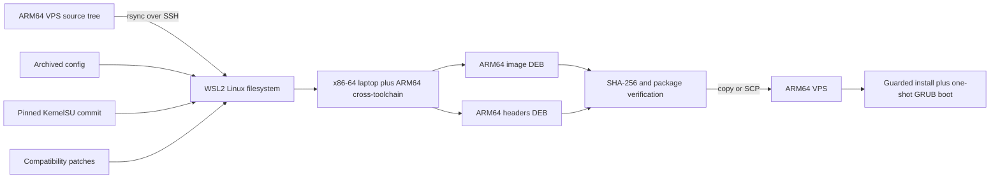

# KernelSU-Next + Redroid 14 on Oracle ARM64

## A recovery, kernel-build, deployment, root-stack, and operations runbook

**Run completed and validated:** 2026-07-27  
**Target:** Oracle Cloud ARM64 Ubuntu 24.04 VPS  
**Result:** Redroid 14, KernelSU Next, Zygisk Next, and LSPosed are running with bounded resources and a permanent watchdog.

> This is both a procedure and an incident record. It explains what was attempted, what failed, why it failed, how the failure was proved, and which safeguards now prevent the VPS from becoming unreachable again.

> The custom KernelSU Next commit used here officially documents kernel compatibility only through Linux 6.6. The Linux 6.8 build in this runbook is a tested compatibility port, not an upstream-supported combination. Keep the stock Ubuntu kernel installed.

---

## Table of contents

1. [Final result](#part-1--final-result)
2. [How the pieces fit together](#part-2--how-the-pieces-fit-together)
3. [Files in this project](#part-3--files-in-this-project)
4. [Phase 0: connect and establish a baseline](#part-4--phase-0-connect-and-establish-a-baseline)
5. [Phase 1: recover the VPS](#part-5--phase-1-recover-the-vps)
6. [Phase 2: prepare Linux and KernelSU](#part-6--phase-2-prepare-linux-and-kernelsu)
7. [Phase 3: build and export the kernel packages](#part-7--phase-3-build-and-export-the-kernel-packages)
8. [Phase 4: install and safely test the custom kernel](#part-8--phase-4-install-and-safely-test-the-custom-kernel)
9. [Problem 1: the first KernelSU kernel crashed](#part-9--problem-1-the-first-kernelsu-kernel-crashed)
10. [Phase 5: make binderfs persistent](#part-10--phase-5-make-binderfs-persistent)
11. [Problem 2: Binder look-alike devices returned ENXIO](#part-11--problem-2-binder-look-alike-devices-returned-enxio)
12. [Problem 3: Android logging made the host appear dead](#part-12--problem-3-android-logging-made-the-host-appear-dead)
13. [Phase 6: create a bounded Redroid canary](#part-13--phase-6-create-a-bounded-redroid-canary)
14. [Problem 4: exit 137 was our watchdog, not OOM](#part-14--problem-4-exit-137-was-our-watchdog-not-oom)
15. [Phase 7: install KernelSU Manager, Zygisk Next, and LSPosed](#part-15--phase-7-install-kernelsu-manager-zygisk-next-and-lsposed)
16. [Problem 5: a Docker restart cannot reset KernelSU hooks](#part-16--problem-5-a-docker-restart-cannot-reset-kernelsu-hooks)
17. [Phase 8: boot ordering and permanent protection](#part-17--phase-8-boot-ordering-and-permanent-protection)
18. [Phase 9: final validation](#part-18--phase-9-final-validation)
19. [Daily operations](#part-19--daily-operations)
20. [Rollback and recovery](#part-20--rollback-and-recovery)
21. [Do not do these things](#part-21--do-not-do-these-things)
22. [Troubleshooting by symptom](#part-22--troubleshooting-by-symptom)
23. [Measured time ledger](#part-23--measured-time-ledger)
24. [Artifact and code reference](#part-24--artifact-and-code-reference)
25. [Primary research sources](#part-25--primary-research-sources)

---

# Part 1 — Final result

## 1.1 Verified host

| Item | Verified value |
|---|---|
| VPS architecture | ARM64 / `aarch64` |
| Operating system | Ubuntu 24.04 |
| CPU | 2 vCPUs |
| RAM | 11.65 GiB |
| Root disk | 45 GiB |
| Swap safety buffer | 2 GiB |
| Active kernel | `6.8.12-zksu #14` |
| Rollback kernel | `6.8.0-136-generic` retained |
| Cgroup mode | v1, Docker `cgroupfs` driver |
| Kernel page size | 4 KiB |
| PSI | enabled, `CONFIG_PSI=y` |
| Binder | `CONFIG_ANDROID_BINDER_IPC=m` |
| binderfs | `CONFIG_ANDROID_BINDERFS=m` |
| KernelSU | `CONFIG_KSU=y` |

## 1.2 Verified Android/root stack

| Item | Verified value |
|---|---|
| Container | `redroid14-ksu` |
| Android | Redroid 14, ARM64 64-bit-only |
| Image digest | `sha256:0a611199ba2e0b5d60af39b3327a517f6407231f4352114ed3bd3cbfe2be69aa` |
| Android boot gate | `sys.boot_completed=1` |
| KernelSU userspace | `ksud 3.3.0 (uapi: 2)` |
| KernelSU Manager | v3.3.0 build 33214 |
| Zygisk Next | 1.4.3 build 817, zygote and KernelSU root active |
| LSPosed | 1.9.2 build 7024, daemon/bridge/companion active |
| ADB | `127.0.0.1:5555` only, reached through SSH tunnel |

## 1.3 Final containment envelope

| Guard | Value | Why |
|---|---:|---|
| CPU quota | 1.5 CPUs | Leaves half a VPS CPU available for SSH and recovery |
| RAM limit | 8 GiB | Leaves roughly 3.65 GiB of host RAM outside ReDroid |
| RAM + swap limit | 10 GiB | Allows up to 2 GiB swap without giving the container unlimited swap |
| Hard task limit | 8,192 | Kernel-enforced cgroup backstop |
| Watchdog trip | 7,000 tasks | Kills a runaway before the hard cap is saturated |
| Restart policy | `no` | A crash cannot become an automatic crash loop |
| Android `/dev/kmsg` | mapped to `/dev/null` | Android logs cannot flood the host journal or serial console |
| Docker log rotation | 50 MiB × 2 | Prevents unbounded container logs |
| ADB publish address | `127.0.0.1` | No public root/debug port |

## 1.4 Final observed stability

The 10-minute monitor took 11 samples from 13:15:24 through 13:25:35 UTC.

- CPU stayed between 0.02% and 0.08% after boot.
- Redroid memory stayed between 1.280 and 1.286 GiB.
- Task count stayed between 955 and 959.
- Host available memory stayed around 9.9 GiB.
- Memory PSI `full avg10` stayed at `0.00`.
- Kernel-critical event count stayed at zero.
- The permanent watchdog stayed active in every sample.

Evidence: [redroid14-stability-10m.log](artifacts/kernel-build/logs/vps-diagnostics/redroid14-stability-10m.log) and [redroid14-final-validation.log](artifacts/kernel-build/logs/vps-diagnostics/redroid14-final-validation.log).

---

# Part 2 — How the pieces fit together

```text
Oracle ARM64 host
├── GRUB
│   ├── 6.8.12-zksu #14        current custom kernel
│   └── 6.8.0-136-generic      rollback kernel
├── binder_linux module
│   └── /dev/binderfs
│       ├── binder
│       ├── hwbinder
│       └── vndbinder
├── Docker
│   └── redroid14-ksu
│       ├── Android 14
│       ├── /data/adb/ksud
│       ├── Zygisk Next
│       └── LSPosed
└── systemd safety chain
    ├── dev-binderfs.mount
    ├── binder-bindmounts.service
    ├── redroid-binder-permissions.service
    ├── docker.service
    ├── redroid14.service
    ├── redroid14-watchdog.service
    └── redroid14-validate.service
```

The ordering matters:

1. Load `binder_linux`.
2. Mount binderfs.
3. Bind the real binderfs device inodes to the conventional `/dev/*` paths.
4. Set permissions before Docker starts.
5. Start Docker.
6. Start Redroid once.
7. Attach the permanent task watchdog.
8. Validate Android and the root modules.

Skipping step 3 caused the most confusing failure in this project. A character device with the right major/minor number is not necessarily the same binderfs device.

---

# Part 3 — Files in this project

## 3.1 VPS automation and systemd files

| File | Purpose |
|---|---|
| [prepare_kernel_v2.sh](vps/prepare_kernel_v2.sh) | Cleans stale objects, applies the lean config, verifies required options, restores swap, and precompiles KernelSU/SELinux |
| [build_kernel_v2.sh](vps/build_kernel_v2.sh) | Locks against duplicate builds, runs `bindeb-pkg`, records timing/resources, copies packages, and creates checksums |
| [install_kernel_v2.sh](vps/install_kernel_v2.sh) | Verifies packages and `/boot` headroom, installs the image/headers, builds initramfs, and updates GRUB without rebooting |
| [kernelsu-arm64-cacheflush.patch](vps/patches/kernelsu-arm64-cacheflush.patch) | Fixes Linux 6.8 ARM64 cache-flush function invocation |
| [kernelsu-selinux-unavailable.patch](vps/patches/kernelsu-selinux-unavailable.patch) | Prevents KernelSU from dereferencing a missing host SELinux policy |
| [dev-binderfs.mount](vps/dev-binderfs.mount) | Mounts binderfs persistently |
| [binder-bindmounts.service](vps/binder-bindmounts.service) | Binds the real binderfs inodes to `/dev/binder`, `/dev/hwbinder`, and `/dev/vndbinder` |
| [redroid-binder-permissions.service](vps/redroid-binder-permissions.service) | Applies mode 0666 before Docker starts |
| [deploy_redroid14_v2.sh](vps/deploy_redroid14_v2.sh) | Performs preflight checks, creates the bounded container, boots Android, installs the root assets, and stages modules |
| [redroid14_watchdog_v2.sh](vps/redroid14_watchdog_v2.sh) | Reads `pids.current` directly and kills the container init PID at the guard threshold |
| [redroid14.service](vps/redroid14.service) | Starts the existing container once after Docker and binder are ready |
| [redroid14-watchdog.service](vps/redroid14-watchdog.service) | Runs the permanent 3,200-task watchdog |
| [validate_redroid14.sh](vps/validate_redroid14.sh) | Verifies boot, OOM state, root assets, module activation, Manager package, and services |
| [redroid14-validate.service](vps/redroid14-validate.service) | Runs the validator after Redroid/watchdog startup and remains `active (exited)` on success |
| [monitor_redroid14_10m.sh](vps/monitor_redroid14_10m.sh) | Takes 11 one-minute samples of CPU, RAM, tasks, PSI, watchdog, and kernel faults |

## 3.2 Distribution and evidence artifacts

| Path | What must be kept |
|---|---|
| [artifacts/kernel-build/packages](artifacts/kernel-build/packages) | Final revision-14 image/header `.deb` files and SHA-256 manifest |
| [artifacts/kernel-build/config](artifacts/kernel-build/config) | Final kernel config, source version, and pinned KernelSU commit |
| [artifacts/kernel-build/patches](artifacts/kernel-build/patches) | Archived Linux 6.8 and SELinux compatibility diffs |
| [artifacts/kernel-build/logs](artifacts/kernel-build/logs) | Final build log and failure/validation evidence |
| [artifacts/android](artifacts/android) | Manager, matching `ksud`, Zygisk Next, LSPosed, release notes, and checksums |
| [REDROID14-DEPLOYMENT.md](artifacts/REDROID14-DEPLOYMENT.md) | Compact deployment/operations record |

The artifact cleanup at the end removed the duplicate Android bundle under `kernel-build/android`, revision-13 packages, redundant configs, two superseded build logs, and bulky duplicate diagnostics. Nothing required for reproduction or diagnosis was deleted.

---

# Part 4 — Phase 0: connect and establish a baseline

**Observed time:** about 5 minutes when SSH is responsive.

## 4.1 Connect

From Windows PowerShell:

```powershell
ssh -i "C:/Users/YOUR_WINDOWS_USER/.ssh/YOUR_PRIVATE_KEY.key" `
  -o StrictHostKeyChecking=no `
  ubuntu@YOUR_VPS_PUBLIC_IP
```

Do not start by deleting files or killing broad process groups. Record the current state first.

## 4.2 Baseline commands

```bash
date -Is
uname -a
uptime
free -h
df -hT / /boot /var/lib/docker /home
ps -eLo pid,ppid,stat,comm,%cpu,%mem --sort=-%cpu | head -n 40
cat /proc/pressure/cpu
cat /proc/pressure/memory
cat /proc/pressure/io
sudo docker ps -a --no-trunc
sudo systemctl --failed
```

Record thread/task pressure as well as ordinary process count:

```bash
ps -eLo pid= | wc -l
cat /proc/sys/kernel/threads-max
cat /proc/sys/kernel/pid_max
```

Docker's PIDS number includes Linux threads. This distinction later explained why 600 PIDS was normal during Android boot while `ps` showed far fewer process names.

## 4.3 Baseline discovered in this incident

- The original Android workload had reached roughly 8,230 tasks and was consuming the available CPU.
- The journal had grown to roughly 3.1 GiB.
- The host had enough RAM but lacked a useful failure boundary around Android.
- Existing Coolify containers had to remain untouched.

---

# Part 5 — Phase 1: recover the VPS

**Observed time:** approximately 20–30 minutes, including verification and storage cleanup.

## 5.1 Stop only the verified runaway workload

Inspect before acting:

```bash
sudo docker ps -a --no-trunc
sudo docker inspect a14_1
sudo docker stats --no-stream a14_1
```

The user explicitly requested deletion of everything related to `a14_1`, so only that container, its exclusive data, and its exclusive image were removed. Coolify containers and shared Docker state were not included.

## 5.2 Confirm resources returned

```bash
uptime
free -h
ps -eLo pid= | wc -l
sudo docker ps --format '{{.Names}}|{{.Status}}'
```

## 5.3 Clean crash-generated logs safely

The journal was vacuumed from about 3.1 GiB to about 97–100 MiB after the relevant failure tail was preserved.

```bash
sudo journalctl --disk-usage
sudo journalctl --vacuum-size=100M
sudo journalctl --disk-usage
```

The preparation script also truncates the two rsyslog files only after the crash evidence has been collected. See [prepare_kernel_v2.sh](vps/prepare_kernel_v2.sh).

## 5.4 Add a swap safety buffer

```bash
sudo fallocate -l 2G /swapfile
sudo chmod 600 /swapfile
sudo mkswap /swapfile
sudo swapon /swapfile
swapon --show
```

Ensure `/etc/fstab` contains a persistent entry before relying on it across reboots.

## What went wrong before

The old workload had no sufficiently low PID/task boundary, could consume all CPU, and could generate large volumes of host-visible logs. On a small VPS, the combination is enough to make SSH appear dead without an OOM or kernel panic.

## Do not

- Do not run `pkill -9 -f android`, `killall`, or another broad pattern without resolving exact PIDs.
- Do not prune all Docker images/volumes on a host that also runs Coolify.
- Do not delete `/var/lib/docker` to fix one container.
- Do not erase journals before preserving the failure interval.
- Do not interpret high free RAM as proof the host is healthy; task storms and log/console storms can still starve it.

---

# Part 6 — Phase 2: prepare Linux and KernelSU

**Observed time:** about 10 minutes for configuration/archive work plus the early subtree compile. Configuration checkpoints were produced between 07:44 and 07:49 UTC.

## 6.1 Source tree and pinned version

The VPS source tree is:

```text
/home/ubuntu/kbuild/linux-6.8.0
```

The source reports kernel release `6.8.12`. KernelSU Next is pinned to:

```text
d6a42fd9285c11b8e8e67bfe72a5050528006c00
```

Local evidence:

- [kernel-source-version.txt](artifacts/kernel-build/config/kernel-source-version.txt)
- [kernelsu-commit.txt](artifacts/kernel-build/config/kernelsu-commit.txt)
- [config.completed](artifacts/kernel-build/config/config.completed)

Never build a moving branch when the output will be distributed.

## 6.2 Apply the Linux 6.8 compatibility work

Two incident-specific patches are retained as executable inputs:

1. [kernelsu-arm64-cacheflush.patch](vps/patches/kernelsu-arm64-cacheflush.patch) changes bare function-like macro references into actual calls with `(start, end)`.
2. [kernelsu-selinux-unavailable.patch](vps/patches/kernelsu-selinux-unavailable.patch) checks whether `selinux_state.policy` exists before duplicating or patching it.

The broader checkout diff is archived in [kernelsu-linux-6.8.patch](artifacts/kernel-build/patches/kernelsu-linux-6.8.patch). The exact final SELinux guard is also archived in [kernelsu-selinux-unavailable.patch](artifacts/kernel-build/patches/kernelsu-selinux-unavailable.patch).

Apply a patch only after verifying the pinned commit:

```bash
cd /home/ubuntu/kbuild/linux-6.8.0/KernelSU-Next
test "$(git rev-parse HEAD)" = d6a42fd9285c11b8e8e67bfe72a5050528006c00
git apply --check /home/ubuntu/kbuild/patches/kernelsu-arm64-cacheflush.patch
git apply /home/ubuntu/kbuild/patches/kernelsu-arm64-cacheflush.patch
```

Use the corresponding path for the SELinux patch. If `git apply --check` says it is already applied, inspect `git diff`; do not apply it twice.

## 6.3 Run the preparation script

Upload and execute [prepare_kernel_v2.sh](vps/prepare_kernel_v2.sh):

```powershell
scp -i "C:/Users/YOUR_WINDOWS_USER/.ssh/YOUR_PRIVATE_KEY.key" `
  .\vps\prepare_kernel_v2.sh `
  ubuntu@YOUR_VPS_PUBLIC_IP:/home/ubuntu/kbuild/
```

```bash
chmod 0755 /home/ubuntu/kbuild/prepare_kernel_v2.sh
/home/ubuntu/kbuild/prepare_kernel_v2.sh
```

The script does the following in order:

1. Verifies it is running as `ubuntu` and that source/KSU paths exist.
2. Archives `.config`, KernelSU commit, compatibility diff, and source version.
3. Clears only the already-preserved crash log files.
4. Runs `make clean` so config changes cannot reuse stale multi-gigabyte objects.
5. Disables debug info, BTF, GDB scripts, AMDGPU, and Nouveau.
6. Enables Kprobes, ext4, overlayfs, KernelSU, Binder IPC, and binderfs.
7. Runs `olddefconfig`.
8. Fails if any required option is absent or any unwanted option remains enabled.
9. Restores the 2 GiB swapfile if needed.
10. Compiles `prepare`, `security/selinux/`, and `drivers/kernelsu/` at `-j1` as an early compatibility gate.

## 6.4 Required configuration contract

```text
CONFIG_DEBUG_INFO_NONE=y
CONFIG_KPROBES=y
CONFIG_EXT4_FS=y
CONFIG_OVERLAY_FS=y
CONFIG_KSU=y
CONFIG_ANDROID_BINDER_IPC=m
CONFIG_ANDROID_BINDERFS=m
CONFIG_NAMESPACES=y
CONFIG_PID_NS=y
CONFIG_NET_NS=y
CONFIG_CGROUPS=y
CONFIG_SECCOMP=y
CONFIG_PSI=y
CONFIG_MEMCG=y
CONFIG_CGROUP_PIDS=y
CONFIG_ARM64_4K_PAGES=y
```

## Why the early compile matters

A full ARM64 kernel build took hours. Compiling the changed KernelSU and SELinux subtrees first exposes API incompatibilities in minutes instead of near the end of a full build.

## Do not

- Do not build from `master`, `main`, or `latest` without recording a commit.
- Do not resume an old object tree after changing debug, Binder, SELinux, or KernelSU options.
- Do not disable the stock Ubuntu kernel or remove it from `/boot`.
- Do not use a 64 KiB ARM page-size config for this Android image.
- Do not ignore an early subtree compile failure and hope the package build will fix it.

---

# Part 7 — Phase 3: build and export the kernel packages

**Observed time:**

- An accidental superseded build was stopped after about 1 minute 16 seconds.
- Full revision 13 build: 07:52:50–10:33:08 UTC, **2 hours 40 minutes 18 seconds**.
- Incremental revision 14 rebuild after the SELinux fix: 11:00:51–11:27:31 UTC, **26 minutes 40 seconds**.

Only revision 14 is retained for distribution.

## 7.1 Build script protections

[build_kernel_v2.sh](vps/build_kernel_v2.sh) provides four important gates:

- `flock` prevents two builds from owning the source tree simultaneously.
- The KernelSU commit must match the pinned hash.
- Required config lines must be present.
- Root free space must be at least 15 GiB.

It runs:

```bash
/usr/bin/time -v ionice -c 2 -n 4 \
  make -j2 bindeb-pkg LOCALVERSION=-zksu
```

`-j2` uses both VPS CPUs. Build-time responsiveness is protected by I/O priority, a named service, persistent logs, and the fact that Redroid is not running during compilation.

## 7.2 Run it under systemd

```bash
sudo systemd-run \
  --unit=ksu-kernel-build.service \
  --collect \
  --property=Type=exec \
  --property=MemoryMax=10G \
  --property=TasksMax=2048 \
  /home/ubuntu/kbuild/build_kernel_v2.sh
```

Monitor without starting a second build:

```bash
sudo systemctl status ksu-kernel-build.service --no-pager -l
sudo journalctl -fu ksu-kernel-build.service
tail -f /home/ubuntu/kbuild/artifacts/logs/build-*.log
free -h
df -h / /boot
```

## 7.3 Build success contract

The script must produce exactly one image and one headers package, then generate a SHA-256 manifest.

Final local packages:

- [linux-image-6.8.12-zksu_6.8.12-14_arm64.deb](artifacts/kernel-build/packages/linux-image-6.8.12-zksu_6.8.12-14_arm64.deb)
- [linux-headers-6.8.12-zksu_6.8.12-14_arm64.deb](artifacts/kernel-build/packages/linux-headers-6.8.12-zksu_6.8.12-14_arm64.deb)
- [SHA256SUMS](artifacts/kernel-build/packages/SHA256SUMS)

Checksums:

```text
38111a5d8d81135cebdd19d90c95b31978d36f27cfefe828645c0e7c82aefb16  linux-image-6.8.12-zksu_6.8.12-14_arm64.deb
26eaee701ac33316f5c22151154576161132a75e6376f512b4b2f4899becb80a  linux-headers-6.8.12-zksu_6.8.12-14_arm64.deb
```

Final evidence: [build-20260727T110051Z.log](artifacts/kernel-build/logs/build-20260727T110051Z.log).

## 7.4 Copy packages to Windows

```powershell
scp -i "C:/Users/YOUR_WINDOWS_USER/.ssh/YOUR_PRIVATE_KEY.key" `
  ubuntu@YOUR_VPS_PUBLIC_IP:/home/ubuntu/kbuild/artifacts/packages/linux-image-6.8.12-zksu_6.8.12-14_arm64.deb `
  .\artifacts\kernel-build\packages\

scp -i "C:/Users/YOUR_WINDOWS_USER/.ssh/YOUR_PRIVATE_KEY.key" `
  ubuntu@YOUR_VPS_PUBLIC_IP:/home/ubuntu/kbuild/artifacts/packages/linux-headers-6.8.12-zksu_6.8.12-14_arm64.deb `
  .\artifacts\kernel-build\packages\
```

Verify locally with `Get-FileHash` before distributing.

## 7.5 Alternative approach: build on a stronger personal computer

The VPS build is not the only valid approach. When the verified image and
headers packages are missing, an x86-64 laptop can cross-compile the ARM64
kernel and return installable `.deb` files to the VPS.

This distinction is essential:

- `/boot/vmlinuz-6.8.12-zksu` is an already-linked kernel binary. It cannot be
  converted back into a patchable source tree.
- `/home/ubuntu/kbuild/linux-6.8.0` is the prepared source tree. It can be copied
  over SSH, cleaned locally, patched or verified, and cross-compiled.
- The resulting package architecture must remain `arm64`, even though the
  machine performing the build is `amd64`/x86-64.

The data flow is:



This offloads CPU-intensive compilation without changing the target
architecture. It also keeps Redroid stopped and leaves the small VPS responsive
during the build.

The command-first version of this approach is in
[`setup_guide.md`, Step 0](setup_guide.md#0-choose-the-kernel-package-approach).

## 7.6 Why WSL2 is used instead of native Windows

The Linux build system expects Linux process, permission, symlink, shell, and
case-sensitivity semantics. WSL2 provides a real Linux kernel and filesystem
while still allowing final packages to be copied into the Windows project.

The source belongs under a path such as:

```text
/home/USER/kbuild/linux-6.8.0
```

It should not be built under `/mnt/c`, `/mnt/d`, OneDrive, or a normal NTFS
project directory. Mounted Windows filesystems are much slower for the kernel's
large number of small files and can introduce permission, symlink, and filename
case problems. Only the final `.deb`, checksum, and log files need to cross back
to the Windows filesystem.

Suggested laptop envelope:

| Resource | Recommendation |
|---|---|
| RAM | 16 GiB or more |
| WSL2 disk space | At least 30 GiB free |
| Jobs on a 12-thread laptop | Start with 8–10 |
| Power/cooling | AC power and adequate cooling |
| Target compiler | `aarch64-linux-gnu-` |
| Output architecture | `arm64` |

Using all 12 threads may produce a slightly shorter compile, but it can make
Windows unresponsive or cause a thin laptop to throttle. Ten jobs leave useful
headroom without reducing the build to the VPS's two-core speed.

## 7.7 Preserve the exact source identity

The cross-build is valid only when it uses the same reproducibility inputs as
the native build:

```text
Kernel source: linux-upstream (6.8.12-11) noble
Kernel release: 6.8.12
Local version: -zksu
KernelSU commit: d6a42fd9285c11b8e8e67bfe72a5050528006c00
Target: ARM64 with 4 KiB pages
```

The simplest way to preserve the incident-tested state is to copy the complete
prepared source tree:

```bash
export BUILD_ROOT="$HOME/kbuild"
export SERVER_IP="SERVER_IP"

rsync -aH --info=progress2 \
  -e "ssh -i $HOME/.ssh/vps-build.key -o StrictHostKeyChecking=accept-new" \
  "ubuntu@$SERVER_IP:/home/ubuntu/kbuild/linux-6.8.0/" \
  "$BUILD_ROOT/linux-6.8.0/"
```

`rsync -aH` retains the source hierarchy, symlinks, timestamps, and nested
KernelSU Git checkout. Because the VPS directory may contain generated objects,
the transfer can be several gigabytes. Those objects must not be trusted across
compiler environments; clean the laptop copy before building.

After transfer:

```bash
export SOURCE_DIR="$BUILD_ROOT/linux-6.8.0"
export KSU_COMMIT=d6a42fd9285c11b8e8e67bfe72a5050528006c00

test -x "$SOURCE_DIR/scripts/config"
test -f "$SOURCE_DIR/debian/changelog"
test -d "$SOURCE_DIR/KernelSU-Next/.git"
test "$(git -C "$SOURCE_DIR/KernelSU-Next" rev-parse HEAD)" = "$KSU_COMMIT"
head -n 1 "$SOURCE_DIR/debian/changelog"
```

If the source tree is gone, it must be reconstructed as described in Part 6.
Downloading an arbitrary Linux 6.8 archive is not equivalent: Ubuntu's Debian
metadata, the pinned KernelSU checkout, configuration, and compatibility changes
all affect the resulting packages.

## 7.8 Patch-state handling on the laptop

The copied source should already contain the two fixes described in Part 6. A
blind `git apply` is therefore wrong. Determine whether each patch is already
applied:

```bash
cd "$SOURCE_DIR/KernelSU-Next"

apply_if_missing() {
  local patch_file="$1"

  if git apply --reverse --check "$patch_file" >/dev/null 2>&1; then
    echo "Already applied: $patch_file"
  elif git apply --check "$patch_file"; then
    git apply "$patch_file"
    echo "Applied: $patch_file"
  else
    echo "Patch state is ambiguous: $patch_file" >&2
    return 1
  fi
}

apply_if_missing "$BUILD_ROOT/vps/patches/kernelsu-arm64-cacheflush.patch"
apply_if_missing "$BUILD_ROOT/vps/patches/kernelsu-selinux-unavailable.patch"
git diff --check
```

The reverse check answers, "Would removing this patch apply cleanly?" If yes,
the patch is already present. If neither the forward nor reverse check passes,
stop and inspect the source instead of forcing a partial application.

## 7.9 Native build versus cross-build command

The VPS-native build used:

```bash
make -j2 bindeb-pkg LOCALVERSION=-zksu
```

The laptop cross-build must add three target declarations:

```bash
make -j10 \
  ARCH=arm64 \
  CROSS_COMPILE=aarch64-linux-gnu- \
  KBUILD_DEBARCH=arm64 \
  bindeb-pkg LOCALVERSION=-zksu
```

Their roles are different:

| Variable | Meaning |
|---|---|
| `ARCH=arm64` | Selects the ARM64 kernel architecture and configuration paths. |
| `CROSS_COMPILE=aarch64-linux-gnu-` | Selects tools such as `aarch64-linux-gnu-gcc`. |
| `KBUILD_DEBARCH=arm64` | Marks Debian package metadata for the VPS architecture. |
| `LOCALVERSION=-zksu` | Preserves the expected `6.8.12-zksu` release identity. |

The host utilities required during the build are still compiled natively for
x86-64 by `HOSTCC`; kernel objects are compiled for ARM64 by the cross-compiler.
That split is normal.

Before the full build, clean the laptop copy, restore
[config.completed](artifacts/kernel-build/config/config.completed), run
`olddefconfig`, and perform the same small compatibility gates:

```bash
cd "$SOURCE_DIR"
make ARCH=arm64 CROSS_COMPILE=aarch64-linux-gnu- clean
rm -f KernelSU-Next/kernel/built-in.a
cp "$BUILD_ROOT/artifacts/config/config.completed" .config
make ARCH=arm64 CROSS_COMPILE=aarch64-linux-gnu- olddefconfig

make -j1 ARCH=arm64 CROSS_COMPILE=aarch64-linux-gnu- prepare
make -j1 ARCH=arm64 CROSS_COMPILE=aarch64-linux-gnu- security/selinux/
make -j1 ARCH=arm64 CROSS_COMPILE=aarch64-linux-gnu- drivers/kernelsu/
```

Then verify the release before committing laptop time to the full build:

```bash
test "$(make -s ARCH=arm64 \
  CROSS_COMPILE=aarch64-linux-gnu- \
  kernelrelease LOCALVERSION=-zksu)" = 6.8.12-zksu
```

## 7.10 Why the existing scripts are not run unchanged in WSL2

[prepare_kernel_v2.sh](vps/prepare_kernel_v2.sh) and
[build_kernel_v2.sh](vps/build_kernel_v2.sh) record the successful VPS workflow,
but they intentionally encode its environment:

- user `ubuntu`;
- source path `/home/ubuntu/kbuild/linux-6.8.0`;
- native ARM64 compiler selection;
- two build jobs by default;
- VPS swap and disk checks;
- incident-specific cleanup of already-preserved VPS logs.

Those assumptions are useful safeguards on the original host and wrong on a
general WSL2 installation. The laptop procedure reuses their commit, config,
early-compile, output, and checksum contracts while explicitly changing only
the build host and cross-toolchain.

## 7.11 Cross-build success and trust boundary

A successful `make` is not sufficient. Both packages must be present and must
declare ARM64:

```bash
cd "$BUILD_ROOT/artifacts/packages"

test "$(dpkg-deb -f linux-image-6.8.12-zksu_*_arm64.deb Architecture)" = arm64
test "$(dpkg-deb -f linux-headers-6.8.12-zksu_*_arm64.deb Architecture)" = arm64

sha256sum -- *.deb > SHA256SUMS
sha256sum -c SHA256SUMS
```

The package filename is not proof. `dpkg-deb` reads the package's actual control
metadata, and SHA-256 detects corruption during the WSL-to-Windows and
Windows-to-VPS transfers.

The cross-built packages must still pass the same installation boundary in
[install_kernel_v2.sh](vps/install_kernel_v2.sh): exactly one image, exactly one
headers package, ARM64 metadata, sufficient `/boot` space, initramfs creation,
and a generated GRUB entry. The first boot must remain one-shot. Building on a
faster computer does not justify weakening any boot or rollback safeguard.

This laptop path was not used for the recorded revision-14 artifact, so its
20–90 minute estimate is a planning range, not a measured result from this
incident. Record the WSL toolchain version and retain the new build log whenever
creating a replacement distribution package.

## Do not

- Do not launch a second `make` when the first appears quiet; inspect the unit and build log.
- Do not build with more jobs than available CPUs on this small host.
- Do not install a package before copying it and its checksum locally.
- Do not distribute revision 13; it contains the SELinux policy NULL-dereference bug.
- Do not treat a `.deb` filename as proof of architecture or integrity.
- Do not try to patch an installed `vmlinuz`; copy or reconstruct source.
- Do not build the kernel source directly on an NTFS-mounted WSL path.
- Do not reuse VPS object files without cleaning the laptop source copy.
- Do not omit `ARCH`, `CROSS_COMPILE`, or `KBUILD_DEBARCH` during a cross-build.
- Do not report the laptop estimate as measured incident time.

---

# Part 8 — Phase 4: install and safely test the custom kernel

**Observed time:** about 20 minutes for package verification, installation, initramfs/GRUB generation, one-time boot selection, reboot, and reconnect. The later revision-14 boot verification took only a few minutes once the package existed.

## 8.1 Verify before installation

[install_kernel_v2.sh](vps/install_kernel_v2.sh) checks:

- SHA-256 manifest.
- Exactly one image package and one header package.
- `Architecture: arm64` in both packages.
- At least 300 MiB free in `/boot`.
- Backup of GRUB defaults and environment.

Run it:

```bash
chmod 0755 /home/ubuntu/kbuild/install_kernel_v2.sh
/home/ubuntu/kbuild/install_kernel_v2.sh
```

The script deliberately does **not** change the persistent GRUB default and does **not** reboot.

## 8.2 Select the new kernel for one boot

Find the exact generated menu entry:

```bash
sudo awk '/^submenu |^[[:space:]]*menuentry / { print }' /boot/grub/grub.cfg
```

Then use `grub-reboot` with the exact submenu/menu entry generated on this host. Do not copy a menu string from another server.

```bash
sudo grub-reboot 'Advanced options for Ubuntu>Ubuntu, with Linux 6.8.12-zksu'
sudo grub-editenv list
sudo reboot
```

## 8.3 Post-boot gate

```bash
uname -r
sudo dmesg | grep -i kernelsu
grep -E 'CONFIG_(KSU|ANDROID_BINDER_IPC|ANDROID_BINDERFS|PSI)=' /boot/config-$(uname -r)
sudo docker ps
systemctl --failed
```

Only after SSH, Docker, Binder, KernelSU initialization, networking, and existing containers pass should the custom kernel become the persistent default.

## 8.4 Rollback remains installed

The stock `6.8.0-136-generic` image and its GRUB entry remain available. The custom image is not the only bootable kernel.

## Do not

- Do not set the new kernel as the persistent default before a one-time boot test.
- Do not remove the stock Ubuntu image to create `/boot` space.
- Do not reboot before confirming `/boot/vmlinuz-*`, `initrd.img-*`, and `/lib/modules/*` exist.
- Do not run `dpkg -i` on an unverified file copied from an old build directory.

---

# Part 9 — Problem 1: the first KernelSU kernel crashed

**Time to encounter:** the revision-13 package completed at 10:33:08 UTC; the first Redroid kernel fault was captured around 10:54 UTC.  
**Time to fix:** the corrected revision-14 rebuild took 26 minutes 40 seconds, plus installation/reboot validation.

## 9.1 Symptom

The host booted the custom kernel successfully, but starting Redroid triggered a KernelSU fault in SELinux policy handling. The first package was not safe for distribution.

Evidence: [redroid14-first-boot-kernel-oops.log](artifacts/kernel-build/logs/redroid14-first-boot-kernel-oops.log).

## 9.2 Root cause

Redroid's containerized Android disables or bypasses normal SELinux policy setup. On the Ubuntu host, `selinux_state.policy` was unavailable. KernelSU's policy duplication path assumed it was non-NULL and dereferenced it.

This was also a warning about the unsupported combination: KernelSU Next documents support through Linux 6.6, while this host kernel is 6.8.

## 9.3 Fix

[kernelsu-selinux-unavailable.patch](vps/patches/kernelsu-selinux-unavailable.patch) adds defensive checks:

- Read the policy under the correct mutex.
- If no policy exists, log and skip rule injection.
- Refuse to duplicate a NULL policy.

The patch converted a kernel crash into explicit warnings such as:

```text
SELinux policy unavailable, skipping rule injection
Failed to cache kernel su domain SID: -2
```

Those warnings are expected in this Redroid environment. KernelSU userspace and module staging were then tested directly rather than assuming rule injection succeeded.

## 9.4 Result

Revision 14 booted, Redroid reached Android, `ksud` ran its init stages, the Manager installed, and Zygisk Next later reported KernelSU root active.

## Do not

- Do not hide a NULL dereference with a generic retry or automatic restart.
- Do not distribute the first package simply because the host itself boots.
- Do not suppress kernel warnings until the root path has been functionally tested.
- Do not claim upstream Linux 6.8 support for this KernelSU commit.

---

# Part 10 — Phase 5: make binderfs persistent

**Observed time:** about 10 minutes to install and verify the three units; root-cause discovery took much longer and is documented in Part 11.

## 10.1 Load Binder

```bash
sudo modprobe binder_linux devices=binder,hwbinder,vndbinder
grep '^binder_linux ' /proc/modules
grep binder /proc/filesystems
```

## 10.2 Mount binderfs

Install [dev-binderfs.mount](vps/dev-binderfs.mount):

```bash
sudo install -m 0644 vps/dev-binderfs.mount /etc/systemd/system/dev-binderfs.mount
sudo mkdir -p /dev/binderfs
sudo systemctl daemon-reload
sudo systemctl enable --now dev-binderfs.mount
```

## 10.3 Bind the real devices to conventional paths

Install [binder-bindmounts.service](vps/binder-bindmounts.service):

```bash
sudo install -m 0644 vps/binder-bindmounts.service /etc/systemd/system/binder-bindmounts.service
sudo systemctl daemon-reload
sudo systemctl enable --now binder-bindmounts.service
```

## 10.4 Apply permissions before Docker

Install [redroid-binder-permissions.service](vps/redroid-binder-permissions.service):

```bash
sudo install -m 0644 vps/redroid-binder-permissions.service /etc/systemd/system/redroid-binder-permissions.service
sudo systemctl daemon-reload
sudo systemctl enable --now redroid-binder-permissions.service
```

Its `Before=docker.service` ordering is intentional.

## 10.5 Verify inode identity

```bash
systemctl is-active dev-binderfs.mount binder-bindmounts.service redroid-binder-permissions.service
findmnt -T /dev/binderfs

for d in \
  /dev/binderfs/binder /dev/binderfs/hwbinder /dev/binderfs/vndbinder \
  /dev/binder /dev/hwbinder /dev/vndbinder
do
  stat -Lc '%n mode=%a dev=%t:%T inode=%i' "$d"
done
```

The corresponding binderfs and `/dev` paths must report the same device and inode. In the validated setup:

```text
/dev/binderfs/binder  dev=ec:1 inode=4
/dev/binder           dev=ec:1 inode=4
```

---

# Part 11 — Problem 2: Binder look-alike devices returned ENXIO

**Observed diagnosis window:** first failed Binder canary around 11:40 UTC; conclusive corrected canary at 12:52 UTC, about **72 minutes**.

## 11.1 Symptom

Inside Redroid:

```text
Binder driver '/dev/binder' could not be opened
Opening '/dev/binder' failed: No such device or address
Opening '/dev/hwbinder' failed: No such device or address
```

Android repeatedly restarted `servicemanager`, `hwservicemanager`, and dependent service classes.

Evidence: [redroid14-enxio-lockup-previous-boot.log](artifacts/kernel-build/logs/vps-diagnostics/redroid14-enxio-lockup-previous-boot.log).

## 11.2 Why major/minor numbers were misleading

The container was privileged, so Docker could recreate character devices with the same major/minor numbers. That looked correct in `ls -l`, but opening them returned `ENXIO`.

Binderfs is a filesystem. Its allocated Binder device is associated with the binderfs inode and private binder device state. Recreating only a character node does not reproduce that inode state.

## 11.3 Fix

Pass the actual binderfs device files into the container:

```bash
--mount type=bind,src=/dev/binderfs/binder,dst=/dev/binder
--mount type=bind,src=/dev/binderfs/hwbinder,dst=/dev/hwbinder
--mount type=bind,src=/dev/binderfs/vndbinder,dst=/dev/vndbinder
```

These exact mounts are in [deploy_redroid14_v2.sh](vps/deploy_redroid14_v2.sh).

## 11.4 Proof

After the fix:

- Binder `No such device or address` count after boot: zero.
- Android reached `boot_progress_enable_screen` and then `sys.boot_completed=1`.
- The final 10-minute run recorded zero Binder errors.

## Do not

- Do not assume `--privileged` automatically gives a working binderfs inode.
- Do not use `mknod` as a substitute for a binderfs bind mount.
- Do not trust only major/minor numbers; verify inode identity and perform an actual open/boot test.
- Do not chase cgroup warnings while Binder itself returns `ENXIO`.

---

# Part 12 — Problem 3: Android logging made the host appear dead

**Observed with the Binder failures:** bursts close to 400 host journal lines per second during the restart storm.

## 12.1 Why container logs reached the host

The official Redroid Android patch redirects Android init stdout and stderr to `/dev/kmsg`. In a normal device this is useful. In a container on a small VPS, a service-restart loop can flood the host kernel journal and serial console.

The archived failure logs contained:

- More than 300 `servicemanager`-related lines per failed run.
- Peaks around 389–395 journal lines in one second.
- No OOM kill.
- No kernel panic or oops in the Binder failure runs.
- No hung task report.

That explains an important symptom: TCP port 22 could accept a connection while the SSH banner was delayed or stalled. The host was saturated by scheduling/logging pressure rather than dead from memory exhaustion.

## 12.2 Fix

Map `/dev/null` over the container's `/dev/kmsg`:

```bash
--mount type=bind,src=/dev/null,dst=/dev/kmsg
```

Android diagnostics remain available through:

- `adb logcat -b all`
- `/data/adb/ksu/log`
- `/data/adb/lspd/log`
- Docker inspection and cgroup metrics

The host retains kernel warnings, oopses, and faults from its own kernel. The host console loglevel is also kept at 4 so informational KernelSU messages do not dominate the serial console:

```bash
cat /proc/sys/kernel/printk
# verified first value: 4
```

## Do not

- Do not expose Android `/dev/kmsg` to the host on a diagnostic crash loop.
- Do not raise the host console loglevel merely to see more Android messages.
- Do not rely only on `docker logs`; this Redroid build redirects early init output elsewhere.
- Do not erase `/data` logs before archiving the failure.

---

# Part 13 — Phase 6: create a bounded Redroid canary

**Observed time:** clean first boot completed in **15 seconds**. The full create, Manager install, two module installs, and staging sequence ran from about 13:05:44 to 13:06:09 UTC, roughly **25 seconds** after the image was already local.

## 13.1 Verify Android assets first

The deployment script starts in `/home/ubuntu/kbuild/artifacts/android` and runs:

```bash
sha256sum -c SHA256SUMS
```

Local manifest: [artifacts/android/SHA256SUMS](artifacts/android/SHA256SUMS).

## 13.2 Preflight contract

[deploy_redroid14_v2.sh](vps/deploy_redroid14_v2.sh) refuses to start unless:

- Kernel is exactly `6.8.12-zksu`.
- At least 4 GiB host memory is available.
- At least 5 GiB is free under `/home/ubuntu`.
- Host task count is below 2,000.
- Kernel console loglevel is at most 4.
- Memory PSI exists.
- The target container does not already exist.
- The data directory is empty.
- Binder devices exist and have mode 0666.
- The exact image digest matches.

## 13.3 Immutable image

Do not create from the moving tag after testing. The script uses:

```text
redroid/redroid@sha256:0a611199ba2e0b5d60af39b3327a517f6407231f4352114ed3bd3cbfe2be69aa
```

## 13.4 Container definition

The important part of the verified `docker create` is:

```bash
sudo docker create \
  --name redroid14-ksu \
  --privileged \
  --restart=no \
  --pids-limit=8192 \
  --memory=8g \
  --memory-swap=10g \
  --cpus=1.5 \
  --stop-timeout=10 \
  --log-driver=json-file \
  --log-opt max-size=50m \
  --log-opt max-file=2 \
  --mount type=bind,src=/dev/binderfs/binder,dst=/dev/binder \
  --mount type=bind,src=/dev/binderfs/hwbinder,dst=/dev/hwbinder \
  --mount type=bind,src=/dev/binderfs/vndbinder,dst=/dev/vndbinder \
  --mount type=bind,src=/dev/null,dst=/dev/kmsg \
  -v /home/ubuntu/redroid14-data:/data \
  -p 127.0.0.1:5555:5555 \
  redroid/redroid@sha256:0a611199ba2e0b5d60af39b3327a517f6407231f4352114ed3bd3cbfe2be69aa \
  androidboot.redroid_gpu_mode=guest \
  androidboot.use_memfd=1 \
  ro.secure=0 \
  ro.debuggable=1
```

## 13.5 Independent watchdog

[redroid14_watchdog_v2.sh](vps/redroid14_watchdog_v2.sh) does not depend on `docker stats` while the container is unstable. It:

1. Resolves the container init PID.
2. Reads its cgroup membership.
3. Locates `pids.current` for cgroup v1 or v2.
4. Records every 100-task milestone and the peak.
5. Sends `SIGKILL` directly to the container init PID at 7,000 tasks.
6. Optionally enforces a boot deadline.

The hard cgroup limit remains 8,192 even if Docker commands become slow. The
original bare-ReDroid limits were 1,400/1,536; LiteGapps first boot exceeded the
soft limit with legitimate Google services, so both limits were raised while
retaining containment below the old 8,230-task failure mode.

## 13.6 First boot gate

```bash
sudo docker exec redroid14-ksu getprop sys.boot_completed
# must be 1
```

The canary is not successful merely because the container is `running`. Success requires:

- `sys.boot_completed=1`
- ADB device state
- no OOM flag
- stable task count
- bounded memory/CPU
- no Binder `ENXIO`
- no kernel panic/oops

## Do not

- Do not use `latest` without pinning the resulting digest.
- Do not publish `5555:5555` on all interfaces.
- Do not use `restart=unless-stopped` during diagnosis.
- Do not use `oom_score_adj=-1000`; it can cause the kernel to sacrifice host services instead of Redroid.
- Do not remove the CPU/PID/memory limits after one successful boot.

---

# Part 14 — Problem 4: exit 137 was our watchdog, not OOM

**Observed time to resolve:** the bounded canary ran at 12:52:24 UTC and exited at 12:52:53, so the misleading failure was identified in about **29 seconds**; log/source correlation and threshold redesign took roughly 20–30 minutes.

## 14.1 What happened

The first watchdog threshold was 600. At 603 tasks it killed the container init PID, producing Docker exit code 137.

Docker inspection proved:

```text
exit=137
OOMKilled=false
```

Android logs proved the boot was healthy and almost complete:

```text
12:52:28 boot_progress_start
12:52:33 boot_progress_system_run
12:52:38 boot_progress_pms_ready
12:52:48 boot_progress_ams_ready
12:52:52 boot_progress_enable_screen
12:52:53 watchdog SIGKILL
```

## 14.2 Why 600 was wrong

Docker PIDS includes processes **and kernel threads**. Android creates many Binder, runtime, media, system-server, and HAL threads. A high PIDS value does not mean an equal number of process names.

Measured healthy values:

| Stage | Task count |
|---|---:|
| Clean boot watchdog peak | 684 |
| Module installation/pre-restart peak | 1,095 |
| Module-enabled host-boot peak | 1,028 |
| Stable module-enabled state | 955–959 |
| Old broken workload | about 8,230 |

## 14.3 Evidence-based replacement

- Permanent watchdog: 7,000.
- Hard cgroup limit: 8,192.

The earlier 1,400/1,536 pair was validated for the root-only stack. It was too
small after GApps added Google Play services and deliberately killed a healthy
container at 1,403 tasks. The revised pair leaves room for modding work but
still trips before the previous 8,230-task failure reaches the hard cap.

Evidence: [redroid14-watchdog.log](artifacts/kernel-build/logs/vps-diagnostics/redroid14-watchdog.log) and [redroid14-binder-fixed-pre-guard-inspect.json](artifacts/kernel-build/logs/vps-diagnostics/redroid14-binder-fixed-pre-guard-inspect.json).

## Do not

- Do not label every exit 137 as OOM; inspect `.State.OOMKilled` and the watchdog log.
- Do not choose a PID threshold from ordinary `ps` process count.
- Do not remove all PID safeguards because the first value was too low.
- Do not monitor a potentially wedged daemon exclusively through Docker APIs; keep a direct cgroup/host-PID path.

---

# Part 15 — Phase 7: install KernelSU Manager, Zygisk Next, and LSPosed

**Observed time:** roughly 10 seconds to install the Manager and stage both modules after first boot; activation occurred on the later host reboot.

## 15.1 Pinned Android assets

| Asset | SHA-256 |
|---|---|
| [KernelSU_Next_v3.3.0_33214-release.apk](artifacts/android/KernelSU_Next_v3.3.0_33214-release.apk) | `fd0b12385c98fe9d5f4f1257b5f184e55c74c1376637507df0718305f5d7a924` |
| [ksud-aarch64-linux-android](artifacts/android/ksud-aarch64-linux-android) | `527fa426c20b312f62adbd1a8baaf47fb8fd170677b1bc6427cbcd8a16ff0ee5` |
| [Zygisk-Next-1.4.3-817-e815170-release.zip](artifacts/android/Zygisk-Next-1.4.3-817-e815170-release.zip) | `82fb9176037771a9ed4f6a530581c7826460dbc19ca5a6908b95c60b86903858` |
| [LSPosed-v1.9.2-7024-zygisk-release.zip](artifacts/android/LSPosed-v1.9.2-7024-zygisk-release.zip) | `0ebc6bcb465d1c4b44b7220ab5f0252e6b4eb7fe43da74650476d2798bb29622` |

Release provenance: [RELEASES.md](artifacts/android/RELEASES.md).

## 15.2 Seed matching `ksud`

Before first boot, the deployment script places the matching ARM64 `ksud` at:

```text
/home/ubuntu/redroid14-data/adb/ksud
```

which becomes:

```text
/data/adb/ksud
```

inside Android.

## 15.3 Install the Manager

```bash
adb -s 127.0.0.1:5555 install -r \
  /home/ubuntu/kbuild/artifacts/android/KernelSU_Next_v3.3.0_33214-release.apk

adb -s 127.0.0.1:5555 shell pm list packages \
  | grep -Fx 'package:com.rifsxd.ksunext'
```

## 15.4 Stage Zygisk Next and LSPosed

```bash
adb -s 127.0.0.1:5555 push \
  Zygisk-Next-1.4.3-817-e815170-release.zip \
  /data/local/tmp/zygisk-next.zip

adb -s 127.0.0.1:5555 push \
  LSPosed-v1.9.2-7024-zygisk-release.zip \
  /data/local/tmp/lsposed.zip

sudo docker exec redroid14-ksu \
  /data/adb/ksud module install /data/local/tmp/zygisk-next.zip

sudo docker exec redroid14-ksu \
  /data/adb/ksud module install /data/local/tmp/lsposed.zip
```

Before reboot, success means the update payloads exist under `/data/adb/modules_update` and marker files exist under `/data/adb/modules/*/update`.

## 15.5 Do not claim activation yet

`ksud module list` showing `enabled=true` immediately after installation only proves registration/staging. Runtime activation requires the KernelSU init and zygote hooks on the next host-kernel boot in this container design.

---

# Part 16 — Problem 5: a Docker restart cannot reset KernelSU hooks

**Time to discover:** about 15 minutes during module activation verification.  
**Correct activation boot:** kernel boot began 13:12:59 UTC; Redroid started at 13:13:17; root modules were active and validator checks were executing by 13:13:54.

## 16.1 Symptom

After `docker restart`, Android booted, but module directories still contained only `module.prop` and `update`; the full payload remained under `/data/adb/modules_update`. KernelSU post-fs-data/service logs were missing for the new Android init.

## 16.2 Root cause in the pinned KernelSU source

The pinned KernelSU integration uses static, one-time state:

```c
static bool first_zygote = true;
static bool init_second_stage_executed = false;
```

After the first zygote it stops the exec hook. Its init.rc reader similarly processes the first relevant read and unregisters the syscall hook.

Those variables live in the host kernel. Restarting only the container creates a new Android init but does not reload the host kernel or reset KernelSU's one-shot state.

## 16.3 Fix

1. Stage both modules during the first Android session.
2. Install the boot-ordered Redroid and watchdog services.
3. Keep Docker restart policy `no`.
4. Reboot the **host once**.
5. Let Redroid be the first/only Android init after that kernel boot.
6. Verify update markers were consumed and runtime components exist.

## 16.4 Proof after host reboot

Zygisk Next module description reported:

```text
[✅zygote, Root: ✅KernelSU (33223), ZL]
```

Logcat contained:

```text
Zygisk Next Daemon 1.4.3-817-e815170-release
loaded 64bit zygisk module zygisk_lsposed
ZygiskCompanion: welcome to LSPosed!
LSPosedService: version 1.9.2 (7024)
LSPosed Bridge: binder received
```

Processes included `nsdaemon-zygote` and `zygisk_lsposed`, and `/data/adb/lspd/log` contained live LSPosed logs.

## Do not

- Do not use `docker restart redroid14-ksu` as a full KernelSU/root-stack reboot.
- Do not assume an enabled module entry proves its runtime injected.
- Do not patch KernelSU to keep global hooks active across arbitrary containers without a separate kernel-level review.
- Do not enable an automatic Docker restart loop to work around one-shot hook state.

---

# Part 17 — Phase 8: boot ordering and permanent protection

**Observed installation time:** about 5 minutes.  
**Observed host boot:** kernel log began 13:12:59; Redroid start completed at 13:13:17; multi-user target at 13:13:56.

## 17.1 Redroid service

[redroid14.service](vps/redroid14.service) starts the existing container once after Docker and Binder permissions are active.

Important properties:

```ini
After=network-online.target docker.service redroid-binder-permissions.service
Requires=docker.service redroid-binder-permissions.service
Type=oneshot
RemainAfterExit=yes
ExecStart=/usr/bin/docker start redroid14-ksu
ExecStop=-/usr/bin/docker stop --time 10 redroid14-ksu
```

## 17.2 Permanent watchdog service

[redroid14-watchdog.service](vps/redroid14-watchdog.service) attaches after Redroid and runs indefinitely:

```ini
ExecStart=/usr/local/sbin/redroid14-watchdog redroid14-ksu 7000 0
Restart=on-success
RestartSec=1
```

`Restart=on-success` handles a quick manual container PID replacement by reattaching. A watchdog trip exits nonzero, so it does not become a kill/restart loop.

## 17.3 Validator service

[redroid14-validate.service](vps/redroid14-validate.service) runs [validate_redroid14.sh](vps/validate_redroid14.sh) after the watchdog.

It remains `active (exited)` only after these checks pass:

- Android boot complete.
- Container still running.
- `OOMKilled=false`.
- Docker restart policy remains `no`.
- Module update markers are gone.
- Zygisk/LSPosed runtime files exist.
- Both modules are returned by `ksud module list`.
- KernelSU Manager package is installed.
- Redroid and watchdog services are active.

## 17.4 Install/enable

```bash
sudo install -m 0755 vps/redroid14_watchdog_v2.sh /usr/local/sbin/redroid14-watchdog
sudo install -m 0755 vps/validate_redroid14.sh /usr/local/sbin/validate-redroid14
sudo install -m 0644 vps/redroid14.service /etc/systemd/system/redroid14.service
sudo install -m 0644 vps/redroid14-watchdog.service /etc/systemd/system/redroid14-watchdog.service
sudo install -m 0644 vps/redroid14-validate.service /etc/systemd/system/redroid14-validate.service

sudo systemctl daemon-reload
sudo systemd-analyze verify \
  /etc/systemd/system/redroid14.service \
  /etc/systemd/system/redroid14-watchdog.service \
  /etc/systemd/system/redroid14-validate.service

sudo systemctl enable \
  redroid14.service \
  redroid14-watchdog.service \
  redroid14-validate.service
```

## 17.5 Why container restart remains `no`

Systemd provides one ordered start at host boot. Docker itself does not repeatedly restart a failed Android. If the watchdog kills a runaway, the container stays stopped for diagnosis.

---

# Part 18 — Phase 9: final validation

**Observed module-enabled Android boot:** about 37–39 seconds from container start to root/module validation.  
**Observed stability test:** 10 minutes 12 seconds.

## 18.1 Immediate checks

```bash
systemctl is-active \
  dev-binderfs.mount \
  binder-bindmounts.service \
  redroid-binder-permissions.service \
  docker.service \
  redroid14.service \
  redroid14-watchdog.service \
  redroid14-validate.service

sudo docker inspect --format \
  'state={{.State.Status}} exit={{.State.ExitCode}} oom={{.State.OOMKilled}} restart={{.HostConfig.RestartPolicy.Name}} pids={{.HostConfig.PidsLimit}}' \
  redroid14-ksu

sudo docker exec redroid14-ksu getprop sys.boot_completed
sudo docker exec redroid14-ksu /data/adb/ksud -V
sudo docker exec redroid14-ksu /data/adb/ksud module list
```

## 18.2 Runtime module checks

```bash
sudo docker exec redroid14-ksu sh -c \
  'ps -A -T | grep -Ei "nsdaemon-zygote|zygisk_lsposed|lspd"'

sudo docker exec redroid14-ksu sh -c \
  'ls -la /data/adb/lspd/log'

sudo docker exec redroid14-ksu sh -c \
  'logcat -b all -d | grep -Ei "Zygisk Next|LSPosed|lspd" | tail -n 160'
```

## 18.3 Host safety checks

```bash
free -h
cat /proc/pressure/memory
sudo journalctl -k -b --no-pager \
  | grep -Ei 'panic|oops|BUG:|Call trace|Out of memory|oom-kill|soft lockup|hard lockup'
```

## 18.4 Ten-minute monitor

[monitor_redroid14_10m.sh](vps/monitor_redroid14_10m.sh) was run as a transient systemd unit:

```bash
sudo systemd-run \
  --unit=redroid14-stability-check \
  --collect \
  --property=Type=exec \
  /usr/local/sbin/monitor-redroid14-10m
```

It fails if the container stops, boot state changes, watchdog becomes inactive, or any kernel-critical event appears.

## 18.5 Final evidence bundle

- [redroid14-final-inspect.json](artifacts/kernel-build/logs/vps-diagnostics/redroid14-final-inspect.json)
- [redroid14-final-validation.log](artifacts/kernel-build/logs/vps-diagnostics/redroid14-final-validation.log)
- [redroid14-stability-10m.log](artifacts/kernel-build/logs/vps-diagnostics/redroid14-stability-10m.log)
- [redroid14-watchdog.log](artifacts/kernel-build/logs/vps-diagnostics/redroid14-watchdog.log)

---

# Part 19 — Daily operations

## 19.1 Check status

```bash
sudo systemctl status \
  redroid14.service \
  redroid14-watchdog.service \
  redroid14-validate.service \
  --no-pager -l

sudo docker stats --no-stream redroid14-ksu
sudo docker exec redroid14-ksu getprop sys.boot_completed
```

## 19.2 Connect ADB securely from Windows

Public `YOUR_VPS_PUBLIC_IP:5555` is intentionally closed. Start a local tunnel:

```powershell
ssh -i "C:/Users/YOUR_WINDOWS_USER/.ssh/YOUR_PRIVATE_KEY.key" `
  -N `
  -L 5555:127.0.0.1:5555 `
  ubuntu@YOUR_VPS_PUBLIC_IP
```

Keep that process/terminal open. In another PowerShell window:

```powershell
adb connect 127.0.0.1:5555
adb -s 127.0.0.1:5555 shell getprop sys.boot_completed
adb -s 127.0.0.1:5555 devices -l
```

At final validation the local tunnel was started as SSH PID 13080, ADB reported `device`, and boot state was `1`.

## 19.3 Full root-stack restart

Because of KernelSU's one-shot host-kernel hooks:

```bash
sudo systemctl reboot
```

After reconnecting:

```bash
systemctl is-active redroid14.service redroid14-watchdog.service redroid14-validate.service
sudo docker exec redroid14-ksu /data/adb/ksud module list
```

## 19.4 Stop Redroid without a restart loop

```bash
sudo systemctl stop redroid14.service
sudo docker ps -a --filter name=redroid14-ksu
```

## 19.5 Temporarily prevent boot startup

```bash
sudo systemctl disable --now \
  redroid14-validate.service \
  redroid14-watchdog.service \
  redroid14.service
```

## 19.6 Inspect watchdog history

```bash
sudo tail -n 100 /home/ubuntu/kbuild/artifacts/logs/redroid14-watchdog.log
sudo journalctl -u redroid14-watchdog.service -b --no-pager
```

---

# Part 20 — Rollback and recovery

## 20.1 If Redroid is runaway but SSH works

```bash
sudo systemctl stop redroid14.service
sudo docker inspect --format \
  'state={{.State.Status}} exit={{.State.ExitCode}} oom={{.State.OOMKilled}}' \
  redroid14-ksu
sudo tail -n 100 /home/ubuntu/kbuild/artifacts/logs/redroid14-watchdog.log
```

Do not restart it until the cause is archived.

## 20.2 If Redroid fails on every host boot

Disable only its units:

```bash
sudo systemctl disable --now \
  redroid14-validate.service \
  redroid14-watchdog.service \
  redroid14.service
```

Coolify and other Docker services remain separate.

## 20.3 If the custom kernel is unstable

Select the stock kernel for the next boot with the exact GRUB menu path generated on this VPS:

```bash
sudo grub-reboot 'Advanced options for Ubuntu>Ubuntu, with Linux 6.8.0-136-generic'
sudo reboot
```

If SSH is unavailable, use the Oracle serial console to select the stock entry or recover the instance boot volume.

## 20.4 Data rollback

Android persistent state lives at:

```text
/home/ubuntu/redroid14-data
```

Before deleting it:

1. Stop `redroid14.service`.
2. Resolve the exact path with `readlink -f`.
3. Archive only that directory.
4. Verify the archive and target.
5. Delete only after explicit authorization.

---

# Part 21 — Do not do these things

## Kernel/build mistakes

- **Do not run two builds.** Use the `flock` in [build_kernel_v2.sh](vps/build_kernel_v2.sh).
- **Do not reuse stale objects after config changes.** Run the controlled clean in [prepare_kernel_v2.sh](vps/prepare_kernel_v2.sh).
- **Do not enable debug/BTF/GDB output on this small disk** unless you have separately budgeted the space.
- **Do not build an unpinned KernelSU branch.** Record the commit in the output bundle.
- **Do not remove the Ubuntu rollback kernel.** Linux 6.8 is outside the pinned KernelSU version's documented range.
- **Do not distribute revision 13.** Only revision 14 has the SELinux NULL guard.

## Binder mistakes

- **Do not use `mknod` look-alikes** for binderfs devices.
- **Do not assume `--privileged` solves binderfs.** Pass the real inodes explicitly.
- **Do not ignore `ENXIO`.** It is a Binder device problem, not a harmless warning.
- **Do not start Docker before Binder permissions are ready.** Preserve systemd ordering.

## Redroid safety mistakes

- **Do not use `restart=unless-stopped` during diagnosis or on this KernelSU lifecycle.**
- **Do not use `oom_score_adj=-1000`.** Preserve the host OOM killer's ability to sacrifice the container.
- **Do not expose ADB publicly.** Use the localhost SSH tunnel.
- **Do not pass host `/dev/kmsg` into Android.** Keep it masked.
- **Do not remove the CPU, memory, PID, or watchdog limits after one successful boot.**
- **Do not treat exit 137 as automatically OOM.** Check `OOMKilled` and the watchdog log.
- **Do not set a PID limit from `ps` process names.** Docker PIDS includes threads.

## Root/module mistakes

- **Do not run a custom Magisk image in parallel with this KernelSU stack.** It adds another root/injection variable.
- **Do not install unverified module ZIPs.** Match the SHA-256 manifest.
- **Do not use a Docker-only restart to activate KernelSU modules.** Reboot the host.
- **Do not claim LSPosed is active from `module list` alone.** Verify daemon, bridge, companion, and logs.

## Host recovery mistakes

- **Do not recursively delete a computed or unresolved path.** Resolve and verify exact targets first.
- **Do not prune all Docker state on a shared Coolify VPS.**
- **Do not erase diagnostic logs before saving the failure interval.**
- **Do not rely on RAM alone as a health signal.** CPU saturation, task storms, I/O pressure, and serial log floods can make SSH unavailable.

---

# Part 22 — Troubleshooting by symptom

| Symptom | First evidence to collect | Likely cause in this project | Correct response |
|---|---|---|---|
| SSH port accepts but banner stalls | Oracle serial console, host journal rate, task count | Android restart/log storm | Stop Redroid, preserve logs, verify `/dev/kmsg` mask and Binder mounts |
| `No such device or address` on `/dev/binder` | `stat`, `findmnt`, Android logcat | Recreated node instead of binderfs inode | Bind mount `/dev/binderfs/*` into container |
| Container exit 137, `OOMKilled=false` | watchdog log, cgroup PIDS | Watchdog SIGKILL | Compare peak to measured healthy range; do not call it OOM |
| Container exit 137, `OOMKilled=true` | Docker inspect, memory events, PSI | Container memory limit | Inspect workload/module memory and keep host OOM isolation |
| `sys.boot_completed` blank | boot progress markers, lmkd, Binder errors | Early Android boot failure | Fix first fatal dependency; do not install modules yet |
| `lmkd` repeatedly dies | `/proc/pressure/memory`, kernel config | Missing PSI/memory support | Verify `CONFIG_PSI=y`, `/proc/pressure/memory`, MEMCG |
| `cpuset controller is not mounted` but boot continues | `sys.boot_completed`, Redroid patches | Usually nonfatal container cgroup warning | Do not switch cgroup modes without another fatal symptom |
| Modules remain in `modules_update` | KSU init logs, update markers | Docker restart did not reset KSU hooks | Boot the host once through systemd ordering |
| Zygisk enabled but no injection | module description, `zn-daemon`, zygote logs | Module staged but not activated | Host reboot, then verify zygote/root status |
| LSPosed enabled but unusable | `/data/adb/lspd/log`, companion/bridge logs | Runtime not injected or manager not launched | Verify Zygisk companion and LSPosed bridge before UI work |
| Public ADB connection refused | `docker port`, host `ss -lntp` | Expected localhost-only binding | Create SSH tunnel; connect to `127.0.0.1:5555` |
| Kernel oops when Android starts | `journalctl -k`, saved oops | KernelSU Linux 6.8/SELinux compatibility bug | Stop Redroid, boot stock kernel if needed, patch/rebuild before retry |

---

# Part 23 — Measured time ledger

Times marked `~` are reconstructed from session checkpoints; exact build/boot/stability times came from persistent logs.

| Work item | Start/end or duration | Result |
|---|---:|---|
| Verify and stop original runaway workload | ~5–10 min | CPU/task pressure returned to normal |
| Storage/journal cleanup and swap setup | ~20 min | Journal ~3.1 GiB → ~100 MiB; 2 GiB swap active |
| Kernel config/archive/early compile | ~10 min | Required config and KSU/SELinux subtrees passed |
| Superseded build launch | 07:51:34–07:52:50 | Stopped/replaced after 1 min 16 sec |
| Revision-13 full kernel build | 07:52:50–10:33:08 | 2 h 40 min 18 sec; later rejected after runtime crash |
| Revision-13 install and first fault discovery | ~10:33–10:54 | About 21 min |
| SELinux guard + revision-14 rebuild | 11:00:51–11:27:31 | 26 min 40 sec |
| First Binder failure to corrected canary | ~11:40–12:52 | About 72 min of diagnosis and controlled tests |
| Correct Binder canary to screen-enable | 12:52:24–12:52:52 | 28 sec; old watchdog killed it one second later |
| Clean first Android boot | 13:05:44–13:05:59 | 15 sec; peak 684 tasks |
| Manager + two module staging | ~13:05:59–13:06:09 | About 10 sec |
| Host boot to Redroid start | 13:12:59–13:13:17 | 18 sec |
| Module-enabled Redroid boot/validation | 13:13:17–13:13:56 | 39 sec; peak 1,028 tasks |
| Stability monitor | 13:15:24–13:25:36 | 10 min 12 sec; all 11 samples passed |

The long revision-13 build dominates the elapsed time. Once objects existed, the revision-14 compatibility rebuild was much faster.

---

# Part 24 — Artifact and code reference

## 24.1 Kernel distribution bundle

```text
artifacts/kernel-build/packages/
├── linux-image-6.8.12-zksu_6.8.12-14_arm64.deb
├── linux-headers-6.8.12-zksu_6.8.12-14_arm64.deb
└── SHA256SUMS
```

These are the files intended for local storage/distribution. The headers package is useful for external module development; the image package is the bootable kernel package.

## 24.2 Reproducibility bundle

```text
artifacts/kernel-build/config/
├── config.completed
├── kernel-source-version.txt
└── kernelsu-commit.txt

artifacts/kernel-build/patches/
├── kernelsu-linux-6.8.patch
└── kernelsu-selinux-unavailable.patch
```

## 24.3 Android/root assets

```text
artifacts/android/
├── KernelSU_Next_v3.3.0_33214-release.apk
├── ksud-aarch64-linux-android
├── Zygisk-Next-1.4.3-817-e815170-release.zip
├── LSPosed-v1.9.2-7024-zygisk-release.zip
├── RELEASES.md
└── SHA256SUMS
```

## 24.4 Evidence retained after cleanup

```text
artifacts/kernel-build/logs/
├── build-20260727T110051Z.log
├── redroid14-first-boot-kernel-oops.log
└── vps-diagnostics/
    ├── redroid14-enxio-lockup-previous-boot.log
    ├── redroid14-binder-fixed-pre-guard-inspect.json
    ├── redroid14-final-inspect.json
    ├── redroid14-final-validation.log
    ├── redroid14-stability-10m.log
    └── redroid14-watchdog.log
```

## 24.5 Files deliberately deleted as useless/superseded

- Duplicate `artifacts/kernel-build/android/` bundle; identical hashes exist under `artifacts/android/`.
- Seven intermediate/duplicate config snapshots; `config.completed` is retained.
- Revision-13 image/header packages and checksum manifest; revision 13 crashes under Redroid.
- Superseded/aborted revision-12/13 build logs after their start/end times were recorded here.
- A redundant first Binder lockup log; the clearer ENXIO run is retained.
- A 6.6 MiB pre-guard data snapshot after its needed facts were extracted; final inspect/log evidence is retained.

No file was deleted from `vps/`: each remaining file is referenced by this runbook and required for reproduction, boot ordering, monitoring, or rollback.

---

# Part 25 — Primary research sources

The local Oracle guide was used for structure and for its correct recommendation to bind the binderfs devices explicitly. These primary sources were used to verify or correct technical claims:

- [Linux kernel binderfs documentation](https://docs.kernel.org/admin-guide/binderfs.html) — binderfs instances and dynamically allocated Binder devices.
- [Docker bind-mount documentation](https://docs.docker.com/engine/storage/bind-mounts/) — explicit host-path-to-container-path mounts.
- [Docker resource constraints](https://docs.docker.com/engine/containers/resource_constraints/) — containers are unlimited by default, memory limits, swap meaning, and warning against extreme negative OOM adjustment.
- [Docker stats reference](https://docs.docker.com/reference/cli/docker/container/stats/) — Docker PIDS includes processes and kernel threads.
- [Docker runtime metrics](https://docs.docker.com/engine/containers/runmetrics/) — direct cgroup metric paths and collection.
- [Official Redroid documentation](https://github.com/remote-android/redroid-doc) — supported Android 14 image, privileged launch model, `use_memfd`, and warning not to expose ADB publicly.
- [Official Redroid Android 14 patches](https://github.com/remote-android/redroid-patches) — container boot changes, cgroup error handling, Binder allocation, and `/dev/kmsg` redirection.
- [Android lmkd documentation](https://source.android.com/docs/core/perf/lmkd) — PSI and memory-cgroup requirements.
- [Pinned KernelSU Next source](https://github.com/KernelSU-Next/KernelSU-Next/tree/d6a42fd9285c11b8e8e67bfe72a5050528006c00) — documented kernel support range and the one-shot init/zygote hook implementation.

---

## Completion checklist

- [x] Original runaway workload stopped and its exclusive data removed.
- [x] Host storage/journal cleaned and 2 GiB swap enabled.
- [x] KernelSU commit and Linux source pinned.
- [x] Linux 6.8 compatibility patches archived.
- [x] Revision-14 ARM64 image/header packages built and copied locally.
- [x] Package checksums verified locally.
- [x] Custom kernel booted and saved as persistent default only after validation.
- [x] Stock Ubuntu kernel retained for rollback.
- [x] binderfs devices persist and their real inodes reach the container.
- [x] Redroid image digest pinned.
- [x] `/dev/kmsg` isolated from the host.
- [x] CPU, RAM, swap, task, log-size, and restart safeguards applied.
- [x] KernelSU Manager installed.
- [x] Zygisk Next and LSPosed checksum-pinned and runtime-verified.
- [x] Ordered Redroid/watchdog/validator services enabled.
- [x] Public ADB closed; local SSH tunnel verified.
- [x] Ten-minute stability monitor passed.
- [x] Final diagnostic and distribution artifacts preserved locally.
- [x] Duplicate, superseded, and bulky useless files removed.

**Current status: complete and operational.**
