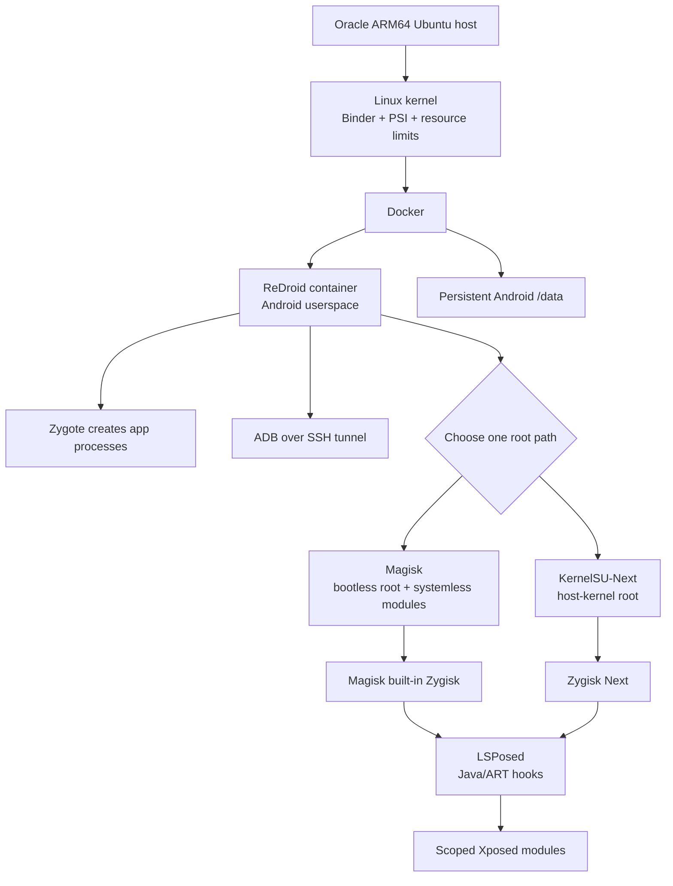

# ReDroid Rooting and Operations on Oracle ARM64

This repository is a practical setup, automation, and troubleshooting toolkit
for running rooted Android in a Docker container on an Oracle Cloud ARM64
Ubuntu VPS. It documents two root choices—Magisk and KernelSU-Next—plus the
ADB, Binder, Zygisk, LSPosed, kernel, module, recovery, and performance work
needed to keep a ReDroid instance usable.

## One-line mental model

**ReDroid** is Android userspace running in a Linux container and sharing the
host Linux kernel; **Magisk or KernelSU** provides root; **Zygisk** loads native
code while Android creates app processes; **LSPosed** hooks Java/ART methods;
and **ADB** is the remote control channel.

## Choose a root path

Use one root provider per Android instance. Do not mix Magisk and KernelSU or
run two Zygisk providers.

| Path | Best fit | Main material in this repository |
|---|---|---|
| **Magisk** | ReDroid 11/13 images and bootless Magisk experiments, including Zygisk, LSPosed, and Play Store work. | [`Magisk_setup/oracle-vps-redroid-magisk-setup.md`](Magisk_setup/oracle-vps-redroid-magisk-setup.md) and [`Magisk_setup/Redroid-A13-vs-A11-Rooting-Analysis.md`](Magisk_setup/Redroid-A13-vs-A11-Rooting-Analysis.md) |
| **KernelSU-Next** | The validated ReDroid 14 path on an Oracle ARM64 host, with root hooks built into a pinned host kernel. | [`KernelSU_setup/setup_guide.md`](KernelSU_setup/setup_guide.md) and [`KernelSU_setup/my_setup_journey.md`](KernelSU_setup/my_setup_journey.md) |

The Magisk path is useful when the selected Redroid image and Android version
already work well with bootless Magisk. The KernelSU-Next path avoids the
bootless root chain by putting the root hooks into the host kernel, but it
requires a controlled kernel build, reboot, rollback plan, and compatibility
patches for the documented Linux 6.8 setup.

## How the stack fits together



## Core terms

| Term | One-line definition |
|---|---|
| **ReDroid** | Android packaged as a container image, not a full virtual machine; it shares the host kernel. |
| **Docker** | The container runtime that starts, limits, and stores the ReDroid instance. |
| **Binder** | Android’s core IPC mechanism; the host must expose the real Binder devices to the container. |
| **Binderfs** | A Linux filesystem that creates the Binder device nodes Android expects. |
| **PSI** | Linux Pressure Stall Information; Android’s `lmkd` uses it to react to memory pressure. |
| **Magisk** | A userspace/bootless root provider with systemless mounts, `su`, modules, and built-in Zygisk. |
| **KernelSU-Next** | A kernel-level root provider whose hooks are built into the host kernel; `ksud` and KernelSU Manager handle userspace control. |
| **Zygisk** | A native module interface that runs during Zygote/app-process creation. |
| **Zygisk Next** | The Zygisk implementation used with KernelSU-Next in the main ReDroid 14 path. |
| **LSPosed** | A Java/ART hooking framework that runs through a Zygisk provider; it is not itself root. |
| **ADB** | Android Debug Bridge for shell commands, APK installation, logs, file transfer, and testing. |
| **SSH tunnel** | The secure path used to reach loopback-only ADB without publishing port `5555`. |

For the longer mental model and runtime diagrams, see
[Redroid_Perks.md](Redroid_Perks.md).

## Main validated path: KernelSU-Next + ReDroid 14

The validated KernelSU track uses:

- Ubuntu 24.04 on an Oracle ARM64 VPS with 4 KiB memory pages
- A pinned Linux `6.8.12-zksu` kernel with KernelSU-Next support
- ReDroid 14 in the `redroid14-ksu` container
- KernelSU Manager, matching `ksud`, Zygisk Next, and LSPosed
- Persistent Binder devices, bounded CPU/RAM/PID resources, and rotating logs
- A watchdog, boot validator, and ten-minute stability monitor
- A stock Ubuntu kernel retained for rollback

Start with the [fast setup guide](KernelSU_setup/setup_guide.md). It uses the
checked-in kernel packages when available and includes a WSL2 cross-build
fallback. The [setup journey](KernelSU_setup/my_setup_journey.md) contains the
full build history, pinned source identity, compatibility patches, incident
analysis, recovery procedures, and final validation evidence.

## Alternative path: Magisk + ReDroid 11/13

The Magisk material covers the image and host decisions needed for an
alternative Redroid deployment:

- Android 11/13 image selection and 32-bit/64-bit ABI concerns
- Binder, Binderfs, PSI, cgroups, and host preflight checks
- Magisk root, Zygisk, LSPosed, module installation, and Play Store setup
- ADB tunnelling, scrcpy-oriented operation, and container persistence
- Android 13/14 bootless-Magisk failure analysis and recovery guidance

Read the [complete Magisk guide](Magisk_setup/oracle-vps-redroid-magisk-setup.md)
for a procedure, then use the [A13 vs A11 analysis](Magisk_setup/Redroid-A13-vs-A11-Rooting-Analysis.md)
for the reasoning and tradeoffs. The included
[`enable_zygisk.sql`](Magisk_setup/enable_zygisk.sql) is a focused helper for
the documented Magisk database workflow.

## Troubleshooting techniques

Troubleshoot from the bottom of the stack upward instead of guessing from one
Android log line:

```text
Host resources and kernel
  -> Binder/Binderfs and PSI
    -> Docker/container state
      -> Android init and sys.boot_completed
        -> Magisk or KernelSU root
          -> Zygisk provider
            -> LSPosed and module scope
              -> Target application behavior
```

Useful techniques documented here include:

- Check `docker inspect`, `sys.boot_completed`, `adb devices`, and service state
  before changing files or restarting broadly.
- Check Binder device inode identity, not only major/minor numbers; look-alike
  devices caused an `ENXIO` failure in the KernelSU runbook.
- Check `/proc/pressure/memory`, `lmkd`, kernel logs, and container logs when
  Android stalls or enters a boot loop.
- Treat exit `137` as a symptom to classify—OOM, watchdog intervention, and
  other termination paths are different failures.
- Verify whether Zygisk and LSPosed are active at runtime; an installed module
  or Manager toggle alone is not proof.
- Keep ADB private through an SSH tunnel, preserve the stock kernel, and use
  the watchdog and resource limits as recovery boundaries.

See [Redroid_Perks.md](Redroid_Perks.md) for day-to-day diagnosis, modules,
backups, security, performance, and troubleshooting recipes; use the
[ADB cheat sheet](adb-cheat-sheet.md) for commands.

## Repository structure

```text
.
├── README.md
├── adb-cheat-sheet.md                 # ADB, logs, packages, root, debugging
├── Redroid_Perks.md                   # Operations, architecture, security
├── KernelSU_setup/
│   ├── setup_guide.md                 # Command-first KernelSU/ReDroid 14 setup
│   ├── my_setup_journey.md            # Build history, failures, recovery, proof
│   ├── vps/
│   │   ├── prepare_kernel_v2.sh       # Prepare pinned kernel source/config
│   │   ├── build_kernel_v2.sh         # Build ARM64 kernel .deb packages
│   │   ├── install_kernel_v2.sh       # Verify/install kernel and update GRUB
│   │   ├── deploy_redroid14_v2.sh     # Create container and install root assets
│   │   ├── validate_redroid14.sh      # Boot/root/module/service validation
│   │   ├── redroid14_watchdog_v2.sh   # Task-count runaway protection
│   │   ├── patches/                    # Inputs used by the VPS build
│   │   └── *.service, *.mount          # Binder, boot, watchdog, validation units
│   ├── artifacts/
│   │   ├── android/                   # Manager, ksud, Zygisk Next, LSPosed
│   │   ├── kernel-build/packages/     # Kernel image/headers .deb + SHA256SUMS
│   │   ├── kernel-build/config/       # Config and pinned source identity
│   │   └── kernel-build/patches/      # Linux 6.8 compatibility patches
├── Magisk_setup/
│   ├── oracle-vps-redroid-magisk-setup.md
│   ├── Redroid-A13-vs-A11-Rooting-Analysis.md
│   └── enable_zygisk.sql
└── .gitignore
```

## Typical setup flow

1. Choose either the [Magisk guide](Magisk_setup/oracle-vps-redroid-magisk-setup.md)
   or the [KernelSU fast guide](KernelSU_setup/setup_guide.md).
2. Replace SSH key and VPS placeholders locally; never commit a real private
   key or access credential.
3. Download missing Android fallback assets from the upstream URLs in the
   KernelSU guide, or use the documented Magisk image workflow.
4. Verify `SHA256SUMS` before installation or redistribution.
5. Keep ADB bound to `127.0.0.1:5555` and connect through SSH.
6. Run the relevant boot, root, module, and stability checks before using the
   instance for app testing or automation.

The APK, `ksud`, module ZIPs, and kernel `.deb` files are distribution
artifacts, not secrets. The checksum manifests are integrity records and are
kept with those artifacts.

## Safety notes

- Do not expose ADB or Docker port `5555` publicly.
- Do not mix Magisk and KernelSU in one instance or run two Zygisk providers.
- Do not treat `sys.boot_completed=1` as proof that root or hooks work.
- Do not remove resource limits, watchdogs, log rotation, or the rollback
  kernel after one successful boot.
- Do not run the live-branch KernelSU one-line setup command inside the pinned
  KernelSU build workflow; the fast guide explains why.
- Verify the exact kernel source, configuration, image digest, module assets,
  and checksums when rebuilding or moving to another host.

## Scope

This is a reproducible setup and operations record for the documented Oracle
ARM64 environment. KernelSU-Next on Linux 6.8 is treated as a tested
compatibility port with local patches, while the Magisk material documents a
separate image/root strategy. Preserve rollback options and validate the
exact environment before treating either path as production-ready.
