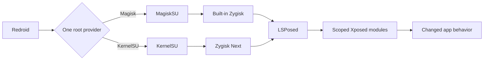
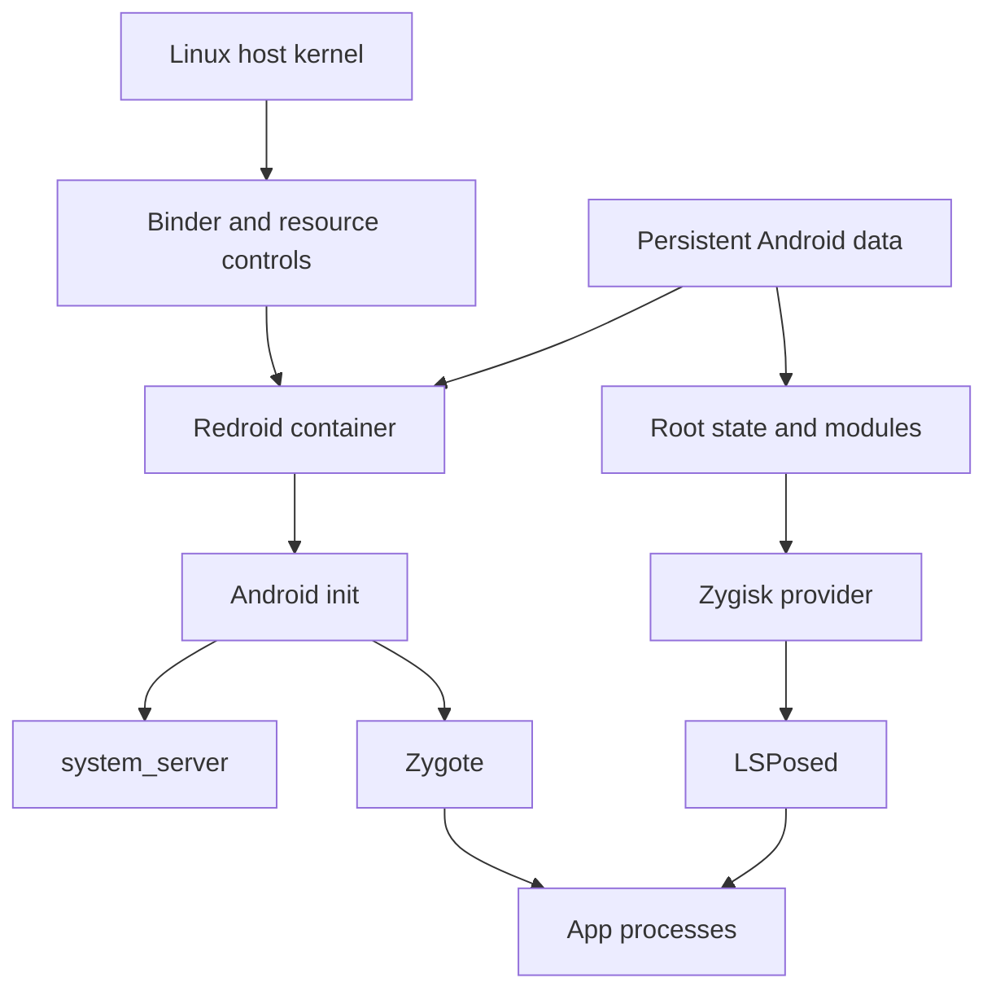
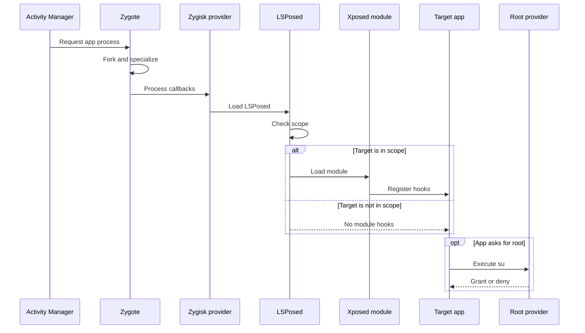
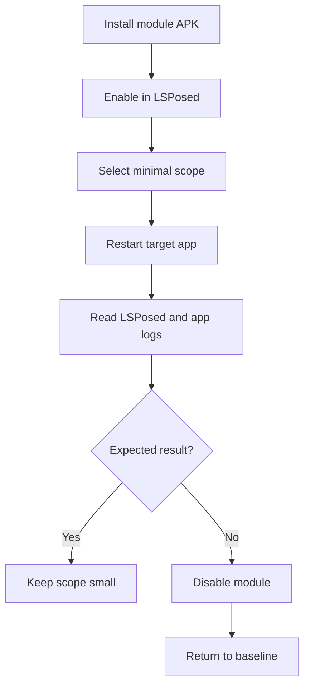
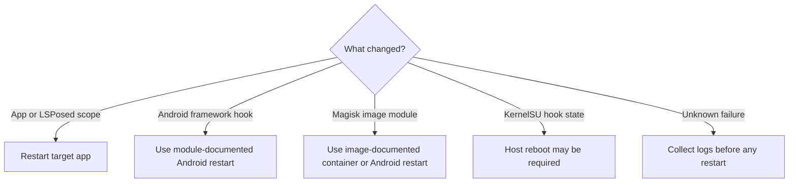
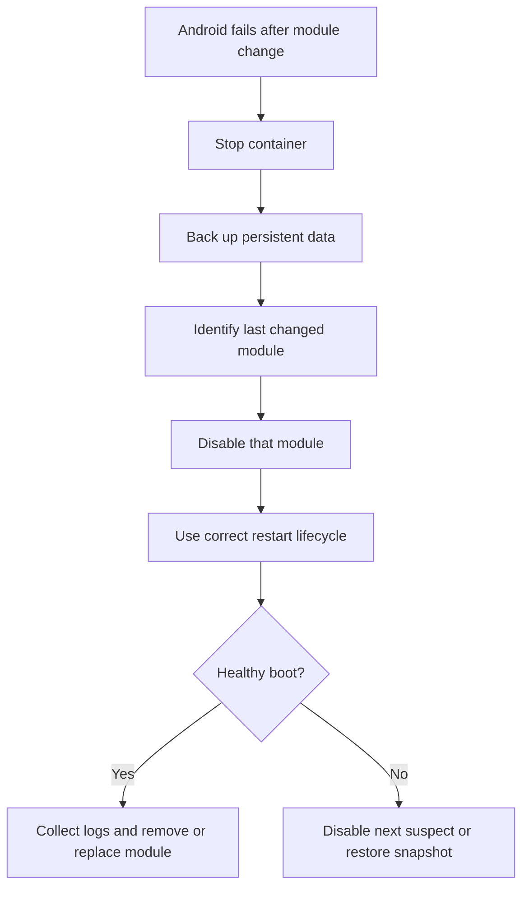
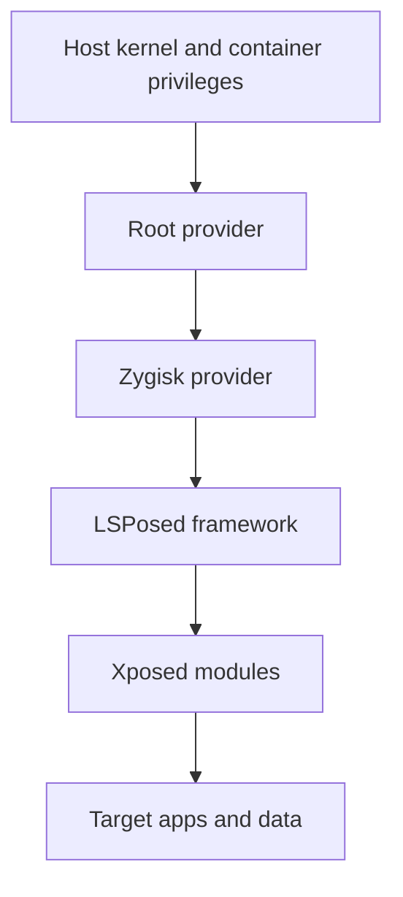
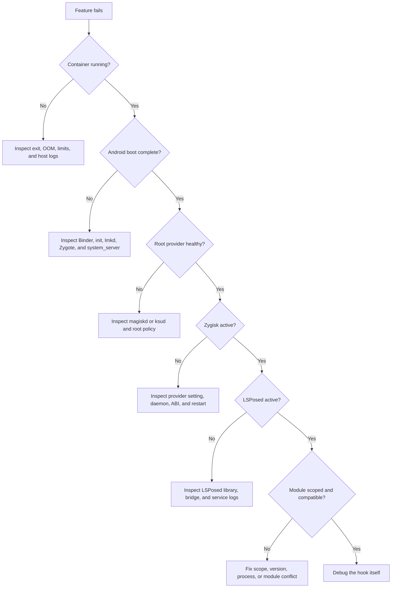

# Using a Rooted Redroid System

## A short, standalone field guide

This guide starts **after setup**. Redroid already boots. Root already works. Zygisk already works. LSPosed already works. Now use the system. Two stacks are supported:

- Redroid + Magisk + built-in Zygisk + LSPosed; Redroid + KernelSU + Zygisk Next + LSPosed.

This guide does not cover:

- Cloud account setup; Kernel builds; Redroid image builds; Root installation; Old incidents; One specific server; One specific container name; Local project files; Distribution packages.

Commands use placeholders. Replace them first.

```bash
CONTAINER=redroid
ADB_SERIAL=127.0.0.1:5555
```
Use only on systems you own or may test.
## Contents

- [Fast mental model](#fast-mental-model)
- [What the stack gives you](#what-the-stack-gives-you)
- [Architecture](#architecture)
- [How an app starts](#how-an-app-starts)
- [Know your kind of root](#know-your-kind-of-root)
- [First health check](#first-health-check)
- [ADB daily use](#adb-daily-use)
- [Root daily use](#root-daily-use)
- [Root modules](#root-modules)
- [Zygisk modules](#zygisk-modules)
- [LSPosed modules](#lsposed-modules)
- [Useful workflows](#useful-workflows)
- [Development workflows](#development-workflows)
- [Automation](#automation)
- [Files and persistence](#files-and-persistence)
- [Restart rules](#restart-rules)
- [Backup and recovery](#backup-and-recovery)
- [Security](#security)
- [Performance](#performance)
- [Troubleshooting](#troubleshooting)
- [Quick recipes](#quick-recipes)
- [Checklists](#checklists)
- [Glossary](#glossary)
- [Official reading](#official-reading)

## Fast mental model

Redroid is Android in a container. It is not a full virtual machine. It shares the host Linux kernel. The layers do different jobs.

| Layer | Simple job |
|---|---|
| Redroid | Runs Android userspace |
| Magisk or KernelSU | Gives controlled root |
| Zygisk | Loads native code during app creation |
| LSPosed | Hooks Java and ART methods |
| Xposed module | Defines the actual behavior change |
Pick one root path.


Do not mix Magisk and KernelSU. Do not run two Zygisk providers. LSPosed is not root. Zygisk is not root. The Manager app is not root by itself. An installed module is not proof of a live module. Proof needs runtime logs.
## What the stack gives you

You can run Android in the cloud. You can keep Android data between container starts. You can control Android with ADB. You can install APKs remotely. You can capture logs remotely. You can copy files in and out. You can run repeatable app tests. You can grant root to selected apps. You can deny root to other apps. You can run root boot scripts. You can run root background services. You can apply systemless changes. You can load native Zygisk modules. You can hook Java methods with LSPosed. You can scope hooks to one app. You can test several module combinations. You can disable a module without editing its target APK. You can restore clean behavior by disabling hooks. You can automate health checks. You can snapshot persistent data. You can recover from bad modules through the host. You still cannot assume:

- Every app supports containers; Every module supports your Android version; Every module supports your CPU ABI; Root is invisible; Hooks are invisible; Play Integrity will pass; Public ADB is safe; A restart fixes every fault.

**Pick the smallest tool**

| Need | Use |
|---|---|
| Install an APK | ADB |
| Read Android logs | ADB logcat |
| Run a normal shell command | ADB shell |
| Run a privileged command | Approved root |
| Start code at boot | Root module |
| Add systemless files | Root mount module |
| Load native code into app creation | Zygisk module |
| Hook Java methods | LSPosed module |
| Change Binder or kernel behavior | Host kernel tools |
Deep tool means more risk. Use the shallow tool first.
## Architecture

**Host side**
The Linux host owns the kernel. The host supplies Binder. The host supplies memory pressure data. The host runs Docker or another container engine. The host stores persistent Android data. The host should limit CPU. The host should limit memory. The host should limit tasks. The host should rotate logs. The host should keep ADB private.
**Container side**
The container runs Android init. Android init starts core services. Binder connects Android services. Zygote creates app processes. `system_server` hosts framework services. The launcher starts after framework boot. `sys.boot_completed=1` means basic boot finished. It does not prove root or hooks.
**Persistent side**
Android `/data` holds apps. Android `/data` holds app data. Android `/data/adb` holds root state. Modules normally live under `/data/adb/modules`. LSPosed keeps its own state under `/data/adb`. The host should persist Android `/data`. The container image should remain replaceable.


**Magisk path**
Magisk joins Android early boot. `magiskinit` prepares its runtime. `magiskd` runs its services. MagiskSU handles root requests. Magic Mount applies systemless files. Magisk can provide built-in Zygisk. The Magisk app controls grants and modules.
**KernelSU path**
KernelSU joins the Linux kernel. The kernel handles root policy. `ksud` handles userspace work. KernelSU Manager controls grants and modules. Zygisk Next supplies the Zygisk API. KernelSU may support detailed App Profiles.
**Common top layer**
Both paths can load LSPosed. LSPosed reads its scope database. LSPosed loads enabled Xposed modules. Only selected processes should receive each module.
## How an app starts

Android asks Zygote for a process. Zygote forks. Android gives the child an app UID. Android applies process settings. Zygisk gets lifecycle callbacks. Zygisk loads compatible native modules. LSPosed checks the package name. LSPosed checks the process name. LSPosed checks the Android user. LSPosed checks module scope. An in-scope module loads. An out-of-scope module stays out. The app then starts normal code. Root is a separate decision.


**Why scope matters**
Small scope means fewer crashes. Small scope means less memory. Small scope means less startup work. Small scope means fewer conflicts. Small scope makes logs clearer. Small scope makes rollback easy. Avoid “select all.” Avoid system framework scope unless required.
## Know your kind of root

**Host root**
Host root controls Linux. It controls containers. It controls host files. It controls Binder devices. It is outside Android app policy.

```bash
sudo id
```
**ADB root**
Some Redroid images start ADB as root. This can happen without Magisk. This can happen without KernelSU. So this proves only ADB privilege:

```bash
adb -s "$ADB_SERIAL" shell id
```
**App root**
An ordinary app has its own UID. It calls `su` for privilege. The selected root provider checks policy. The user grants or denies access. This is the root test that matters for apps.
**Hooked process**
A hooked app may have no root. A rooted app may have no hooks. Root and hooks are separate powers.

| App state | Root | Hooks |
|---|---:|---:|
| Normal app | No | No |
| Root app | Yes | No |
| Scoped app | No | Yes |
| Root and scoped | Yes | Yes |
## First health check

Run this before real work.
**Check the container**

```bash
docker inspect "$CONTAINER" --format 'status={{.State.Status}} oom={{.State.OOMKilled}} restarts={{.RestartCount}}'
```
Good signs:

- Status is `running`; OOM killed is `false`; Restart count is stable.

**Check resource use**
```bash
docker stats --no-stream "$CONTAINER"
```
Look for:

- Stable CPU; Stable memory; Stable task count; No rapid growth.

**Check Android boot**
```bash
docker exec "$CONTAINER" getprop sys.boot_completed
```
Expected:
```text
1
```
**Check core services**
```bash
adb -s "$ADB_SERIAL" shell service check activity
adb -s "$ADB_SERIAL" shell service check package
adb -s "$ADB_SERIAL" shell service check window
```
Each should report a service.
**Check root provider**
Magisk:
```bash
adb -s "$ADB_SERIAL" shell magisk -v
adb -s "$ADB_SERIAL" shell ps -A | grep magiskd
```
KernelSU:
```bash
docker exec "$CONTAINER" /data/adb/ksud -V
docker exec "$CONTAINER" /data/adb/ksud module list
```
**Check Zygisk**
Magisk path:

- Open Magisk; Confirm Zygisk is enabled; Read Zygisk logs.

KernelSU path:

- Confirm Zygisk Next is enabled; Confirm its daemon exists; Read its module description.

**Check LSPosed**

- Open LSPosed Manager; Confirm framework is active; Confirm a bridge/service log exists; Confirm no repeated crash appears.

**Check one real module**

- Pick one harmless test module; Scope it to one test app; Start the app; Confirm one visible result; Read the module log; Disable it; Confirm normal behavior returns.

This tests the full chain.
## ADB daily use

**Keep ADB private**
Bind ADB to host loopback. Use an SSH tunnel. Do not publish rooted ADB to the internet. Example tunnel:
```powershell
$Server = "your.server.example"
$SshUser = "ubuntu"
ssh -N -L 5555:127.0.0.1:5555 "$SshUser@$Server"
```
Connect locally:
```powershell
adb connect 127.0.0.1:5555
adb devices -l
```
**Select the device**
```bash
ADB_SERIAL=127.0.0.1:5555
adb -s "$ADB_SERIAL" get-state
```
**Open a shell**
```bash
adb -s "$ADB_SERIAL" shell
```
**Run one command**
```bash
adb -s "$ADB_SERIAL" shell getprop ro.build.version.release
```
**Install an APK**
```bash
adb -s "$ADB_SERIAL" install -r app.apk
```
Use `-r` to replace while keeping data. Use `-d` only for a deliberate downgrade.
**Uninstall an app**
```bash
adb -s "$ADB_SERIAL" uninstall com.example.app
```
Keep data if needed:
```bash
adb -s "$ADB_SERIAL" shell pm uninstall -k --user 0 com.example.app
```
**List packages**
```bash
adb -s "$ADB_SERIAL" shell pm list packages
adb -s "$ADB_SERIAL" shell pm list packages -3
```
**Find one package**
```bash
adb -s "$ADB_SERIAL" shell pm list packages | grep example
```
**Find APK path**
```bash
adb -s "$ADB_SERIAL" shell pm path com.example.app
```
**Start an activity**
```bash
adb -s "$ADB_SERIAL" shell monkey -p com.example.app 1
```
**Force-stop an app**
```bash
adb -s "$ADB_SERIAL" shell am force-stop com.example.app
```
**Clear app data**
```bash
adb -s "$ADB_SERIAL" shell pm clear com.example.app
```
This destroys that app’s local data.
**Push a file**
```bash
adb -s "$ADB_SERIAL" push local.bin /data/local/tmp/local.bin
```
**Pull a file**
```bash
adb -s "$ADB_SERIAL" pull /sdcard/Download/report.txt .
```
**Capture a screenshot**
```bash
adb -s "$ADB_SERIAL" exec-out screencap -p > screen.png
```
**Record the screen**
```bash
adb -s "$ADB_SERIAL" shell screenrecord /sdcard/demo.mp4
adb -s "$ADB_SERIAL" pull /sdcard/demo.mp4 .
```
**Read logs**
```bash
adb -s "$ADB_SERIAL" logcat
```
Clear old logs first:
```bash
adb -s "$ADB_SERIAL" logcat -c
```
Dump and exit:
```bash
adb -s "$ADB_SERIAL" logcat -d > logcat.txt
```
Filter one app PID:
```bash
PID=$(adb -s "$ADB_SERIAL" shell pidof com.example.app | tr -d '\r')
adb -s "$ADB_SERIAL" logcat --pid="$PID"
```
**Check boot properties**
```bash
adb -s "$ADB_SERIAL" shell getprop sys.boot_completed
adb -s "$ADB_SERIAL" shell getprop ro.product.cpu.abi
adb -s "$ADB_SERIAL" shell getprop ro.build.version.sdk
```
**Disconnect**
```bash
adb disconnect "$ADB_SERIAL"
```
## Root daily use

Root is dangerous. Grant it slowly.
**Before granting root**
Ask:

- Who made the app?; Is source available?; Why does it need root?; Can ADB do the job instead?; Can a narrow profile do the job?; Can the command be run once manually?.

**Grant flow**

1. Start the app.
2. Let it request `su`.
3. Read the request.
4. Grant only if expected.
5. Run one test.
6. Read logs.
7. Revoke if no longer needed.

**Magisk control**
Use the Magisk app. Review Superuser entries. Remove stale grants. Do not grant forever by habit.
**KernelSU control**
Use KernelSU Manager. Review the app allowlist. Use App Profiles when supported. Limit UID, groups, capabilities, or SELinux rights when practical.
**Root command test**
Test through a normal app or approved shell identity. Do not use an already-root ADB shell as proof. Simple command:
```bash
su -c id
```
Expected for full root:
```text
uid=0(root)
```
**Safer command habits**

- Print paths before deleting; Quote every path; Avoid wildcards as root; Avoid recursive writes to `/data`; Back up before changing modules; Prefer read-only checks first; Keep commands in a log.

## Root modules

A root module changes the root environment. It may run scripts. It may start a daemon. It may set properties. It may add SELinux rules. It may add systemless files. It may contain a Zygisk module.
**Normal module files**
```text
module.prop
customize.sh
post-fs-data.sh
service.sh
system.prop
sepolicy.rule
system/
zygisk/
```
Not every module has every file.
**Module stages**
Install stage prepares files. `post-fs-data` runs early. `service` runs later. Mount logic changes file views. Zygisk logic waits for Zygote.
**Install rule**
Use the selected root Manager. Do not unzip modules by hand. Manual copying can create false success. The folder may exist. The scripts may never run. The native library may never load.
**Before installing**

- Confirm root provider support; Confirm Android version support; Confirm CPU ABI support; Confirm Zygisk provider support; Confirm checksum; Read `module.prop`; Read install scripts; Read boot scripts; Read open issues; Make a data backup.

**After installing**

- Follow the correct restart rule; Confirm update markers are gone; Confirm module files exist; Confirm service processes exist; Confirm runtime logs exist; Confirm Android boot still completes; Confirm resource use stays stable.

**Disable first**
If a module breaks Android:

1. Stop the container.
2. Back up `/data`.
3. Add the module’s disable marker.
4. Start using the correct lifecycle.
5. Check boot.
6. Remove only after proof.

Typical marker:
```text
/data/adb/modules/<module-id>/disable
```
Exact recovery behavior depends on the root provider.
## Zygisk modules

Zygisk modules are native code. They join app process creation. They can see process metadata. They can load into selected processes. They can change native runtime behavior. They can also crash a process.
**Provider map**

| Root provider | Normal Zygisk provider |
|---|---|
| Magisk | Built-in Zygisk |
| KernelSU | Zygisk Next |
One root provider. One Zygisk provider.
**ABI matters**
An ARM64 Zygote needs ARM64 code. An x86_64 Zygote needs x86_64 code. A mixed-ABI image may need both libraries. Check ABI:
```bash
adb -s "$ADB_SERIAL" shell getprop ro.product.cpu.abilist
```
**Runtime proof**
Installed files are weak proof. An enabled flag is weak proof. Use stronger proof:

- Zygisk daemon is alive; Zygote did not crash; Module library loaded; Companion process connected; Target process shows expected behavior; Logs name the correct ABI.

**Native module risk**
A bad Java hook may break one method. A bad native hook may kill the whole process. A Zygote fault can break many apps. Test native modules alone.
## LSPosed modules

LSPosed is a framework. An Xposed module supplies behavior. The module is usually an APK. The module uses Xposed APIs. LSPosed loads it into selected processes.
**Scope flow**

**Safe first test**
Use a disposable app. Use one module. Use one package scope. Avoid Android System. Avoid `system_server`. Clear old logs. Start the app once. Read logs. Disable the module. Retest baseline.
**What a hook can do**
A hook can inspect arguments. A hook can change arguments. A hook can run before a method. A hook can run after a method. A hook can replace a return value. A hook can skip the original method. A hook can observe exceptions. A hook can replace exceptions.
**What a hook cannot promise**

- Future app compatibility; No crash; No detection; Correct behavior after app updates; Safety in every process; Permission to modify third-party services.

**Module conflict test**
If two modules touch one app:

1. Disable both.
2. Test clean app.
3. Enable module A.
4. Test again.
5. Disable A.
6. Enable module B.
7. Test again.
8. Enable both only if each works alone.

**Multi-process apps**
One package may use many processes. The main process may work. A remote service may still fail. Check process names:
```bash
adb -s "$ADB_SERIAL" shell ps -A | grep com.example.app
```
Scope and logs must match the real process.
## Useful workflows

**App compatibility lab**
Keep one clean data snapshot. Install one app version. Run a clean baseline. Save logs. Enable one module. Run the same actions. Compare output. Roll back data. Repeat with another version.
**Regression testing**
Define one start state. Define one test script. Define expected output. Capture app version. Capture module versions. Capture Android properties. Capture logs. Repeat after updates.
**Root app testing**
Start with root denied. Observe failure behavior. Grant root. Observe success behavior. Revoke root. Confirm cleanup. Test a narrow profile if available.
**Hook debugging**
Clear logcat. Restart only the target app. Trigger one feature. Save LSPosed logs. Save app logs. Record class and method names. Test one hook at a time.
**Remote UI use**
Use `scrcpy` through private ADB. Keep ADB tunneled. Lower resolution if bandwidth is poor. Lower frame rate if CPU is limited. Close the viewer when not needed.
**Disposable sandbox**
Clone from a known data snapshot. Give the clone a new container name. Give it a separate ADB port. Give it separate `/data`. Do not share writable module data. Test risky modules only there.
**Controlled property test**
Record the original property. Change one property. Restart the affected process. Test one behavior. Restore the property. Do not change many properties together.
## Development workflows

**Choose the layer**
Need root command? Write a root app or script. Need boot task? Write a root module. Need native app-start code? Write a Zygisk module. Need Java method hooks? Write an LSPosed module. Need kernel behavior? Work on the host kernel.
**LSPosed development loop**

1. Build the module APK.
2. Install with ADB.
3. Enable in LSPosed.
4. Select one test package.
5. Force-stop the target.
6. Clear logs.
7. Start the target.
8. Trigger one method.
9. Read logs.
10. Disable on crash.

Install update:
```bash
adb -s "$ADB_SERIAL" install -r module-debug.apk
```
Restart target:
```bash
adb -s "$ADB_SERIAL" shell am force-stop com.example.target
adb -s "$ADB_SERIAL" shell monkey -p com.example.target 1
```
**Zygisk development loop**

1. Detect target ABI.
2. Build matching native library.
3. Package a valid root module.
4. Record its checksum.
5. Install through the Manager.
6. Use the correct restart.
7. Check Zygote health.
8. Check module load log.
9. Test one target process.
10. Remove on native crash.

**Logging rules**
Use a unique tag. Log module version once. Log target package once. Log process name once. Avoid hot-loop logs. Avoid secrets. Avoid full tokens. Avoid personal data.
**Test matrix**
Record:

- Android version; Android API level; CPU ABI; Root provider; Root provider version; Zygisk provider; LSPosed version; Module version; Target app version; Process name; Scope.

**Release discipline**
Pin dependencies. Sign APKs consistently. Publish checksums. Keep a changelog. State supported ABIs. State supported Android versions. State required root provider. State required restart. State safe recovery steps.
## Automation

**Basic boot wait**
```bash
until [ "$(adb -s "$ADB_SERIAL" shell getprop sys.boot_completed 2>/dev/null | tr -d '\r')" = "1" ]; do
  sleep 5
done
```
Use a timeout in production. Never wait forever.
**Health script shape**
```text
check container running
check no OOM kill
check Android boot complete
check root provider
check Zygisk provider
check LSPosed bridge
check CPU and memory
check task count
save logs on failure
exit nonzero on failure
```
**App test shape**
```text
install exact APK
clear old logs
set exact module scope
start app
perform test action
collect result
collect logs
stop app
restore state
```
**Avoid flaky automation**
Wait for boot property. Then wait for needed service. Then start the app. Do not use blind long sleeps. Do not start five tests together. Do not mutate shared data in parallel. Use unique output folders. Record timestamps in UTC.
**Useful machine-readable facts**
```bash
adb -s "$ADB_SERIAL" shell getprop ro.build.version.sdk
adb -s "$ADB_SERIAL" shell getprop ro.product.cpu.abilist
adb -s "$ADB_SERIAL" shell getprop ro.build.fingerprint
adb -s "$ADB_SERIAL" shell pm list packages -3
docker inspect "$CONTAINER"
docker stats --no-stream "$CONTAINER"
```
**Failure bundle**
Save:

- Container inspect JSON; Container logs; Android logcat; Kernel log tail; Root module list; LSPosed logs; Android properties; Resource snapshot; Exact test steps.

Remove secrets before sharing.
## Files and persistence

**Three storage areas**
Container image is the base. Container writable layer is temporary state. Bind-mounted Android `/data` is persistent state. Know which one you change.
**Important Android paths**
```text
/data/app
/data/data
/data/user
/data/local/tmp
/data/adb
/data/adb/modules
```
Do not edit app-private data casually. Do not change owners blindly. Do not run recursive `chmod 777`.
**Temporary transfer path**
Use:
```text
/data/local/tmp
```
Clean old files later. Do not store permanent module state there.
**Module path**
Root modules usually live here:
```text
/data/adb/modules
```
The provider may use update/staging folders. Do not move staged files by hand.
**Data ownership**
Android expects specific UIDs. SELinux may expect specific labels. A host copy can lose metadata. Use archive tools that preserve owners and xattrs when required. Test restore before trusting backup.
## Restart rules

Restart the smallest layer that works.
**App restart**
Use after changing app scope or app code.
```bash
adb -s "$ADB_SERIAL" shell am force-stop com.example.app
adb -s "$ADB_SERIAL" shell monkey -p com.example.app 1
```
**Android framework restart**
Some framework hooks need more than an app restart. Use only if the module documents it. Expect brief ADB loss.
**Container restart**
This restarts Android userspace. It does not restart the host kernel. It may reset a Magisk Redroid integration. It may not reset KernelSU kernel hooks.
**Host reboot**
This reloads the host kernel. This resets kernel-side state. This is the full reset for many KernelSU Redroid designs. It also restarts every host service. Use it deliberately.

**Never restart first**
First save logs. First inspect exit reason. First inspect OOM state. First inspect task growth. Restarting can erase evidence.
## Backup and recovery

**Back up before**

- Root module install; Zygisk module install; LSPosed framework update; Root provider update; Large app data migration; Permission repair; Systemless mount change.

**Consistent backup**
Stop Android writes first. Stop the container cleanly. Confirm it stopped. Archive persistent `/data`. Preserve ownership. Preserve extended attributes if needed. Record root and module versions. Start the original again.
**Restore test**
Restore into a separate path. Use a separate container name. Use a separate ADB port. Boot the clone. Check apps. Check root. Check LSPosed. Only then trust the backup.
**Bad module recovery**

**Recovery order**

1. Preserve evidence.
2. Stop restart loops.
3. Back up data.
4. Disable last change.
5. Boot once.
6. Verify Android.
7. Verify root.
8. Verify Zygisk.
9. Verify LSPosed.
10. Re-enable changes one at a time.

## Security

Root expands trust. Zygisk expands trust. LSPosed expands trust. Every module runs powerful code.
**Keep private**

- ADB endpoint; SSH key; Root database; Android data backups; App tokens; Module logs with personal data.

**ADB rule**
Use loopback plus SSH tunnel. Do not expose port 5555 publicly. A firewall allow rule is not authentication.
**Root rule**
Grant the minimum. Review grants often. Remove unused root apps. Do not run unknown shell scripts.
**Module rule**
Use official releases. Verify checksums. Read scripts. Read license terms. Check open issues. Keep a rollback.
**Scope rule**
Scope to one app first. Never select all by habit. Treat framework scope as high risk.
**Detection reality**
Root can be detected. Hooks can be detected. Mounts can be detected. Modules can be detected. Manager apps can be detected. Kernel changes can be detected. Do not promise invisibility.
**Attestation reality**
Root approval is one system. Play certification is another. Play Integrity is another. Hardware attestation is another. Passing one does not imply another.
**Trust order**

Higher layer compromise can affect lower data. Host compromise can affect everything.
## Performance

Redroid uses many threads. Docker PIDs may include threads. Do not set tiny task limits blindly. Measure a clean boot. Measure a module boot. Measure steady state. Keep headroom.
**Watch**

- CPU percentage; Memory use; Task count; Restart count; OOM state; Disk free space; Log growth; Memory pressure.

**Common performance costs**
Large LSPosed scope costs memory. Many native modules cost startup time. Hot method hooks cost CPU. Verbose logs cost CPU and disk. High screen resolution costs GPU and bandwidth. Too many background apps cost memory.
**Good optimization order**

1. Remove broken modules.
2. Reduce LSPosed scope.
3. Stop hot-loop logging.
4. Reduce background apps.
5. Lower display resolution or frame rate.
6. Measure again.
7. Change limits only with evidence.

**Detect runaway tasks**
```bash
docker stats --no-stream "$CONTAINER"
docker top "$CONTAINER" -eo pid,ppid,comm,%cpu,%mem
```
If tasks climb fast:

- Save logs; Find repeating crashes; Find service restart loops; Stop the container if host health is at risk; Do not enable automatic restart loops.

**Logs**
Rotate container logs. Avoid unlimited logcat capture. Do not flood host kernel logs. Compress old diagnostics. Delete only known temporary files.
## Troubleshooting

Use one ladder. Do not guess from the top.

**Container not running**
Check:
```bash
docker inspect "$CONTAINER"
docker logs --tail 200 "$CONTAINER"
```
Look for:

- Exit code; OOM flag; Task limit; Missing device; Bad mount; Permission error.

**ADB connection refused**
Check listener:
```bash
ss -lntp | grep 5555
```
Check port mapping:
```bash
docker port "$CONTAINER"
```
Check SSH tunnel. Cloud firewall does not create a listener.
**ADB says offline**
Wait for Android init. Restart local ADB server:
```bash
adb kill-server
adb start-server
adb connect "$ADB_SERIAL"
```
Then inspect container logs.
**Boot property never becomes 1**
Read:
```bash
adb -s "$ADB_SERIAL" logcat -b all -d
docker logs --tail 500 "$CONTAINER"
```
Search for:

- Binder errors; `servicemanager` loops; `lmkd` exits; Zygote crashes; `system_server` crashes; SELinux denials; ABI loader errors.

**Root Manager shows not installed**
Manager APK may be present alone. Check actual runtime. Magisk:
```bash
adb -s "$ADB_SERIAL" shell magisk -v
adb -s "$ADB_SERIAL" shell ps -A | grep magiskd
```
KernelSU:
```bash
docker exec "$CONTAINER" /data/adb/ksud -V
```
**Root request never appears**
Confirm app really calls `su`. Confirm app UID. Confirm only one root provider. Check provider logs. Check deny policy. Do not test from already-root ADB.
**Zygisk enabled but dead**
Check correct provider. Check only one provider. Check ABI. Check restart method. Check Zygote logs. Check module update state.
**LSPosed says inactive**
Check Zygisk first. Check LSPosed native library. Check LSPosed daemon. Check bridge log. Check Android version support. Reinstall through the Manager if files were copied manually.
**Module active but no effect**
Check module enabled. Check exact package scope. Check exact process. Check Android user. Check app version. Check method signature. Restart target app. Read module logs.
**App crashes only with module**
Disable that module. Confirm clean baseline. Reduce scope. Disable other modules. Check app update changes. Report a minimal reproduction.
**CPU reaches 100 percent**
Save stats. Save logs. Check repeating service deaths. Check log storms. Check task growth. Stop the container if the host is threatened. Do not just raise every limit.
**Memory grows**
Compare clean boot. Compare modules disabled. Reduce scope. Look for app restart loops. Look for native leaks. Check OOM state.
**Exit code 137**
It means SIGKILL. It does not always mean OOM. Check:

- OOM flag; Watchdog logs; Manual kills; Task limits; Host memory logs.

**Disk fills**
Check:
```bash
df -h
docker system df
du -xhd1 /path/to/redroid-data
```
Likely causes:

- Container logs; Logcat dumps; Screen recordings; APK downloads; Old backups; App caches.

Delete only identified files.
## Quick recipes

**Confirm Android is ready**
```bash
adb -s "$ADB_SERIAL" shell getprop sys.boot_completed
```
**Show Android version**
```bash
adb -s "$ADB_SERIAL" shell getprop ro.build.version.release
```
**Show API level**
```bash
adb -s "$ADB_SERIAL" shell getprop ro.build.version.sdk
```
**Show CPU ABI**
```bash
adb -s "$ADB_SERIAL" shell getprop ro.product.cpu.abilist
```
**Show current app PID**
```bash
adb -s "$ADB_SERIAL" shell pidof com.example.app
```
**Show current activity**
```bash
adb -s "$ADB_SERIAL" shell dumpsys activity activities | grep mResumedActivity
```
**Show package details**
```bash
adb -s "$ADB_SERIAL" shell dumpsys package com.example.app
```
**Grant a normal Android permission**
```bash
adb -s "$ADB_SERIAL" shell pm grant com.example.app android.permission.POST_NOTIFICATIONS
```
This is not root grant.
**Revoke a normal Android permission**
```bash
adb -s "$ADB_SERIAL" shell pm revoke com.example.app android.permission.POST_NOTIFICATIONS
```
**Clear one app log test**
```bash
adb -s "$ADB_SERIAL" logcat -c
adb -s "$ADB_SERIAL" shell am force-stop com.example.app
adb -s "$ADB_SERIAL" shell monkey -p com.example.app 1
adb -s "$ADB_SERIAL" logcat -d > app-test.log
```
**List third-party apps**
```bash
adb -s "$ADB_SERIAL" shell pm list packages -3
```
**List root modules**
Generic filesystem view:
```bash
adb -s "$ADB_SERIAL" shell ls -1 /data/adb/modules
```
Use the provider Manager for authoritative state.
**Find LSPosed logs**
```bash
adb -s "$ADB_SERIAL" shell find /data/adb -maxdepth 3 -type f -iname '*log*' | grep -i lsp
```
Paths vary by version.
**Watch crashes**
```bash
adb -s "$ADB_SERIAL" logcat '*:S' AndroidRuntime:E DEBUG:E libc:F
```
**Watch one package start**
```bash
adb -s "$ADB_SERIAL" shell am force-stop com.example.app
adb -s "$ADB_SERIAL" logcat -c
adb -s "$ADB_SERIAL" shell monkey -p com.example.app 1
adb -s "$ADB_SERIAL" logcat -d | grep -i com.example.app
```
**Check container limits**
```bash
docker inspect "$CONTAINER" --format 'memory={{.HostConfig.Memory}} pids={{.HostConfig.PidsLimit}} cpus={{.HostConfig.NanoCpus}}'
```
**Check OOM status**
```bash
docker inspect "$CONTAINER" --format '{{.State.OOMKilled}}'
```
**Check restart policy**
```bash
docker inspect "$CONTAINER" --format '{{.HostConfig.RestartPolicy.Name}}'
```
**Stop cleanly**
```bash
docker stop --time 10 "$CONTAINER"
```
**Start existing container**
```bash
docker start "$CONTAINER"
```
Use the stack’s restart rules.
**Save diagnostics**
```bash
mkdir -p diagnostics
docker inspect "$CONTAINER" > diagnostics/container-inspect.json
docker logs "$CONTAINER" > diagnostics/container.log 2>&1
adb -s "$ADB_SERIAL" logcat -b all -d > diagnostics/logcat.txt
docker stats --no-stream "$CONTAINER" > diagnostics/stats.txt
```
Review for secrets.
## Checklists

**Before each work session**

- [ ] SSH tunnel is active.
- [ ] ADB connects to loopback.
- [ ] Container is running.
- [ ] OOM flag is false.
- [ ] Android boot equals 1.
- [ ] Root provider is healthy.
- [ ] Zygisk provider is healthy.
- [ ] LSPosed is active.
- [ ] CPU is stable.
- [ ] Memory is stable.
- [ ] Disk has free space.

**Before installing a root module**

- [ ] Source is trusted.
- [ ] License is understood.
- [ ] Checksum is verified.
- [ ] Android version is supported.
- [ ] ABI is supported.
- [ ] Root provider is supported.
- [ ] Zygisk provider is supported.
- [ ] Scripts were reviewed.
- [ ] Backup exists.
- [ ] Recovery path exists.
- [ ] Correct restart method is known.

**Before enabling an LSPosed module**

- [ ] Module source is trusted.
- [ ] Target app is authorized for testing.
- [ ] Target app version is supported.
- [ ] Only one test module is enabled.
- [ ] Scope contains one package first.
- [ ] System framework is not selected casually.
- [ ] Baseline behavior is recorded.
- [ ] Logs are cleared.
- [ ] Disable path is known.

**After a change**

- [ ] Android still boots.
- [ ] Root still works.
- [ ] Zygote is stable.
- [ ] LSPosed bridge is active.
- [ ] Target app starts.
- [ ] Expected behavior appears.
- [ ] Unscoped apps remain unchanged.
- [ ] CPU remains stable.
- [ ] Memory remains stable.
- [ ] Task count remains stable.
- [ ] No log storm appears.

**Weekly maintenance**

- [ ] Review root grants.
- [ ] Review enabled modules.
- [ ] Review LSPosed scopes.
- [ ] Remove unused APKs.
- [ ] Clean known temporary files.
- [ ] Rotate diagnostics.
- [ ] Check disk space.
- [ ] Check backup age.
- [ ] Test one restore periodically.
- [ ] Record version changes.

**Before updating anything**

- [ ] Read changelog.
- [ ] Read known issues.
- [ ] Confirm compatibility matrix.
- [ ] Save old package.
- [ ] Save current versions.
- [ ] Back up persistent data.
- [ ] Update one layer only.
- [ ] Reboot using the correct rule.
- [ ] Run full health check.
- [ ] Keep rollback until stable.

**Emergency checklist**

- [ ] Stop automatic restart loop.
- [ ] Save host and container logs.
- [ ] Save inspect output.
- [ ] Stop the container if host health drops.
- [ ] Back up persistent data.
- [ ] Disable the last changed module.
- [ ] Start once.
- [ ] Verify boot.
- [ ] Restore snapshot if still broken.
- [ ] Do not delete broad paths.

## Glossary

| Term | Plain meaning |
|---|---|
| ADB | Command tool for Android |
| ADB root | Privileged ADB shell; not proof of app root |
| Android `/data` | Persistent apps, settings, and root state |
| App Profile | KernelSU rules for one app |
| ART | Android Java/Kotlin runtime |
| Binder | Android service communication driver |
| Container | Isolated userspace sharing the host kernel |
| Hook | Code that intercepts a method or lifecycle point |
| KernelSU | Kernel-based Android root provider |
| `ksud` | KernelSU userspace tool and service |
| LSPosed | Xposed-compatible ART hook framework |
| Magisk | Android root and systemless module framework |
| `magiskd` | Magisk userspace daemon |
| MagiskSU | Magisk root request path |
| Magic Mount | Magisk systemless file view |
| Manager | UI for root or hook configuration |
| Module | Package that adds behavior |
| OOM | Out of memory condition |
| PID | Process identifier; Docker counts may include threads |
| PSI | Linux resource pressure data |
| Scope | Apps or processes receiving an LSPosed module |
| Systemless | Runtime change without rewriting the base system image |
| Xposed module | APK containing ART/Java hooks |
| Zygisk | Native module API around Zygote app creation |
| Zygisk Next | Standalone Zygisk provider commonly used with KernelSU |
| Zygote | Android template process that creates apps |
## Official reading

This guide is standalone. It depends only on public concepts. Use upstream docs for version details.

- [Redroid documentation](https://github.com/remote-android/redroid-doc)
- [Android Zygote documentation](https://source.android.com/docs/core/runtime/zygote)
- [Magisk documentation](https://topjohnwu.github.io/Magisk/)
- [Magisk internal details](https://topjohnwu.github.io/Magisk/details.html)
- [KernelSU documentation](https://kernelsu.org/)
- [KernelSU module guide](https://kernelsu.org/guide/module.html)
- [Zygisk Next](https://github.com/Dr-TSNG/ZygiskNext)
- [LSPosed](https://github.com/LSPosed/LSPosed)
- [Docker resource constraints](https://docs.docker.com/engine/containers/resource_constraints/)

Final rule:
```text
Check bottom layer first.
Container.
Android boot.
Root provider.
Zygisk provider.
LSPosed.
Module scope.
Hook behavior.
```
Small steps. Small scope. One change. Keep logs. Keep backup.
Stay reversible.
