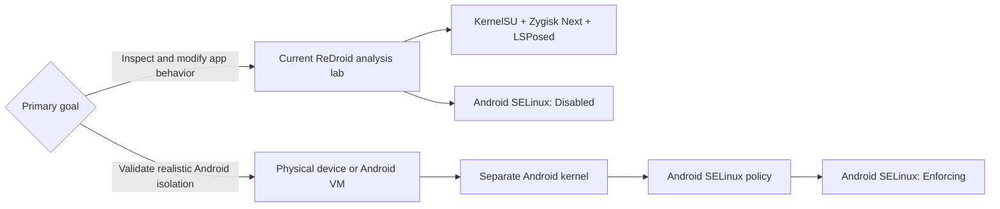
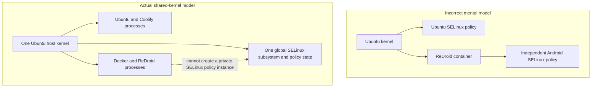
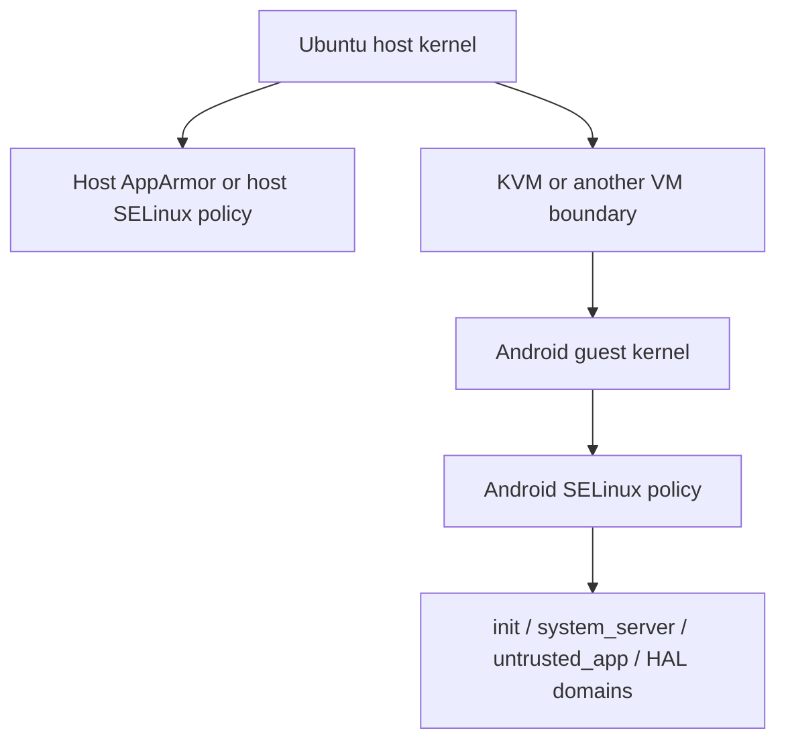
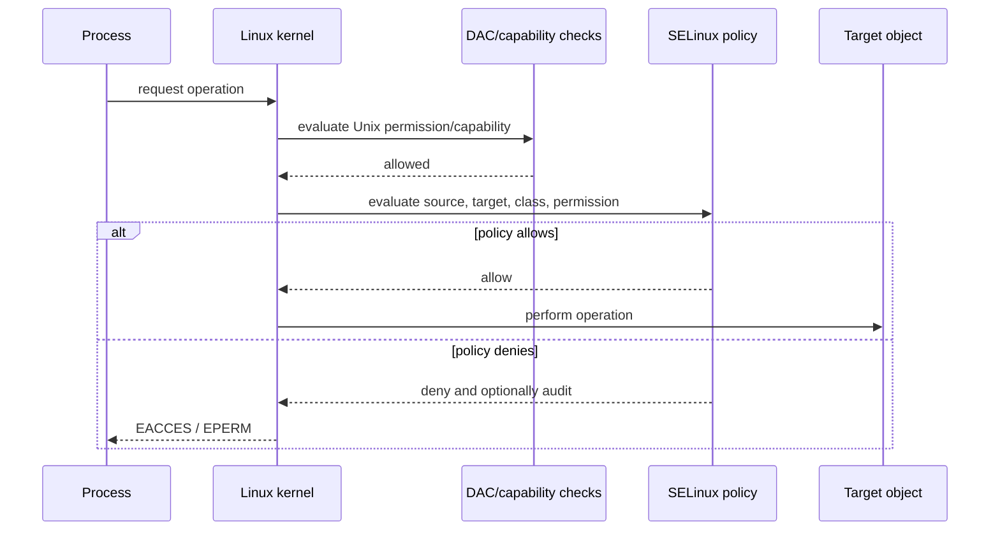
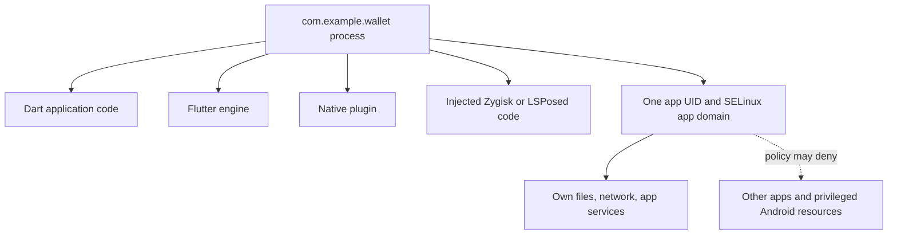
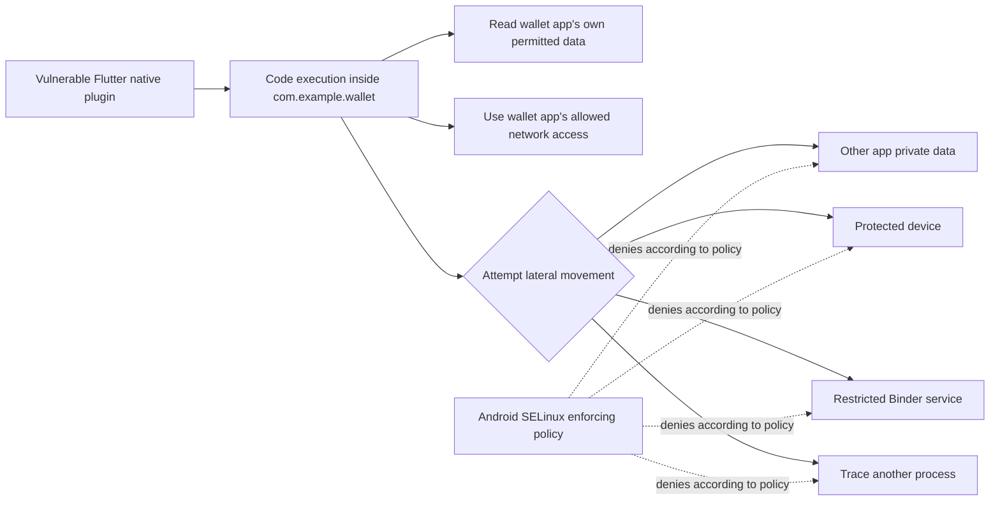
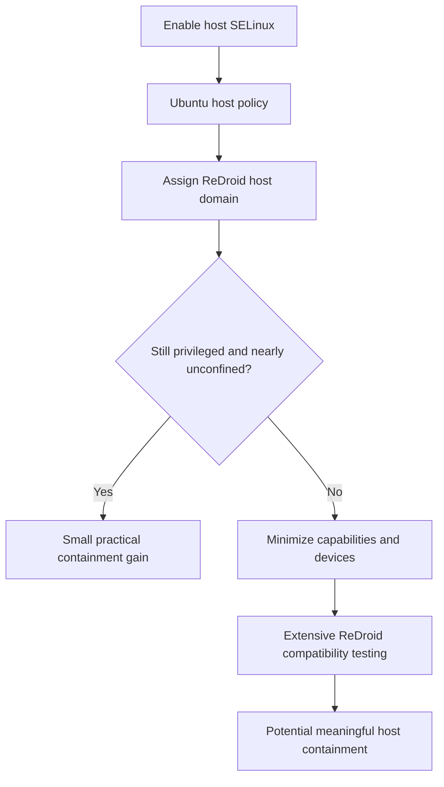
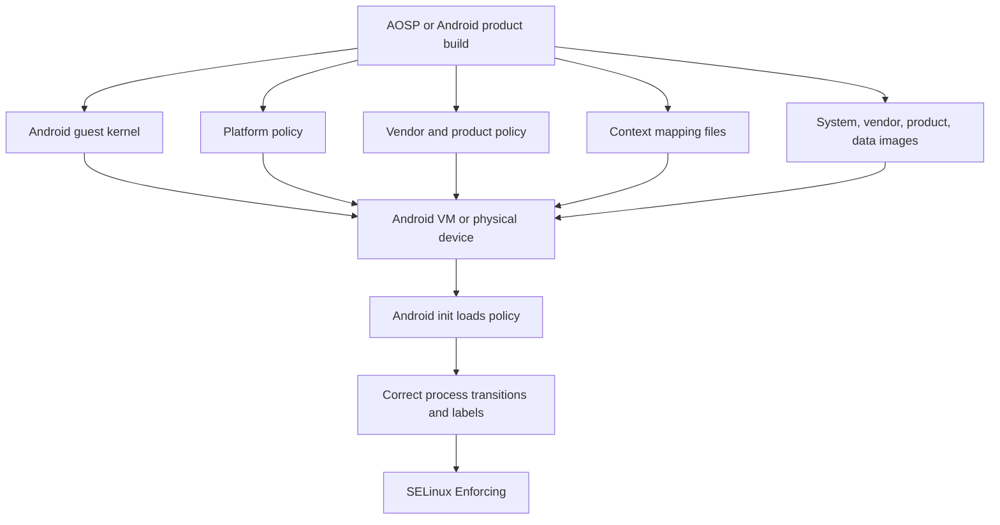
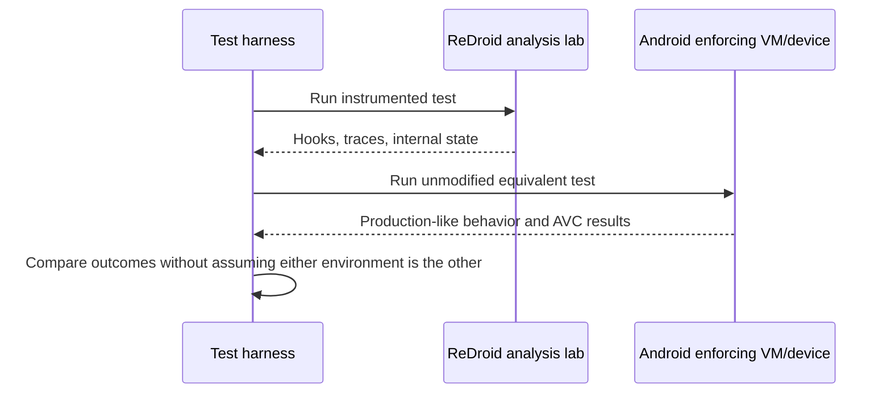
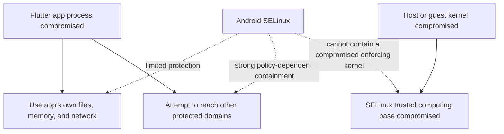

# SELinux, Android, ReDroid, and This Repository

## Technical review, corrected architecture, security boundaries, and practical deployment choices

> **Scope:** This document reviews the preceding SELinux discussion against the
> repository's actual configuration and authoritative Linux, Android, OCI, and
> Docker behavior. It explains what SELinux can and cannot provide for a rooted
> ReDroid reverse-engineering lab.
>
> **Most important correction:** ReDroid is a Linux container and shares the
> Ubuntu host kernel. Standard SELinux does not provide a separate policy
> namespace for each container. A ReDroid container therefore cannot safely run
> an independent Android SELinux policy while the same kernel simultaneously
> runs a different Ubuntu SELinux policy. Genuine Android SELinux enforcement
> requires a separate Android kernel boundary, normally a physical Android
> device or an Android virtual machine.

---

## 1. Executive conclusion

The earlier discussion was correct about SELinux's purpose, app detection, and
the difference between host protection and Android app protection. It was not
fully correct about how to obtain Android SELinux enforcement in ReDroid.

The corrected conclusions are:

1. **SELinux is mandatory access control (MAC).** It allows the kernel to decide
   whether a labeled process may perform an operation on a labeled object, even
   when ordinary Unix owner/group/mode checks would allow it.
2. **SELinux does not give a reverse engineer more app control.** It primarily
   removes authority and contains compromised processes.
3. **The current custom kernel compiles SELinux support, but does not select it
   as an active LSM.** The archived configuration selects AppArmor instead.
4. **The current Android runtime is genuinely SELinux-disabled.** Repository
   observations record `getenforce` as `Disabled`; spoofing a property to say
   `enforcing` does not create policy or enforcement.
5. **Host SELinux would not turn Android SELinux on.** It could only apply the
   host's one global policy to ReDroid's Linux processes and host resources.
6. **An ordinary container cannot have its own independent SELinux policy.**
   Linux container namespaces include PID, mount, network, IPC, UTS, user,
   cgroup, and time namespaces; there is no standard SELinux-policy namespace.
7. **A custom ReDroid image alone is insufficient.** Android `init` normally
   loads Android policy into the kernel SELinux subsystem. In ReDroid that is
   the shared Ubuntu kernel subsystem, not a private Android kernel.
8. **The current `--privileged` deployment substantially weakens host MAC
   confinement.** Docker documents that privileged mode grants all capabilities,
   all host devices, and reconfigures AppArmor or SELinux to provide nearly the
   same host access as processes outside the container.
9. **SELinux does not stop code already injected into the same Flutter app
   process from reading that app's own data.** Dart code, the Flutter engine,
   native plugins, and injected Zygisk/LSPosed code execute as the same Linux
   process and generally share its Android SELinux domain.
10. **Use separate environments for separate goals:** retain this ReDroid stack
    as an instrumented analysis lab, and use a physical device or Android VM
    with its own enforcing kernel for realistic security validation.



---

## 2. Review of the earlier conversation

### 2.1 Claims that were substantially correct

| Earlier claim | Assessment | Precise interpretation |
|---|---|---|
| SELinux is mandatory access control | Correct | SELinux adds policy checks after or alongside ordinary DAC checks, using process and object security contexts. |
| A process running as UID 0 can still be denied | Correct with a boundary | A confined root process can be denied. A sufficiently privileged host administrator may be able to change policy, boot without SELinux, or otherwise alter the trusted computing base. |
| Host SELinux and Android SELinux are conceptually different | Correct | Host policy is written for Ubuntu/container resources; Android policy is written for Android domains, services, properties, Binder interactions, and device types. |
| Enabling host SELinux does not make `adb shell getenforce` become `Enforcing` | Correct | Host policy does not create Android domains or an Android policy instance. |
| Setting `ro.boot.selinux=enforcing` is not proof | Correct | A property is only text. Enforcement requires an active SELinux LSM, a loaded policy, enforcing state, and valid labels/transitions. |
| An app can detect disabled SELinux | Correct | It may inspect `getenforce`, selinuxfs, process contexts, files, properties, and combine these with root/debug/container signals. |
| SELinux limits post-compromise movement | Correct | It can prevent a compromised app domain from reaching unrelated app data, privileged services, devices, or kernel interfaces when the policy denies those operations. |
| A Flutter app does not normally install its own SELinux policy | Correct | Android assigns the app domain. The app is a policy subject, not the policy administrator. |
| Host SELinux would mainly protect the VPS | Correct | If the container were meaningfully confined, host policy could restrict access to host paths, services, and devices. |
| Root, Zygisk, LSPosed, debuggable properties, and container traits remain separate detection signals | Correct | SELinux enforcement neither hides nor legitimizes those artifacts. |

### 2.2 Claims that needed correction or qualification

| Earlier claim | Corrected statement |
|---|---|
| Build a custom Android image, enable host SELinux, and load Android policy inside ReDroid | **Not valid as an independent-policy design.** Android `init` would target the shared host kernel's global SELinux state. There is no ordinary Docker SELinux-policy namespace. |
| Host SELinux enforcing and Android SELinux enforcing could coexist as separate policies in this container | **Not as two independent policies on the shared kernel.** A single combined host+Android policy is theoretically imaginable but would be a custom appliance-level kernel/policy project, not normal ReDroid or normal Ubuntu administration. |
| Correct Android labels and policy are enough | Incomplete. Android also needs its own SELinux-enabled kernel instance, correct boot/init flow, compatible policy version, filesystem support, process transitions, Binder rules, and complete platform/vendor policy. |
| The KernelSU NULL guard proves ReDroid disabled Android policy setup | Overstated. It proves `selinux_state.policy` was NULL when that KernelSU path ran. The separate runtime observation `getenforce=Disabled` proves the final Android-visible state. |
| KernelSU/Zygisk/LSPosed cannot run with enforcing SELinux | Too absolute. They can run if policy permits their operations, but that policy necessarily expands trust and weakens the value of an unmodified hardened baseline. |
| SELinux would protect an app from LSPosed code injected into that same app | Generally false. Once code runs inside the app process, it inherits that process's UID/domain and can access resources allowed to the app itself. SELinux is not an intra-process sandbox. |
| Enabling SELinux on the current host necessarily increases security | Not automatically. With `privileged: true` and broad host access, Docker deliberately relaxes AppArmor/SELinux confinement. A policy that simply allows every required operation can add complexity without a meaningful boundary. |

### 2.3 The key architectural correction

The previous proposed path treated Android policy as if it could be loaded into
a container-private SELinux instance. That is the major error.

Android's early `init` flow normally:

1. reads or compiles the platform/vendor Android policy;
2. mounts or locates selinuxfs;
3. loads the policy through the kernel SELinux API;
4. sets enforcing mode;
5. restores file contexts; and
6. transitions Android processes into domains such as `init`, `system_server`,
   `hal_*`, and `untrusted_app`.

In a physical Android device or VM, those operations affect the Android kernel.
In ReDroid, they would affect the same kernel used by Ubuntu, Docker, Coolify,
and every other host process.



The correct isolation boundary for a separate Android SELinux policy is a
separate kernel:



---

## 3. What SELinux actually controls

### 3.1 DAC versus MAC

Traditional Unix discretionary access control (DAC) asks questions such as:

```text
Who owns the file?
What are its user/group/other mode bits?
Does the process have a capability that bypasses this check?
```

SELinux adds mandatory policy questions:

```text
What is the source process type?
What is the target object type?
What object class is involved?
What operation is requested?
Does loaded policy contain an allow rule?
```

A simplified conceptual decision is:

```text
subject context + target context + class + permission -> allow or deny
```

For example:

```text
u:r:untrusted_app:s0  ->  u:object_r:system_data_file:s0  -> file/read
```

would normally be denied unless Android policy explicitly allowed that
relationship. The real Android policy is much more detailed and may include
attributes, transitions, MLS/MCS categories, constraints, `neverallow` rules,
Binder classes, property classes, and service-manager classes.

### 3.2 Enforcement order

Possessing normal Linux permission is not enough if SELinux denies the action:



### 3.3 What SELinux does not do

SELinux does not automatically:

- remove vulnerabilities from application code;
- validate server-side authorization;
- encrypt app data;
- hide root, hooks, emulation, or container traits;
- provide hardware-backed attestation;
- prevent code already executing inside a process from using that process's
  legitimate permissions;
- make an untrusted module trustworthy;
- provide a separate kernel to a container; or
- create an Android policy merely because a property says `enforcing`.

---

## 4. Current repository state

### 4.1 Host kernel configuration

The archived kernel configuration contains:

```text
CONFIG_SECURITY_SELINUX=y
CONFIG_SECURITY_SELINUX_BOOTPARAM=y
CONFIG_SECURITY_SELINUX_DEVELOP=y
CONFIG_DEFAULT_SECURITY_APPARMOR=y
CONFIG_LSM="landlock,lockdown,yama,integrity,apparmor"
```

This means:

- SELinux code was compiled into the kernel;
- SELinux is not listed in the configured active LSM order;
- AppArmor is the selected major MAC system in this build; and
- compile-time availability must not be confused with a loaded policy or
  runtime enforcement.

Evidence:

- `KernelSU_setup/artifacts/kernel-build/config/config.completed:13294`
- `KernelSU_setup/artifacts/kernel-build/config/config.completed:13369`
- `KernelSU_setup/artifacts/kernel-build/config/config.completed:13372`
- `KernelSU_setup/artifacts/kernel-build/config/config.completed:13374`

The actual running host should still be checked rather than inferred solely
from the archived build configuration:

```bash
cat /sys/kernel/security/lsm
sudo aa-status || true
getenforce 2>/dev/null || true
sestatus 2>/dev/null || true
mount | grep -E 'securityfs|selinuxfs'
cat /proc/cmdline
```

### 4.2 Android runtime state

Repository evidence records:

```text
adb shell getenforce
Disabled
```

It also records that setting `ro.boot.selinux=enforcing` did not create an
active policy. This is the correct interpretation.

Relevant evidence:

- `rev-eng/network-tools/captures/README.md:126`
- `rev-eng/network-tools/captures/README.md:554`
- `rev-eng/network-tools/captures/diskwala-deep-dive.md:287`
- `rev-eng/docs/05-Follow-Up-Fixes.md:256`

### 4.3 KernelSU's SELinux NULL guard

The retained patch checks the global kernel object `selinux_state.policy`:

```c
old_pol = rcu_dereference_protected(
    selinux_state.policy,
    lockdep_is_held(&selinux_state.policy_mutex));
if (!old_pol) {
    pr_info("SELinux policy unavailable, skipping rule injection\n");
    goto out_unlock;
}
```

The patch correctly prevents a NULL dereference. It does not create SELinux,
load Android policy, or isolate KernelSU's policy changes from the host.

If a host SELinux policy were loaded, this NULL guard would no longer select
the skip path. The pinned KernelSU code could then try to duplicate and modify
the loaded global policy. Treating an Ubuntu host policy as Android policy would
require a separate source-level design and review; it must not be tested on the
production VPS by simply enabling SELinux.

Relevant evidence:

- `KernelSU_setup/vps/patches/kernelsu-selinux-unavailable.patch`
- `KernelSU_setup/my_setup_journey.md:831`

### 4.4 Container privilege model

Both deployment paths use a privileged container:

```yaml
privileged: true
```

or:

```bash
docker create --privileged ...
```

They also provide:

- real BinderFS device inodes;
- persistent `/data`;
- broad mount behavior needed by Android and modules;
- `ro.secure=0`;
- `ro.debuggable=1`;
- KernelSU host-kernel hooks;
- Zygisk Next and LSPosed; and
- systemless module mounts.

Docker explicitly states that privileged mode grants all capabilities, enables
all host devices, and reconfigures AppArmor or SELinux to give nearly host-level
access. Therefore the current design should be treated as a trusted,
host-sensitive analysis workload, not as a strong hostile-code sandbox.

Relevant evidence:

- `KernelSU_setup/coolify/docker-compose.yml:8`
- `KernelSU_setup/coolify/docker-compose.yml:29`
- `KernelSU_setup/vps/deploy_redroid14_v2.sh:129`

---

## 5. Three security boundaries that must not be confused

### 5.1 Boundary A: host MAC confinement

Host AppArmor or SELinux can control the Linux process representing ReDroid and
its access to host objects.

Potential controls include:

- deny access to unrelated host directories;
- restrict host devices;
- restrict kernel filesystems and interfaces;
- restrict interactions with other services; and
- limit which bind-mounted paths may be accessed.

This boundary protects Ubuntu from the container. It does not create Android
domains such as `untrusted_app`.

### 5.2 Boundary B: Android SELinux confinement

On a normal Android kernel, Android policy controls interactions among:

- applications;
- Zygote;
- `system_server`;
- HAL services;
- Binder services;
- properties;
- files and sockets;
- device nodes; and
- kernel interfaces.

This boundary limits an Android process after compromise. It requires the
Android kernel and policy to operate together.

### 5.3 Boundary C: same-process application integrity

SELinux normally labels and controls a process as a whole. It does not isolate
Dart code from a native Flutter plugin or an injected library inside the same
process.



If the injected code runs inside `com.example.wallet`, it can usually use the
same permissions to read that wallet app's own database, memory, tokens, and
network inputs. SELinux may stop it moving to another app or a protected device,
but it does not restore the integrity of the already-compromised wallet process.

---

## 6. Flutter example: what Android SELinux contains

Assume an authorized test application:

```text
Package: com.example.wallet
Implementation: Flutter/Dart plus one native Android plugin
Normal domain: an untrusted-app family domain assigned by Android
```

### 6.1 Vulnerability scenario

Suppose the native plugin has a memory-safety defect and an attacker gains code
execution in the Flutter app process.

Without a functioning Android SELinux policy, the remaining barriers are mainly:

- the app UID and Unix permissions;
- process namespaces and kernel hardening;
- Android framework permission checks;
- seccomp where present;
- Binder service authorization; and
- application/server authentication.

With genuine Android SELinux enforcing, the compromised process remains in its
assigned app domain. Policy may deny attempts to:

- read another package's private data;
- open a protected device node;
- trace another UID's process;
- publish or find restricted Binder services;
- change protected properties;
- access system data files; or
- use privileged kernel interfaces.



### 6.2 What remains compromised

SELinux cannot generally stop the malicious code from using resources already
granted to `com.example.wallet`, including:

- the app's own files;
- values already decrypted in app memory;
- the app's own network permission;
- app-accessible Android services;
- credentials exposed to the app process; and
- operations the app is legitimately authorized to perform.

This is why SELinux is described as **containment**, not a cure for the original
vulnerability.

### 6.3 Effect of LSPosed/Zygisk instrumentation

When LSPosed or a Zygisk module intentionally enters the Flutter app process:

1. the module obtains execution in the same process;
2. it generally inherits that process's app domain;
3. it can inspect or modify values available to that process; and
4. Android SELinux may still deny attempts to leave that domain and reach
   unrelated protected objects.

An enforcing result therefore does not prove that the app has not been hooked.

---

## 7. Environment detection versus actual enforcement

These are separate questions:

```text
Detection: Can the app identify an unusual or modified environment?
Enforcement: Does the kernel deny operations forbidden by policy?
```

An application may collect signals such as:

- `getenforce` result;
- access to selinuxfs;
- its process context;
- root binaries or manager packages;
- Zygisk/LSPosed artifacts;
- suspicious native libraries or mounts;
- `ro.secure`, `ro.debuggable`, and build tags;
- emulator/container hardware properties;
- ADB/debug state;
- boot state and attestation results; and
- timing or behavioral inconsistencies.

Changing one property can alter one reported string, but it does not reproduce
the underlying security behavior. A robust app may compare multiple signals.

| Change | Makes Android SELinux real? | May alter a simple check? | Adds containment? |
|---|---:|---:|---:|
| Set `ro.boot.selinux=enforcing` | No | Possibly | No |
| Enable Ubuntu host SELinux | No | Usually not for Android checks | Potentially for host resources |
| Add fake `getenforce` output through a hook | No | Yes | No |
| Boot Android with its own kernel and valid enforcing policy | Yes | Yes | Yes |

For authorized reverse engineering, record the real environment honestly.
Do not treat property spoofing as proof that production Android behavior has
been reproduced.

---

## 8. What host SELinux could provide to this ReDroid deployment

Host SELinux could theoretically improve containment if ReDroid were assigned a
meaningfully restricted host domain. That project would involve:

- selecting SELinux instead of AppArmor as the host's major MAC LSM;
- installing and maintaining an Ubuntu-compatible host policy;
- labeling the ReDroid data directory and required device objects;
- defining access to BinderFS nodes;
- defining mount, namespace, network, and device permissions;
- constraining interactions with Docker, Coolify, and other host workloads;
- replacing `--privileged` with the smallest feasible capability/device set; and
- validating every existing boot, module, GApps, APEX, watchdog, and recovery
  workflow.

The last two requirements are the difficult part. ReDroid's published quick
start and this validated deployment use privileged mode. If the policy must
grant nearly everything privileged mode requests, the effective security gain
may be small.



Host SELinux still would **not**:

- create independent Android SELinux;
- assign correct Android app domains;
- prevent same-process Flutter instrumentation;
- hide the reverse-engineering environment; or
- make the device equivalent to certified physical Android hardware.

Because the current kernel and Ubuntu deployment already use AppArmor, a more
natural first host-hardening investigation is whether ReDroid can run under a
narrower AppArmor/capability/device profile. That pursues the host-containment
goal without replacing the host's selected MAC framework. It still requires a
separate clone and careful testing.

---

## 9. How to obtain genuine Android SELinux enforcement

### 9.1 Recommended choices

Use one of these separate-kernel environments:

1. **Physical Android device** with the desired Android version and a stock or
   controlled user build.
2. **Android Emulator/AVD** whose guest kernel and system image implement Android
   SELinux.
3. **Cuttlefish or another Android VM** with a separate guest kernel.
4. **A custom Android VM** built from matching AOSP platform, vendor policy,
   kernel, and filesystem images.

The exact choice depends on ARM64 performance, nested virtualization support,
GPU requirements, and the app's hardware/attestation requirements.

### 9.2 Components that must match

A genuine custom Android enforcing environment requires:

- a guest kernel built with SELinux enabled and selected;
- Android platform policy for the exact branch/API level;
- matching vendor/ODM/product/system_ext policy fragments;
- policy compatibility mappings;
- correct `file_contexts`, `property_contexts`, `service_contexts`, and other
  context mappings;
- filesystem support for security labels where applicable;
- correct labels for devices, sockets, services, properties, APEX, and data;
- Android `init` policy loading and domain transitions;
- Binder and service-manager SELinux integration;
- enforcing mode after policy load; and
- validation against Android compatibility and policy tests.



### 9.3 Root-stack decision

For a clean security-validation baseline, omit:

- KernelSU;
- Magisk;
- Zygisk Next;
- LSPosed;
- root ADB;
- debuggable build properties;
- mutable systemless overlays; and
- test interception CAs.

If root or hooks are required, create a second rooted guest. Its policy may
remain enforcing, but its threat model is different because privileged
components can inject code, change mounts, grant root, or alter policy. Do not
call that rooted guest equivalent to an unmodified production device merely
because `getenforce` prints `Enforcing`.

### 9.4 Why a combined host+Android policy is not recommended

It is theoretically possible to imagine one global SELinux policy containing
both Ubuntu and Android types and rules. In practice this would require:

- merging two policy ecosystems;
- labeling host and Android files coherently;
- preserving Ubuntu boot and service transitions;
- preserving Android boot and domain transitions;
- resolving policy-version and class differences;
- handling containers, Docker, Binder, APEX, and KernelSU;
- maintaining the merge across Ubuntu and Android updates; and
- accepting that Android policy reload affects the global host policy state.

This is a custom operating-system appliance project, not a supported ReDroid
configuration. A VM is clearer, safer, and easier to validate.

---

## 10. Recommended two-environment workflow

### 10.1 Environment A: instrumented analysis lab

Keep this repository's current ReDroid environment for authorized analysis:

```text
Purpose: observation, hooking, controlled modification, automation
Android SELinux: Disabled
KernelSU: enabled
Zygisk Next: enabled
LSPosed: enabled
ADB: private only
Trust level: privileged and host-sensitive
```

Required compensating controls:

- never expose ADB publicly;
- retain CPU, memory, and PID limits;
- retain watchdog and restart-loop protection;
- keep `/dev/kmsg` masked;
- keep Binder mounts explicit;
- isolate secrets and captures;
- use only reviewed modules;
- keep a stock host-kernel rollback; and
- do not treat the container as safe for hostile unknown code.

### 10.2 Environment B: hardened behavior baseline

Use a separate Android kernel environment:

```text
Purpose: realistic app behavior and security-boundary validation
Android SELinux: Enforcing
Root stack: absent for the clean baseline
Debug properties: production-like
ADB: authenticated/private or disabled as appropriate
Trust level: closer to stock Android
```

Run the same authorized Flutter-app test case in both environments and compare:

- startup behavior;
- API behavior;
- permission behavior;
- crashes and denials;
- file access;
- Binder service access;
- process contexts;
- attestation/detection signals; and
- performance/timing differences.



This separation is stronger than attempting to make one environment both fully
open to instrumentation and representative of a locked-down device.

---

## 11. Validation checklist

### 11.1 Current ReDroid lab

These commands verify facts; they do not enable SELinux:

```bash
# Host LSM state
cat /sys/kernel/security/lsm
cat /proc/cmdline
sudo aa-status || true
getenforce 2>/dev/null || true
sestatus 2>/dev/null || true

# Container privilege and security options
sudo docker inspect "$CONTAINER" --format '{{json .HostConfig.Privileged}}'
sudo docker inspect "$CONTAINER" --format '{{json .HostConfig.SecurityOpt}}'

# Android-visible SELinux state
adb -s "$ADB_SERIAL" shell getenforce
adb -s "$ADB_SERIAL" shell 'cat /proc/self/attr/current 2>/dev/null || true'
adb -s "$ADB_SERIAL" shell 'mount | grep -i selinux || true'
adb -s "$ADB_SERIAL" shell 'ls -ldZ /data /system 2>/dev/null || true'
adb -s "$ADB_SERIAL" shell 'ps -AZ 2>/dev/null | head -n 30'
```

Expected for the documented current deployment:

```text
Android getenforce: Disabled
Meaningful Android SELinux domain enforcement: absent
```

### 11.2 Separate Android enforcing guest/device

Minimum validation:

```bash
adb shell getenforce
adb shell cat /proc/self/attr/current
adb shell ps -AZ
adb shell ls -Z /data /system /vendor
adb shell dmesg | grep -i 'avc: denied' || true
adb logcat -b all -d | grep -i 'avc: denied' || true
```

Expected:

```text
getenforce reports Enforcing
init, system_server, Zygote, apps, and services have expected Android contexts
files and devices have expected object contexts
no unexplained denial prevents normal app behavior
```

`getenforce=Enforcing` alone is necessary but not sufficient. A credible result
also requires correct process transitions, labels, policy behavior, and absence
of blanket unconfined domains.

### 11.3 Flutter containment test

For a test app such as `com.example.wallet`, verify only authorized negative
cases:

1. App can access its own private data.
2. App cannot read another test package's private data.
3. App cannot open a deliberately protected test device or file type.
4. App cannot trace another UID's test process.
5. Normal platform-channel and native-plugin behavior still works.
6. Denials appear with the expected source and target contexts.
7. No broad allow rule was added merely to silence the audit log.

Do not generate policy by blindly converting every AVC denial into an allow
rule. First determine whether the requested operation is necessary and safe.

---

## 12. Merits and demerits by deployment type

| Deployment | Merits | Demerits |
|---|---|---|
| Current ReDroid lab | Excellent instrumentation; existing KernelSU/Zygisk/LSPosed workflow; proven automation | Android SELinux disabled; privileged host-sensitive container; detectable and unlike stock Android |
| ReDroid under host SELinux | Could restrict container access to host objects if privileges are minimized | Does not provide Android policy; privileged mode weakens benefit; substantial policy and compatibility work |
| Combined Ubuntu+Android global SELinux policy | Theoretically one policy could describe both worlds | Extremely complex, fragile, global blast radius, unsupported, poor upgradeability |
| Android VM with enforcing policy | Separate kernel; authentic Android domain model; strong validation boundary | More resources; virtualization setup; may lack physical hardware/attestation fidelity |
| Physical enforcing Android device | Closest production behavior and hardware boundary | Less convenient automation/instrumentation; device management and rollback complexity |

---

## 13. Threat-model summary

### 13.1 SELinux is effective against

- a compromised untrusted app attempting to access unrelated protected objects;
- accidental over-permission from Unix file modes;
- services attempting operations outside their assigned domains;
- some lateral movement from one Android component to another; and
- some container-to-host access when the host container domain is genuinely
  constrained.

### 13.2 SELinux is not sufficient against

- host-kernel compromise;
- an administrator deliberately changing policy;
- unrestricted privileged-container control;
- code injected into the same target app process;
- malicious code using the target app's legitimate authority;
- server-side authorization defects;
- secrets already available in process memory;
- intentionally trusted KernelSU/Zygisk/LSPosed modules; or
- hardware/device authenticity checks.



---

## 14. Decision guidance for this repository

### If the goal is reverse engineering

Keep the current ReDroid lab and strengthen its external containment. Android
SELinux being disabled is useful for instrumentation but is also a clear
environment difference that must be documented.

### If the goal is protecting the Ubuntu VPS

Prioritize:

1. private ADB and firewall enforcement;
2. removal of unnecessary host mounts and devices;
3. least capabilities instead of privileged mode where ReDroid permits;
4. AppArmor profile research because AppArmor is the current host MAC;
5. independent service/network isolation; and
6. a separate disposable host for untrusted workloads.

Host SELinux migration can be researched separately, but it is not an Android
SELinux solution.

### If the goal is testing an app that rejects disabled SELinux

Use a physical enforcing device or Android VM. Do not rely on property spoofing
or host SELinux. If the app must also be instrumented, compare two runs:

- a transparent instrumented run in ReDroid; and
- an unmodified enforcing run in the separate Android environment.

### If the goal is a hardened Android service

Build or use a separate-kernel Android platform and start without KernelSU,
Zygisk, or LSPosed. Add privileged components only after defining why they are
needed and how they alter the threat model.

---

## 15. Final answer

The correct architecture is not:

```text
Ubuntu SELinux policy + independent Android SELinux policy in one ReDroid container
```

because both would use the same host kernel SELinux subsystem.

The correct architecture is:

```text
Ubuntu host kernel + host MAC policy
    -> VM boundary
        -> Android guest kernel + Android SELinux policy
```

For this repository:

- **ReDroid remains the powerful reverse-engineering environment.**
- **A separate Android VM or physical device provides the enforcing control
  environment.**
- **Host MAC hardening protects the VPS but does not create Android SELinux.**
- **SELinux contains cross-domain access; it does not prevent authorized or
  malicious code already executing inside the same Flutter app process from
  using that app's own permissions.**

---

## 16. References

### Repository evidence

- [`README.md`](README.md)
- [`Redroid_Perks.md`](Redroid_Perks.md)
- [`KernelSU_setup/my_setup_journey.md`](KernelSU_setup/my_setup_journey.md)
- [`KernelSU_setup/setup_guide.md`](KernelSU_setup/setup_guide.md)
- [`KernelSU_setup/coolify/docker-compose.yml`](KernelSU_setup/coolify/docker-compose.yml)
- [`KernelSU_setup/vps/deploy_redroid14_v2.sh`](KernelSU_setup/vps/deploy_redroid14_v2.sh)
- [`KernelSU_setup/vps/patches/kernelsu-selinux-unavailable.patch`](KernelSU_setup/vps/patches/kernelsu-selinux-unavailable.patch)
- [`KernelSU_setup/artifacts/kernel-build/config/config.completed`](KernelSU_setup/artifacts/kernel-build/config/config.completed)
- [`rev-eng/network-tools/captures/README.md`](rev-eng/network-tools/captures/README.md)
- [`rev-eng/network-tools/captures/diskwala-deep-dive.md`](rev-eng/network-tools/captures/diskwala-deep-dive.md)
- [`rev-eng/docs/05-Follow-Up-Fixes.md`](rev-eng/docs/05-Follow-Up-Fixes.md)

### Authoritative external references

- Android SELinux documentation:
  <https://source.android.com/docs/security/features/selinux>
- AOSP Android `init` SELinux implementation, including policy loading:
  <https://android.googlesource.com/platform/system/core/+/refs/heads/main/init/selinux.cpp>
- Linux kernel SELinux documentation:
  <https://docs.kernel.org/admin-guide/LSM/SELinux.html>
- Linux Security Module documentation:
  <https://docs.kernel.org/admin-guide/LSM/index.html>
- OCI Linux container namespace specification:
  <https://github.com/opencontainers/runtime-spec/blob/main/config-linux.md#namespaces>
- Docker privileged-container behavior:
  <https://docs.docker.com/engine/containers/run/#runtime-privilege-and-linux-capabilities>
- ReDroid documentation and privileged launch model:
  <https://github.com/remote-android/redroid-doc>
- Linux SELinux global state definition (`selinux_state`):
  <https://github.com/torvalds/linux/blob/master/security/selinux/include/security.h>
